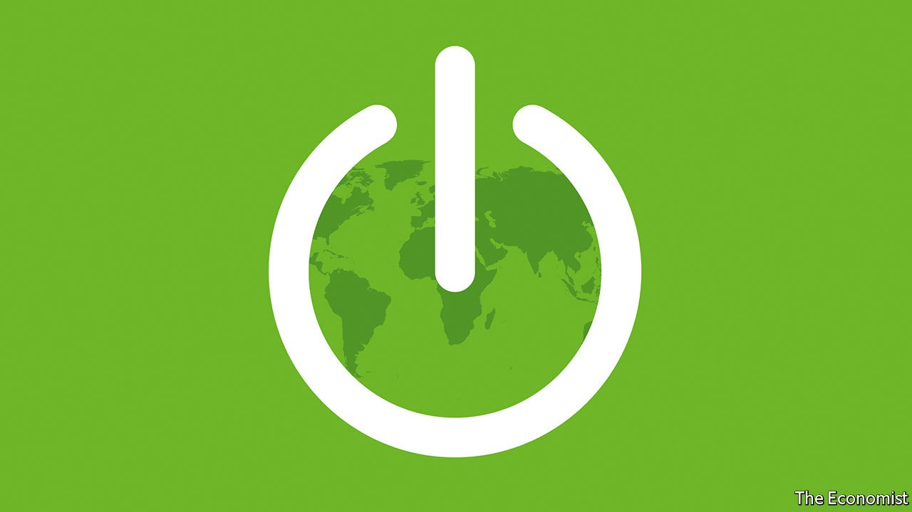

## The new energy order

# Is it the end of the oil age?

> Power in the 21st century

> Sep 17th 2020

For more coverage of climate change, register for The Climate Issue, our fortnightly [newsletter](https://www.economist.com//theclimateissue/), or visit our [climate-change hub](https://www.economist.com//news/2020/04/24/the-economists-coverage-of-climate-change)

OIL FUELLED the 20th century—its cars, its wars, its economy and its geopolitics. Now the world is in the midst of an energy shock that is speeding up the shift to a new order. As covid-19 struck the global economy earlier this year, demand for oil dropped by more than a fifth and prices collapsed. Since then there has been a jittery recovery, but a return to the old world is unlikely. Fossil-fuel producers are being forced to confront their vulnerabilities. ExxonMobil has been ejected from the Dow Jones Industrial Average, having been a member since 1928. Petrostates such as Saudi Arabia need an oil price of $70-80 a barrel to balance their budgets. Today it is scraping along at just $40.

There have been oil slumps before, but this one is different. As the public, governments and investors wake up to climate change, the clean-energy industry is gaining momentum. Capital markets have shifted: clean-power stocks are up by 45% this year. With interest rates near zero, politicians are backing green-infrastructure plans. America’s Democratic presidential contender, Joe Biden, wants to spend $2trn decarbonising America’s economy. The European Union has earmarked 30% of its $880bn covid-19 recovery plan for climate measures, and its president, Ursula von der Leyen, used her state-of-the-union address this week to confirm that she wants the EU to cut greenhouse-gas emissions by 55% over 1990 levels in the next decade.

The 21st-century energy system promises to be better than the oil age—better for human health, more politically stable and less economically volatile. The shift involves big risks. If disorderly, it could add to political and economic instability in petrostates and concentrate control of the green-supply chain in China. Even more dangerous, it could happen too slowly.

Today fossil fuels are the ultimate source of 85% of energy. But this system is dirty. Energy accounts for two-thirds of greenhouse-gas emissions; the pollution from burning fossil fuels kills over 4m people a year, mostly in the emerging world’s mega-cities. Oil has also created political instability. For decades petrostates such as Venezuela and Saudi Arabia, with little incentive to develop their economies, have been mired in the politics of handouts and cronyism. In an effort to ensure secure supplies, the world’s big powers have vied to influence these states, not least in the Middle East, where America has roughly 60,000 troops. Fossil fuels cause economic volatility, too. Oil markets are buffeted by an erratic cartel. Concentration of the world’s oil reserves makes supply vulnerable to geopolitical shocks. Little wonder that the price has swung by over 30% in a sixth-month period 62 times since 1970.

A picture of the new energy system is emerging. With bold action, renewable electricity such as solar and wind power could rise from 5% of supply today to 25% in 2035, and nearly 50% by 2050. Oil and coal use will drop, although cleaner natural gas will remain central. This architecture will ultimately bring huge benefits. Most important, decarbonising energy will avoid the chaos of unchecked climate change, including devastating droughts, famine, floods and mass dislocation. Once mature, it should be more politically stable, too, because supply will be diversified, geographically and technologically. Petrostates will have to attempt to reform themselves and, as their governments start to depend on taxing their own citizens, some will become more representative. Consuming countries, which once sought energy security by meddling in the politics of the oil producers, will instead look to sensible regulation of their own power industry. The 21st-century system should also be less economically volatile. Electricity prices will be determined not by a few big actors but by competition and gradual efficiency gains.

Yet even as a better energy system emerges, the threat of a poorly managed transition looms. Two risks stand out. Autocratic China could temporarily gain clout over the global power system because of its dominance in making key components and developing new technologies. Today Chinese firms produce 72% of the world’s solar modules, 69% of its lithium-ion batteries and 45% of its wind turbines. They also control much of the refining of minerals critical to clean energy, such as cobalt and lithium. Instead of a petrostate, the People’s Republic may become an “electrostate”. In the past six months it has announced investments in electric-car infrastructure and transmission, tested a nuclear plant in Pakistan and considered stockpiling cobalt.

China’s leverage depends on how fast other economies move (see [Briefing](https://www.economist.com//briefing/2020/09/17/americas-domination-of-oil-and-gas-will-not-cow-china)). Europe is home to giant developers of wind and solar farms—Orsted, Enel and Iberdrola are building such projects around the world. European firms are leading the race to cut their own emissions, too. America’s trajectory has been affected by the rise of shale oil and gas, which has made it the world’s largest oil producer, and by Republican resistance to decarbonisation measures. If America were to act on climate change—with, say, a carbon tax and new infrastructure—its capital markets, national energy laboratories and universities would make it a formidable green power.

The other big risk is the transition of petrostates, which account for 8% of world GDP and nearly 900m citizens. As oil demand dwindles, they will face a vicious fight for market share which will be won by the countries with the cheapest and cleanest crude. Even as they grapple with the growing urgency of economic and political reform, the public resources to pay for it may dwindle. This year Saudi Arabia’s government revenue fell by 49% in the second quarter. A perilous few decades lie ahead.

Faced with these dangers, the temptation will be to ease the adjustment, by taking the transition more slowly. However, that would bring about a different, even more destabilising set of climate-related consequences. Instead, as our special report in this issue explains, the investments being contemplated fall drastically short of what is needed to keep temperatures within 2°C of pre-industrial levels, let alone the 1.5°C required to limit the environmental, economic and political turmoil of climate change. For example, annual investment in wind and solar capacity needs to be about $750bn, triple recent levels. And if the shift towards fossil-fuel-free renewable energy accelerates, as it must, it will cause even more geopolitical turbulence. The move to a new energy order is vital, but it will be messy. ■

## URL

https://www.economist.com/leaders/2020/09/17/is-it-the-end-of-the-oil-age
