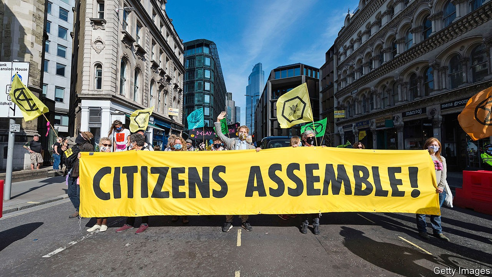

## Amateurs to the rescue

# Politicians should take citizens’ assemblies seriously

> Panels of ordinary people can solve problems that the professionals fear to tackle

> Sep 19th 2020

IN 403BC Athens decided to overhaul its institutions. A disastrous war with Sparta had shown that direct democracy, whereby adult male citizens voted on laws, was not enough to stop eloquent demagogues from getting what they wanted, and indeed from subverting democracy altogether. So a new body, chosen by lot, was set up to scrutinise the decisions of voters. It was called the nomothetai or “layers down of law” and it would be given the time to ponder difficult decisions, unmolested by silver-tongued orators and the schemes of ambitious politicians.

This ancient idea is back in vogue, and not before time. Around the world “citizens’ assemblies” and other deliberative groups are being created to consider questions that politicians have struggled to answer (see [article](https://www.economist.com//node/21791841)). Over weeks or months, 100 or so citizens—picked at random, but with a view to creating a body reflective of the population as a whole in terms of gender, age, income and education—meet to discuss a divisive topic in a considered, careful way. Often they are paid for their time, to ensure that it is not just political wonks who sign up. At the end they present their recommendations to politicians. Before covid-19 these citizens met in conference centres in large cities where, by mingling over lunch-breaks, they discovered that the monsters who disagree with them turned out to be human after all. Now, as a result of the pandemic, they mostly gather on Zoom.

Citizens’ assemblies are often promoted as a way to reverse the decline in trust in democracy, which has been precipitous in most of the developed world over the past decade or so. Last year the majority of people polled in America, Britain, France and Australia—along with many other rich countries—felt that, regardless of which party wins an election, nothing really changes. Politicians, a common complaint runs, have no understanding of, or interest in, the lives and concerns of ordinary people.

Citizens’ assemblies can help remedy that. They are not a substitute for the everyday business of legislating, but a way to break the deadlock when politicians have tried to deal with important issues and failed. Ordinary people, it turns out, are quite reasonable. A large four-day deliberative experiment in America softened Republicans’ views on immigration; Democrats became less eager to raise the minimum wage. Even more strikingly, two 18-month-long citizens’ assemblies in Ireland showed that the country, despite its deep Catholic roots, was far more socially liberal than politicians had realised. Assemblies overwhelmingly recommended the legalisation of both same-sex marriage and abortion.

Perhaps because citizens’ assemblies reflect the population, their conclusions seem to appeal to it, too. Same-sex marriage and abortion were both legalised in Ireland when whopping majorities in referendums demonstrated that the country had reached a new consensus after years of fighting. And assemblies are not just for engaged middle-class types. One European study found that people with less education, as well as those who are most mistrustful of politicians, are keenest on the idea.

Citizens’ assemblies are good, in short, at coming up with solutions to thorny or polarising issues in which politicians have been captured by their party’s extremes. But they work best if they follow some rules. To start with, national politicians must embrace them. So far, most have been at the local or state level. A recent Climate Assembly in Britain was set up by a series of parliamentary committees; the government had no part in it.

Assemblies must also have a clear question to debate. Should gay marriage be legalised? How can our city live within its means? The current citizens’ assembly in Scotland is an example of what to avoid. It has a series of thumb-sucking questions to ponder, including, “What kind of country are we seeking to build?”—inviting an equally thumb-sucking answer.

Lastly, the politicians who set up citizens’ assemblies must genuinely be open to their conclusions. They cannot simply be looking for an endorsement of their own preconceptions. Nicola Sturgeon, Scotland’s first minister, dented the integrity of the assembly there by launching it at the same time as she renewed her party’s goal of independence, making the whole process suspect in the eyes of those who do not share her beliefs. The assemblies should instead be set up in the spirit of open debate, experiment, and a willingness to listen to other points of view.

And politicians should promise to put the recommendations of a citizens’ assembly to a vote in parliament or, when appropriate, a referendum, whatever the outcome. If they claim to represent the people, they should take the people seriously. ■

## URL

https://www.economist.com/leaders/2020/09/19/politicians-should-take-citizens-assemblies-seriously
