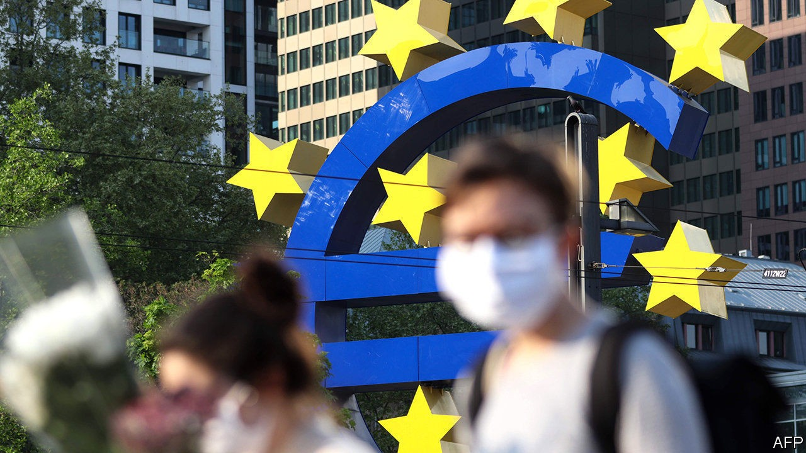
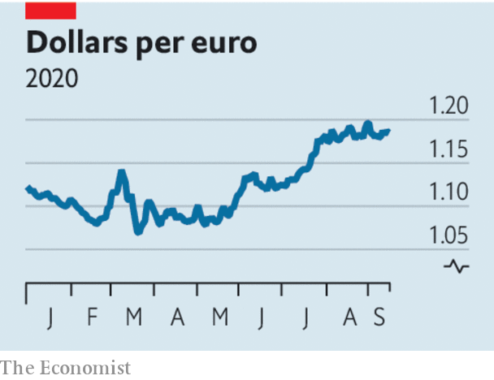

## Off target

# The ECB’s lack of credibility could hamstring Europe’s recovery

> A strong currency is both cause and consequence of the ECB’s failures

> Sep 19th 2020

AT POINTS IN the past decade the European Central Bank (ECB) was the only institution standing between the euro zone and financial oblivion. Europe’s problem was budgetary inhibition and insufficient risk-sharing. Monetary policymakers were the only game in town. No longer. Earlier this year the European Union agreed to issue joint debt to fund a fiscal response to the pandemic, sending confidence in the currency union surging. Now the most pressing problem in euro-zone economic policy stems from Frankfurt. It is that hardly anyone believes the ECB is serious about hitting its inflation target of “below, but close to, 2%”.

Covid-19 continues to leave most of the world with a 90% economy in which activity is depressed (see [article](https://www.economist.com//finance-and-economics/2020/09/16/is-the-world-economy-recovering)). Disinflation is the natural consequence. In August euro-zone prices fell for the first time in four years. But it is the job of policymakers to ensure that shocks do not become prolonged disinflationary slumps. The ECB’S own forecasts, released after its monetary-policy meeting on September 10th, show that it is failing. Inflation will rise over the next three years—but only to 1.3%. Financial markets expect it will stay around that level for most of the next decade. Professional forecasters are only a little more optimistic. The latest force holding down prices is a strong euro. The single currency has appreciated by 5.4% against the dollar this year.

A central bank that took its target seriously would fight tooth and nail to improve this outlook. Depressed inflation expectations are a dangerous malady. They keep real interest rates—that is, rates minus expected inflation—higher than they otherwise would be. This is a problem when, as today, nominal rates cannot fall much further. And central banking is a confidence game: the more a target loses credibility, the harder it is to hit. So concerned is America’s Federal Reserve about inflation expectations that it has promised to allow inflation to overshoot its target temporarily to make up for shortfalls, ensuring that inflation averages 2% over the long term.

The ECB, by comparison, seems unperturbed. Instead of injecting new stimulus last week, it held back. The problem is not a lack of means. It insists that it could cut interest rates below today’s level of -0.5%, offer funding to banks on looser terms or expand its purchases of government debt. But it has done none of these things. After last week’s meeting Christine Lagarde, the bank’s president, said that increased asset purchases had not even been discussed. That pushed the euro up further, showing that the bank’s insouciance is adding to the currency’s strength and making expectations of low inflation self-fulfilling. Perhaps Ms Lagarde, not for the first time, gave too hawkish an impression. In a seemingly corrective blog post the next day, Philip Lane, the bank’s chief economist, struck a more doveish tone. The ECB will probably act in December. But it remains an institution that appears to view inflation shortfalls as a minor annoyance, not a test of its mettle.

Some would have it that the problem remains fiscal. Europe’s budgetary stimulus is smaller than America’s, and the ECB has already played an enormous role in markets this year. But the view that looser purse strings are needed to “ease the burden” on monetary policy is dangerous. If the practical effect of budgetary loosening is to let the central bank take a breather, the chances are that the exchange rate will appreciate, offsetting some or all of the stimulus. The monetary taps must stay fully open for the extra fiscal stimulus to have the desired effect. That is what is happening in America.

There is nothing inherently wrong with a strong euro. Many models, including our Big Mac index, suggest that it is warranted. But at present it partly reflects a suspicion that the ECB is willing to live with a lower rate of inflation than its official target demands. That risks damaging both the central bank’s credibility and also the euro zone’s recovery. ■

## URL

https://www.economist.com/leaders/2020/09/19/the-ecbs-lack-of-credibility-could-hamstring-europes-recovery
