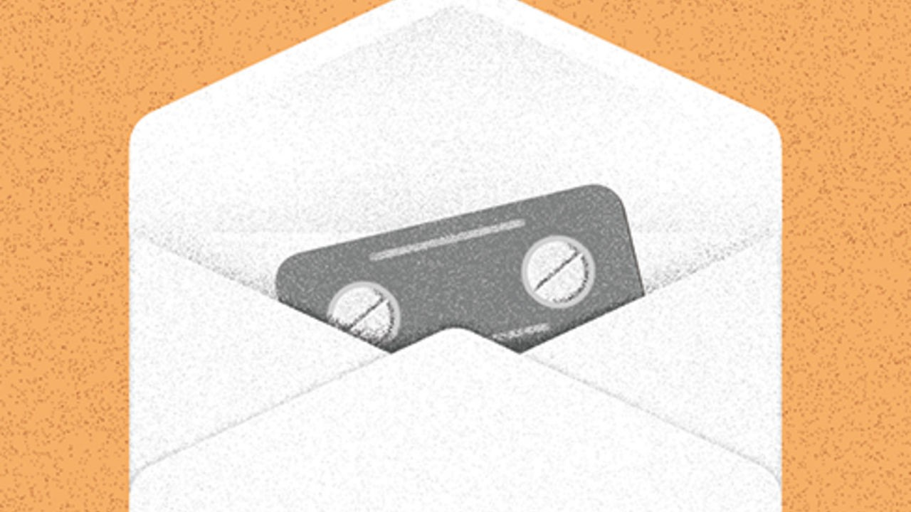

## Women’s health

# The pandemic shows a better way to handle abortion

> It is safe and efficient for early terminations to take place at home

> Sep 19th 2020

FOR MOST women deciding how or when to give birth, covid-19 has been a nightmare. Fertility treatments have paused, sexual-health clinics closed and partners been banned from delivery rooms. Yet the pandemic has brought one silver lining. It has shown a better way to carry out early-stage abortions.

Abortion is legal in most of the world, and relatively straightforward in most rich countries. But obstacles remain. They include compulsory waiting times and mandatory counselling. Perhaps the most common obstacle is that the first step in medical abortions (which involve drugs rather than surgery) must take place in clinics. Yet temporary measures set up during the pandemic suggest this is often unnecessary. These temporary measures should now become permanent.

At-home procedures are available only to women in the first trimester of pregnancy—which includes most of those who have abortions today. Two medicines are needed: mifepristone (which blocks the effects of the pregnancy-enabling hormone progesterone) and misoprostol (which induces contractions). They are taken a couple of days apart, and the pregnancy normally ends four to six hours after the second one is administered. In most of Britain, before the pandemic, the drugs were handed out after an ultrasound and an in-person consultation at a clinic. The mifepristone had to be administered by a doctor; the misoprostol was taken at home.

Covid-19 has changed that. In March Britain’s health secretary approved a rule change which, in effect, gave a woman’s home the same status as an abortion clinic. Instead of visiting a doctor, women could arrange an abortion by phone and have the pills delivered by post. Ireland introduced similar rules. France extended the limit for an at-home abortion from the seventh to the ninth week of pregnancy, though the pills must still be collected from a doctor or pharmacy. In July a federal judge in America lifted regulations that required women to collect abortion pills from a surgery, clinic or hospital, ruling that this was a “substantial obstacle in the path of women” during a pandemic.

None of these countries have yet decided if these kinds of approaches will last. In America, the Trump administration has asked the Supreme Court to overturn it. A decision is expected soon (see [article](https://www.economist.com//node/21791885)). In Britain the government has said that it will launch a public consultation on whether to keep the new approach. Ireland and France are also uncertain about whether to make the changes permanent.

Some people take a principled position that abortion at any time during pregnancy is wrong. For everyone else, however, the decision turns on two questions. Will removing medical supervision endanger women’s health? And will it lead to many more abortions? Take each in turn.

There is no evidence that at-home terminations are dangerous, and plenty to suggest that they are not. The World Health Organisation has said that early-term abortions can be carried out safely outside a clinic. In Britain the British Medical Association and Royal College of Obstetricians and Gynaecologists have both called for the changes to be made permanent. Recent data there show that they have resulted in women having abortions earlier, and thus more safely. From January to June, 25% more than in the previous year were carried out at less than seven weeks’ gestation.

This increase is explained by a surge in early abortions not in the overall total. Britain has seen only a 4% rise in terminations carried out in the first half of the year. That could reflect a straitened economy, say, or stressed relationships in lockdown and less access to contraception as well as easier abortion. The Guttmacher Institute, a pro-choice research group, finds no link between abortion restrictions in American states and changes in their abortion rate—whether the states make abortion easier or harder.

More important, if there ends up being an increase in the number of terminations that may be for a good reason. Some women are poor, live in regions with few clinics, or have a spouse or parent from whom they need to hide their abortion. For them the new rules have removed barriers that they might otherwise have found insurmountable. The changes to the abortion regime introduced as a result of the pandemic do not create new rights; they give a woman access to her existing rights more safely and efficiently. As with any citizen, that is welcome. ■

## URL

https://www.economist.com/leaders/2020/09/19/the-pandemic-shows-a-better-way-to-handle-abortion
