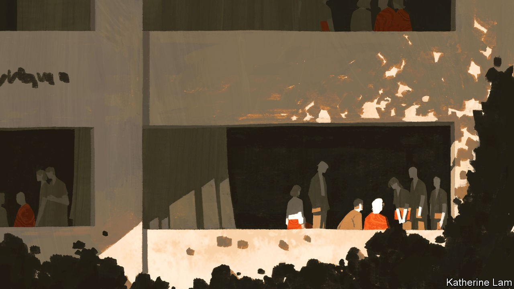
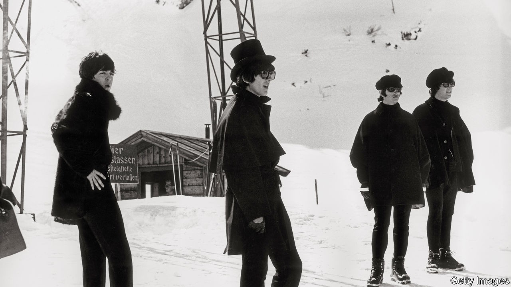
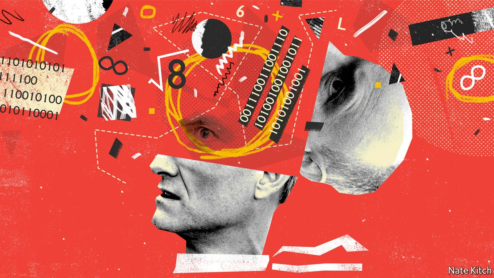

## On dementia, the Beatles, scientific management

# Letters to the editor

> A selection of correspondence

> Sep 19th 2020

Letters are welcome via e-mail to [letters@economist.com](https://www.economist.com/mailto:letters@economist.com)

Your excellent leader and special report on dementia ([August 29th](https://www.economist.com//special-report/2020/08/27/as-humanity-ages-the-numbers-of-people-with-dementia-will-surge)) were most timely. The idea that dementia can be prevented is fairly new. At a G8 meeting organised by David Cameron in 2013, a letter from 111 scientists in 36 countries stated that dementia (including Alzheimer’s disease) can be prevented, and urged the G8 to devote resources to this quest. As you pointed out, we now believe that up to 40% of dementia is preventable mainly by public-health measures, and yet the sums spent on these measures are tiny compared with the billions of dollars spent by drug companies looking for a cure.

There will not be a cure for this disease since the brain is far too damaged at the time of diagnosis. But there is already evidence that certain interventions, like those you mentioned and in addition the consumption of certain nutrients, can slow down the disease process. There is an urgent need for governments to fund research into prevention since this is our only chance of averting the huge problems in the future that you identified.

A. DAVID SMITHEmeritus professor of pharmacologyUniversity of Oxford

Some 12% of ostensible cases of dementia are due to cognitive side-effects of medication, which is reversible. Others are due to depression, causing reversible pseudodementia. An often overlooked type of dementia is frontotemporal dementia (FTD), constituting 10% or more of cases. It often begins earlier in life than Alzheimer’s. Half of patients with FTD have the behavioural variant. Memory loss is not a prominent early symptom; instead, patients may exhibit decreased judgment, poor problem-solving skills, impulsivity, hypersexuality, lack of empathy, binge-eating, decreased attention span, mental rigidity, perseveration and language problems such as impaired syntax, leaving out words and a preference for partial phrases. Accompanying neuromuscular disease can lead to weakness in the arms and legs, and tremor.

RICHARD WAUGAMANClinical professor of psychiatryGeorgetown UniversityWashington, DC

Without question, the “rising prevalence of dementia is a global emergency” (“[The memory hole](https://www.economist.com//leaders/2020/08/27/the-rising-prevalence-of-dementia-is-a-global-emergency)”, August 29th). But to say that “smoking less, exercising more and losing weight in middle age has reduced the risk of dementia” completely misses the problem: we are outliving the evolutionary lifespan of our brains.

To think America is on the verge of licensing a drug “to stem cognitive decline in Alzheimer’s patients” is like buying the magic beans of Donepezil, which may do wonders for recuperating pharmaceutical losses in drug development, but in the end just gives a lot of old folks diarrhoea. Most disheartening is your perverse conclusion that it would be a good idea to require “everyone aged 40-65 to pay a premium…as it avoids penalising the young”. Let those who want to live out a decade of dementia in a nursing home buy what insurance they wish. I think I’ll spend my savings enjoying a life I can still appreciate.

CLAYTON WILEYDirector of neuropathologyUPMC Presbyterian HospitalPittsburgh

I am 89. No one considered the effects of medical advances. I take my blood-pressure pills obediently. I do not want to have a stroke, but can honestly say an efficient fatal heart attack would be welcome. I have the right to refuse life-extending drugs when I am presumably deemed to be mortally ill. It seems I do not have that freedom any earlier.

I am not the only old person unafraid of dying. Most of my life has been great, but I have been here long enough and am scared of becoming demented. A lot of people are bound to get dementia—God help us. We have forgotten that death used to come when one’s body failed. It was meant to be a release, both for the loved one dying and their loving relatives and friends, who suffer watching them.

JILL MCCALLUMOlney, Buckinghamshire

So signs of Alzheimer’s were detected in Ronald Reagan’s speech patterns long before his diagnosis. An interesting footnote to this is provided by Oliver Sacks in “The Man Who Mistook His Wife for a Hat” published in 1985. Sacks relayed the story of a ward of aphasia patients who were moved by a speech made by Reagan “apparently, mainly to laughter”. He attributed this, not to syntax, but to something wrong in Reagan’s “tones and cadences”. Sacks concluded that his aphasic patients were “undeceived and undeceivable by words”.

PAUL KINZIEBossier City, Louisiana

Although I’m far from wearying of “Rubber Soul”, I agree that “Help!” gets insufficient love from snootier Beatles fans, a group in which I must include myself (“[Send for ‘Help!’](https://www.economist.com//books-and-arts/2020/08/27/the-therapeutic-properties-of-help)”, August 29th). If the former was their departure album, they were already packed and ready to board with the latter. I’m surprised, though, that your article failed to point out that the title track highlights what was to become a defining characteristic of John Lennon and Paul McCartney’s work with George Martin: their liberal use of eclectic musical references. “When I was younger, so much younger than today” is sung to a tune from the intermezzo of the “Karelia Suite” by Jean Sibelius. Even Lennon’s grandfather was young when that was written.

DAVE MORRISLondon

Another overlooked aspect of this album is Paul McCartney’s rather interesting lyrical sleight of hand in “I’ve Just Seen a Face”. Here the second line of the song is completely ungrammatical on its own, but makes grammatical sense when the object of the first line (“I can’t forget”) becomes the subject for the second line. Mr McCartney seems to have been the first lyricist to perform such legerdemain, and the performance is so seamless as to be almost unnoticeable: “I’ve just seen a face/I can’t forget the time or place/Where we just met.” The only other song that I know that consciously does the same sort of thing is Love’s “Between Clark and Hilldale”.

JORDAN MOARWaterloo, Canada

Bagehot reported that the term “scientific management” was coined by Frederick Taylor, an American management guru ([August 22nd](https://www.economist.com//britain/2020/08/20/how-the-british-government-rules-by-algorithm)). Taylor is rightly associated with the term, since he popularised it. However, it was actually coined by Louis D. Brandeis, the “people’s lawyer”, who gained fame as a champion of consumers against monopolists. He first used the expression “scientific management” in 1910, in testimony before the Interstate Commerce Commission, when it was considering requests by the railroads for rate increases. Taylor then picked up on the expression. Brandeis went on to a long and distinguished service on the Supreme Court.

STEPHEN NEFFSchool of LawUniversity of Edinburgh 

That “scientific management” bungled the algorithm for children’s exam results, verifies a maxim attributed to J.R. Searle, an American philosopher: if you have to add “scientific” to a field, it probably ain’t.

A.D. PELLEGRINIBloomington, Minnesota

## URL

https://www.economist.com/letters/2020/09/19/letters-to-the-editor
