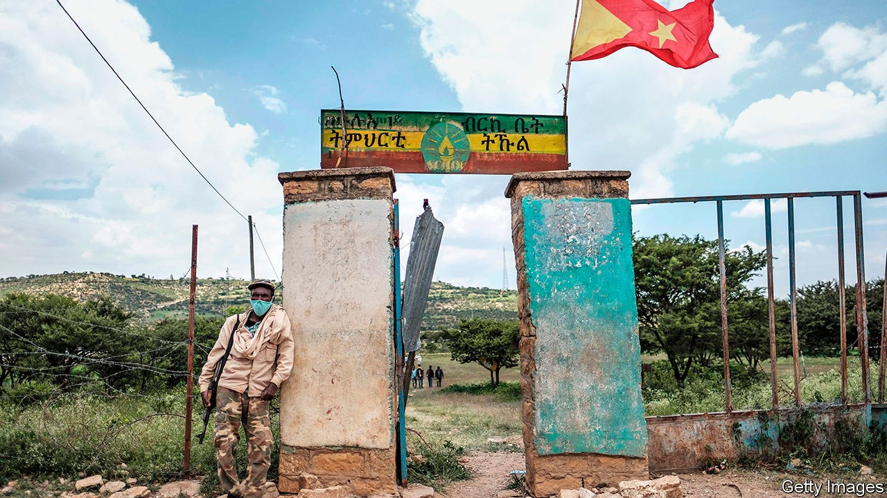
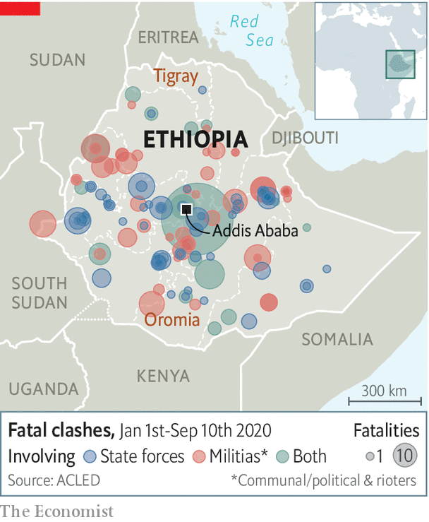

## Ethnic tensions and state violence

# Ethiopia’s democratic transition is in peril

> Abiy Ahmed has so far delivered neither democracy nor peace

> Sep 19th 2020ADDIS ABABA

“FREEDOM IS NOT a gift doled out to people by a government,” Abiy Ahmed said in his inaugural address as Ethiopia’s prime minister in 2018. “Rather [it is] a gift of nature to everyone that emanates from our human dignity.” His words marked a remarkable turn for a country that over the past five decades had seen an absolute monarchy, revolutions, civil war and authoritarian rule, but not freedom or democracy. After coming to power on the back of anti-government protests, Abiy freed political prisoners and journalists, welcomed opposition parties back from exile and encouraged rebels to disarm. He made peace with Eritrea, for which he was awarded the Nobel prize last year, and pledged to hold the first free elections in Africa’s second-most-populous country.

Yet Abiy has been unable to patch the deep ethnic fissures that threaten to tear Ethiopia apart, and has not altered the state’s instinct for violence and repression. This year alone at least 147 fatal clashes have left several hundred dead, according to figures compiled by the Armed Conflict Location & Event Data project (see map). In July riots took place across Addis Ababa, the capital, and the Oromia region, after the assassination of Hachalu Hundessa, a musician and activist from Abiy’s own Oromo ethnic group. By one count 239 people were killed, some by mobs, others by security forces. Thousands have since been arrested, including Jawar Mohammed, an Oromo opposition leader considered Abiy’s main rival, who is accused of inciting violence. In August protests calling for his release resulted in yet more deaths.

Tensions had been building for months before the latest unrest. The government’s decision to postpone elections because of covid-19 spurred talk of a constitutional crisis. Opponents including the Tigrayan People’s Liberation Front (TPLF), which runs the northern region of Tigray and dominated the federal government for nearly three decades, accused Abiy of trying to extend his time in office.

Abiy and his allies, in turn, blame the TPLF and militant ethnic nationalists for inciting violence. In an opinion piece published online by The Economist this week (see [article](https://www.economist.com//by-invitation/2020/09/17/abiy-ahmed-on-the-threats-to-ethiopias-democratic-transition)), the prime minister warns that Ethiopia’s journey to democracy risks being derailed by those “who are accustomed to undue past privileges” and those trying “to assume power through violence”, allusions to both the TPLF and parts of the previously outlawed Oromo Liberation Front (OLF).

Abiy’s comments are his most explicit admission yet of the difficulties of holding together a fractious federation in which ethnicity is arguably more powerful than national identity. Moreover, he is trying to do so with fast-dissipating legitimacy. Next month the constitutional term limit of this parliament and government will expire. This is adding to tension between the federal government and some of the nine ethnically constituted states, each of which has the right to secede. This month the TPLF defied the centre and held regional elections, which some saw as a first step towards Tigray breaking away.

Yet Abiy insists that his government’s actions do not mark a reversal of its democratic reforms. “What we learn from the fledgling democracies of Europe of the 1920s and 1930s is that democracy has to be defended from violent demagogues and mobs,” he told The Economist in a written response to questions. Tacitly acknowledging brutality, he says, “Given the institutions we have inherited, we realise that law-enforcement activities entail a risk of human-rights violations and abuse.”

Indeed many of those arrested or killed in clashes were perpetrators or instigators of violence. But Abiy himself is responsible for more of the current mess than he admits. Since taking office he has focused on amassing power by sidelining rivals, locking up opponents and monopolising decision-making instead of working with the opposition to lessen tension peacefully.

Although Abiy’s rhetoric differs from his predecessors’, his administration’s conduct looks increasingly familiar. For more than a year security forces have waged a harsh campaign against armed Oromo separatists. A report by Amnesty International alleged torture and summary executions. Instead of promising to investigate, Abiy dismissed the allegations as “fiction”. Responding to The Economist, he admits there may be “isolated incidents where law-enforcement agencies have used disproportionate force”. But he adds that allegations are “taken out of context”.

Meanwhile, opposition figures say political freedoms are being withdrawn. “Time and again they close our offices and detain our members,” says Merera Gudina, an Oromo leader. Even after judges have ordered certain prisoners’ release, the police have rearrested them. Eskinder Nega, an opposition leader blamed by the government for the rioting in the capital in July, was charged with terrorism on September 10th. Eskinder previously spent seven years in prison on trumped-up charges.

The government has repeatedly cut off the internet. Journalists were barred from travelling to Tigray to cover its election. A new law criminalising “hate speech” includes provisions which can be used to lock up peaceful dissidents. At least three broadcasters linked to the opposition, only one of which had aired calls for violence, were closed in July.

A lasting solution to Ethiopia’s crisis is likely to require negotiations with opposition groups and a broader discussion of ethnic versus individual rights. And although Abiy says he is committed to talks, he is wary of the opposition’s calls for a comprehensive “national dialogue”.

Abiy’s vision of a multi-ethnic country whose “destiny lies in our togetherness” is more hopeful than the one offered by militant ethnic nationalists whose break-up of the country would lead to ethnic cleansing and fighting between the regions. But after more than a century of trying to use force to forge a united state, now may be the time to try doing so through consent. ■

## URL

https://www.economist.com/middle-east-and-africa/2020/09/19/ethiopias-democratic-transition-is-in-peril
