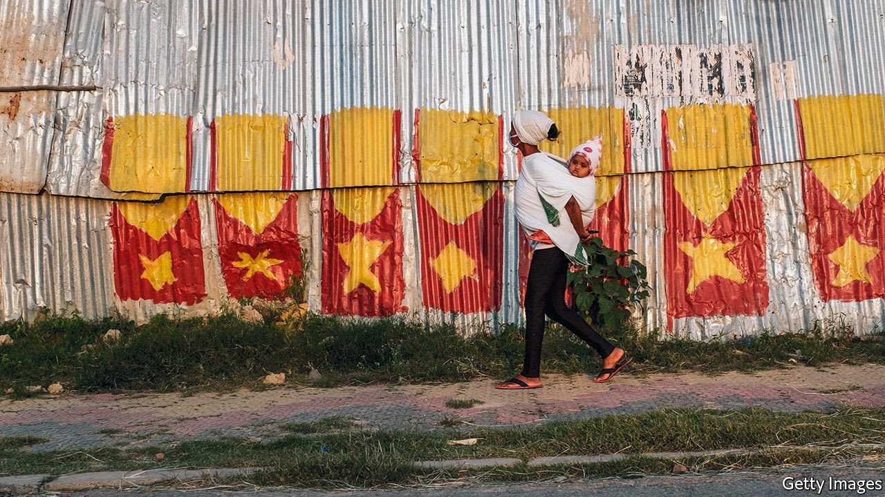

## How to spend it

# Sensible budgets are not Ghana’s forte. But there is hope

> A new initiative is ranking spending ideas by costs and benefits

> Sep 19th 2020

TUBERCULOSIS IS A terrible disease. It destroys lungs from the inside out, leaving sufferers coughing up the bloody remains. In Ghana too few people are diagnosed in time: the disease kills over 15,000 people a year, about 5% of all deaths. But a recent pilot scheme shows that diagnosis can be faster and more accurate simply by whisking samples from clinics that lack the latest testing technology to the nearest well-equipped testing centre. This could save more than 3,000 lives in six years if plans to scale up were followed through. Since the benefits are estimated at 166 times the costs over 20 years, the scheme is patently a fine idea.

Ghana is not famous for spending public money wisely. A study in 2015 found that, once under construction, a third of municipal infrastructure projects are never finished: half-built bridges litter the country. Spending is also highly political. In every election year bar one since 2000 the fiscal deficit has jumped sharply as the government of the day splurged to grab votes. IMF bail-outs and adjustment programmes have tended to follow. Last year Ghana completed its 16th.

Ghana’s National Development Planning Commission (NDPC) and the Copenhagen Consensus, an international think-tank, have teamed up to create a new initiative called the Ghana Priorities. It hopes to steer the government away from pork barrels by using solid evidence to assess which projects give the most bang for each buck.

More than 400 ideas have been narrowed down to 79. The costs and benefits of each have been analysed in peer-reviewed research papers and given a ratio. The best, such as ones for improving TB diagnostics and for universal malaria testing, have benefits worth over 100 times the costs (health schemes tend to score well). A land-title programme to clarify property rights promises benefits more than 90 times greater than the investment required.

Many fairly simple interventions have benefits that are reckoned to be a good 30 or so times higher than their costs. One community health-care programme included extra training for front-line staff, simplified health surveys so data can be used more easily and a flexible budget for local health clinics. These cut the deaths of new-born babies by half, according to a study published in 2019.

Cost-benefit analysis does not capture everything. It does not always identify precisely who benefits and who pays. The quality of the data and the number-crunching varies. The indirect effects of long-term national development projects are tough to analyse. But other methods are worryingly subjective. The team running the initiative asked a panel of economists and Ghana’s ministers for finance and planning to rank the proposals. They promoted R&D spending, which is superficially attractive but has a low benefit-cost ratio of only 1.5, from 62nd to 15th place.

The real test is what happens next. The nominally apolitical NDPC says the findings are already influencing how the government spends in response to covid-19. It also hopes that the research will shape Ghana’s medium-term development plan.

But James Dzansi of the International Growth Centre, a think-tank, says that party manifestos often knock aside such plans. An election beckons in December. Similar initiatives in the past have faltered when governments changed, says Mr Dzansi. The Ghana Priorities has better evidence underpinning it, he says. “Will this also lose momentum when a new government comes to power?” No matter who is in charge, though, wonks themselves may need to keep promoting evidence-based policies over political ones, says Koku Awoonor-Williams, one such wonk. ■

## URL

https://www.economist.com/middle-east-and-africa/2020/09/19/sensible-budgets-are-not-ghanas-forte-but-there-is-hope
