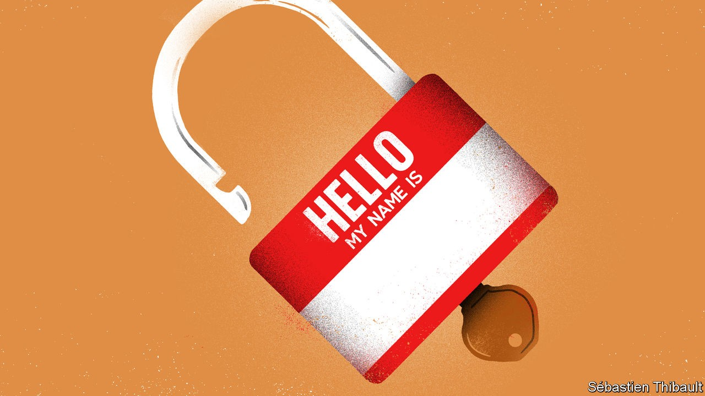

## Name games

# Why no one is called Linda in Saudi Arabia

> The kingdom still bans some foreign names, but other countries are loosening up

> Sep 19th 2020

ABDELMADJID LABADI, who lives in Algeria, could have chosen an Arabic name for his daughter. But he wanted one that reflected his Berber ethnicity. His choices were limited: Algeria keeps a list of around 300 approved Berber names, a way of holding the minority in check. Mr Labadi wanted none of them. So for almost four years he left his daughter officially nameless, as he fought in court for the name he preferred. In July he finally won and his daughter formally became Tanila, Berber for dove.

Regimes in the Middle East and north Africa long restricted names as a way of encouraging national unity—usually centred on the majority ethnic group or religion. For example, Turkey banned Kurdish names and non-Turkish suffixes, such as the Armenian “-ian”. Post-revolution Iran banned Western names and balked at pre-Islamic Persian ones. Israeli bureaucrats gave Jewish immigrants from Europe and Muslim countries Hebrew names on arrival. Algeria’s registrars were obliged to ensure that names were “Algerian-sounding”; Morocco said they must sound Moroccan.

But this form of nationalism has been receding in much of the region. Officials who guarded against “cultural separatism” now celebrate diversity. Take Tunisia, which ended its ban on foreign names in July. “What people drink or name their children is their private affair,” said Lotfi Zitoun, the minister who took the decision. Turkey officially ditched its policy of Turkifying names in 2003. The constitution passed by Iraq in 2005 ended the Arabisation of minority names. Israel dispensed with Hebraisation in the 1990s, when a wave of Jews from the former Soviet Union arrived.

Even today, though, official tolerance is limited. Algerian registrars still grimace at names such as Kahina, a Jewish Berber queen who battled the conquering armies of Islam. A Kurd in Turkey can call his child Serwav, which means warrior, but it is likely to invite government scrutiny. Iran’s ayatollahs have grown more comfortable with ancient Persian names, but they frown upon those of old shahs and kings, which might betray a parent’s monarchist leanings. Not long ago Saudi Arabia banned 51 names. Many were favoured by Shia Muslims, who are a minority in the kingdom. But Linda was on the list, too.

Other parts of the world are also restrictive in this way. China bans “extreme” names, such as Muhammad or Islam, in its Xinjiang-region. Until 2017 California prohibited the use of accents in names. An Egyptian parliamentarian once tried to make things simple by banning all foreign names. But he backtracked after being reminded that the widow of Egypt’s longest-serving president, Hosni Mubarak, is called Suzanne.

## URL

https://www.economist.com/middle-east-and-africa/2020/09/19/why-no-one-is-called-linda-in-saudi-arabia
