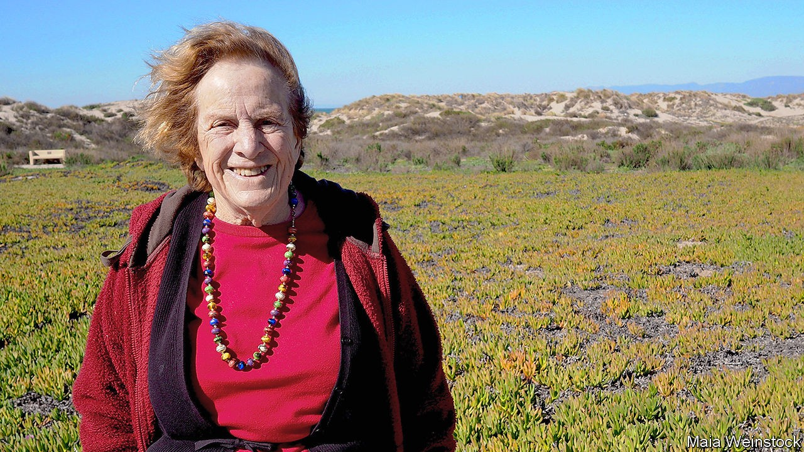

## Getting to know the Sun

# Joan Feynman died on July 22nd

> The astrophysicist who studied auroras and prevailed against prejudice was 93

> Sep 19th 2020

IN THE DUSTY Spanish town of Tordesillas in 1494, Spain and Portugal divided the unclaimed world between them. The moment is famous. Less well known is that around 1963, she at Columbia, he at Caltech, Joan Feynman and her brother Richard divvied up the universe. She took auroras, the Northern and Southern Lights that shimmer through the night sky in the highest latitudes. He, nine years older and fast becoming a world star in physics, took all the rest, which was fine with her.

The arrangement was serious. When, many years later, Richard was asked to look into auroras, he said he would have to ask Joan’s permission. She said no. They were hers, and besides, he had started the fascination. One night when she was small he dragged her out of bed, made her get dressed and took her to the golf course in Far Rockaway, near their house. Auroras did not normally come down to lower latitudes, but here was one. As she stared at a sky that was dancing with red, gold and green lights, he told her that no one knew how they happened, which was true back then. The mystery, with the lights, lodged in her head for good.

After years of looking into it, she found the answer. Auroras happened when particles from the solar wind, the stream of free electrons and heavy ions flowing out of the Sun, penetrated the magnetosphere that protected the Earth. The magnetic fields of the Earth and the solar wind, bound in different directions, intersected, and the colours were caused by solar particles colliding with oxygen and nitrogen in the Earth’s upper atmosphere. During coronal mass ejections, when huge flares of material were flung out of the Sun at speeds of up to 1,500km a second, auroras increased in frequency and range on the Earth. The faster the speed, the greater the geomagnetic disturbance.

Her studies expanded, fuelled by data sent back by Explorer 33 in 1966, to cover as much as possible of the Sun’s behaviour: its 11-year sunspot cycles, its 88-year Gleissberg cycles, its strange peaks and troughs of activity. Most usefully for the Space Age, she found that coronal mass ejections could be detected by the presence of helium in the solar wind. They also came in groups. If these storms could to some extent be predicted, spacecraft could be designed to resist them better. In short, that night walk in childhood had led her to a lifetime of considering the interplay between the Earth and its giant, vital, fluctuating star: a star it faced with its magnetosphere flattened on the day-side like a shield, while on the night-side of Earth the magnetosphere relaxed, with a wide, long, open tail. That shape, too, she had discovered.

Yet she might never have done any of this work. At every turn people tried to put her off science as a career. Women couldn’t do it, her mother said. Their brains were too feeble. At Syracuse University, where her thesis was on absorption of infra-red radiation in crystals, she was told to write one on cobwebs, more useful for cleaning her house. When she tried, after graduating, to place an ad in the New York Times for a research job, she was told only men could do so, in the men’s section.

Marriage and children therefore seemed inevitable as well as desirable, but full-time housewifery drove her to misery and then depression. Science was her life. Now it seemed mostly confined to her kitchen, observing how long it took to heat the baby food, or showing her elder son, as she baked, how to mix an acid with a base in a bottle to get an explosion. There were shades of her upbringing here, in a family jumping with curiosity, where everything—a napkin rolling across the table, a bug on a leaf, the wonder that the heavy waffle-iron was made of atoms—had been investigated. The how and why of everyday science still delighted her, but even part-time research was hard to fit in. And all the while the shining Sun reminded her what she should be working on.

The one person who had always encouraged her was Richard. Though she constantly doubted herself, ready to shrink into some background role, he told her to aim for the top. As soon as she could talk he had challenged her with sums and made her his assistant in his bedroom-lab, to throw switches and hold her finger in a spark-gap to feel the little shock. Bringing her water at night, he would whirl the glass around to show the magic of centrifugal force. On her 14th birthday, feeding her fascination with the night sky, he gave her a college textbook on astronomy. It was hard going, but on page 407 came a revelation as good as the aurora, or almost. Below a figure of a spectrum was a reference to a work by Cecilia Payne-Gaposchkin on stellar atmospheres—a woman, a married woman at that, doing science. So the world was not closed to her. It could open. She just had to persist and, over 60 years, she did.

Increasingly she was interested not simply in the science of Earth-Sun relations, but in their history. From 1985, working at the Jet Propulsion Laboratory in Pasadena, California, she studied observations of auroras from ancient China and medieval Europe, when people feared they portended war, famine, the return of spirits or the work of devils. She consulted records, kept methodically for centuries, of water levels in the Nile, to trace the impact of the Sun on the climate of north Africa. Though the Sun was in a historically stable phase, and had been for billions of years, to her eye it still showed considerable, often strange, variation—variation which, she thought, might explain the relative tardiness of Homo sapiens to take up agriculture, waiting until, round 10,000BC, the climate stabilised.

To those who asked why, in her late 80s, she went on researching, her answer was partly that she still had plenty of questions. How, for example, did the Sun end up with a cycle of 88 years? And why did it act in the unexpected ways it did? The beauty of auroras was beguiling. But with one extra-high-speed ejection, as it had shown from time to time, the Sun could disable Earth’s communications. And it was also possible, with only a small bout of laziness, that it could turn the golf course in Far Rockaway—that golf course where Richard had told her, “Nobody knows”—back into the ice rink it had been 12,000 years before. ■

## URL

https://www.economist.com/obituary/2020/09/19/joan-feynman-died-on-july-22nd
