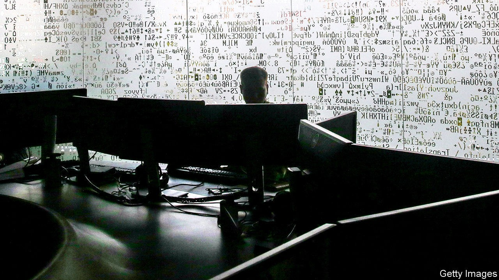
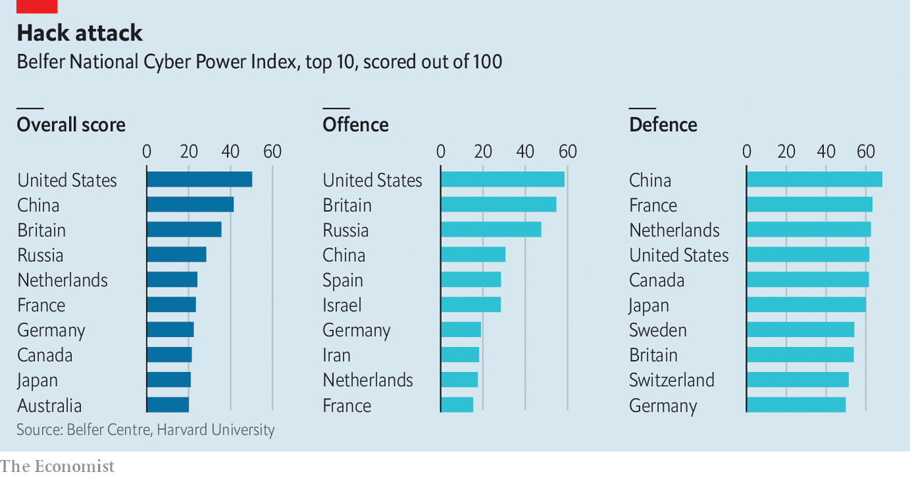

## Digital dominance

# A new global ranking of cyber-power throws up some surprises

> America rules digital national security, China is not far behind

> Sep 19th 2020

CHINA HAS the world’s largest army. Russia wields the most tanks. America owns the fanciest satellites. But who has the most cyber-power? A new National Cyber Power Index by the Belfer Centre at Harvard University ranks 30 countries on their level of ambition and capability. Offensive cyber-power—the ability to do harm in or through computer networks—is one measure. But so too are the strength of a country’s defences, the sophistication of its cyber-security industry and its ability to spread and counter propaganda (see chart).

That America stands at the top of the list is not surprising. Its cyber-security budget for fiscal year 2020 stood at over $17bn and the National Security Agency (NSA), its signals-intelligence (SIGINT) agency, probably gets well over $10bn. The awesome scale of America’s digital espionage was laid bare in leaks by Edward Snowden, a former NSA contractor, in 2013, which showed the agency hoovering up vast amounts of the world’s internet traffic and trying to weaken encryption standards.

China, in second place, has demonstrated a voracious appetite for commercial cyber-espionage abroad and an iron grip on the internet at home. Britain, whose National Cyber Security Centre has parried over 1,800 cyber-attacks since its creation in 2016, is third. Britain is currently setting up an offensive National Cyber Force staffed jointly by spies and soldiers. Russia, whose spies interfered with America’s last election, is in fourth place.

The big surprise is the Netherlands in fifth place, ahead of France, Germany and Canada. Dutch expertise in analysing malware is particularly sharp, says a Dutch insider, who points out that this is handy both for spotting attacks and mounting them. The cybercrime team of the Dutch police has proved adept at apprehending online criminals. And in 2014 the small but world-class group of hackers working for Dutch intelligence managed to penetrate a computer network used by the SVR, Russia’s foreign intelligence service—including CCTV cameras in the building—allowing them to watch as the Russians hacked America’s State Department.

Measuring cyber-power is fraught with difficulty, warns Marcus Willett, a former deputy director of GCHQ, Britain’s SIGINT agency. Many experts are puzzled by Israel’s relatively low ranking on the Belfer index, despite its hacking prowess; its secrecy may be one reason for this. “Warships in the Antarctic can easily be seen,” says Mr Willett, “yet a piece of code inserted into a power plant is hard to detect.” Though some states acknowledge their offensive capabilities—America and Britain boast of smashing Islamic State networks in Iraq and Syria, partly as a signal to Russia and China—most shy away from doing so.

Many countries outsource the dirtiest work to deniable proxies, like “hacktivists” and criminals. And whereas procuring a warship or missile is expensive and time-consuming, potent malware can be stolen or bought online. WannaCry, a ransomware attack mounted by North Korea in 2017, used a hacking tool, EternalBlue, which had leaked out of the NSA.

A forthcoming study of cyber-power by Mr Willett and his colleagues at the International Institute for Strategic Studies (IISS), a think-tank, concludes that, although stealing things and disrupting networks is important, what matters most over the longer term is control of digital infrastructure, such as the hardware that runs mobile telecommunications and key apps. Dominance there will be crucial to economic strength and national security, says the IISS. On that measure, “only China is currently positioned to be able to make the jump to join the US in the first rank.” ■

## URL

https://www.economist.com/science-and-technology/2020/09/19/a-new-global-ranking-of-cyber-power-throws-up-some-surprises
