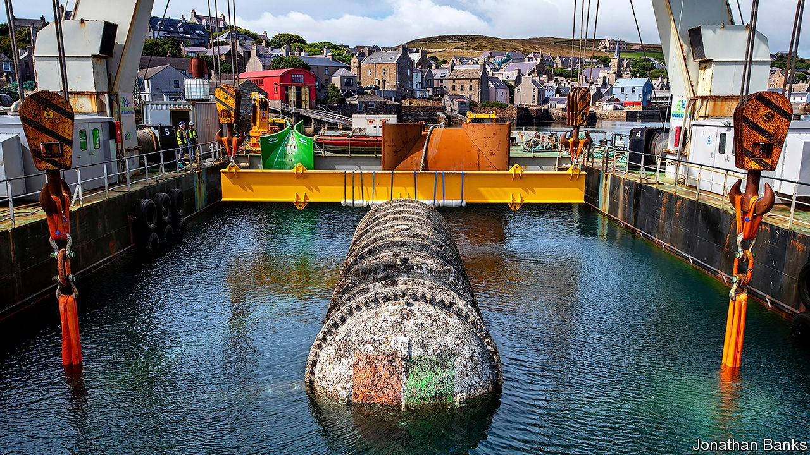

## Cloud computing

# Davy Jones’s data-centre

> Building server farms underwater is less crazy than it sounds

> Sep 19th 2020

EARLIER THIS year a ship hauled a large, barnacle-covered cylinder sporting a Microsoft logo from the seas off the Orkney islands. Inside were a dozen server racks, of the sort found in data-centres around the world. Sunk in 2018, and connected to the shore by cable, the computers had spent the past couple of years humming away, part of an experiment into the feasibility of building data-centres underwater.

On September 14th Microsoft revealed some results. The aquatic data-centre suffered equipment failures at just one-eighth the rate of those built on land. Being inaccessible to humans, the firm could fill it with nitrogen instead of air, cutting down corrosion. The lack of human visitors also meant none of the bumping and jostling that can cause faults on land.

Microsoft hopes some of the lessons can be applied to existing, land-based data-centres. In the longer term, though, it notes that building underwater offers advantages beyond just reliability. Immersion in seawater helps with cooling, a big expense on land. Data-centres work best when placed close to customers. Land in New York or London is expensive, but nearby sea-floor is cheap. More than half the world’s population lives within 120 miles (192km) of the sea. Ben Cutler, the engineer in charge of the project, says submarine data-centres could be co-located with offshore wind farms as “anchor” customers. The cylinder fits in a standard shipping container, so could be deployed to remote places like islands, or even disaster areas to support relief efforts. Water and electronics, it seems, do sometimes mix.■

## URL

https://www.economist.com/science-and-technology/2020/09/19/davy-joness-data-centre
