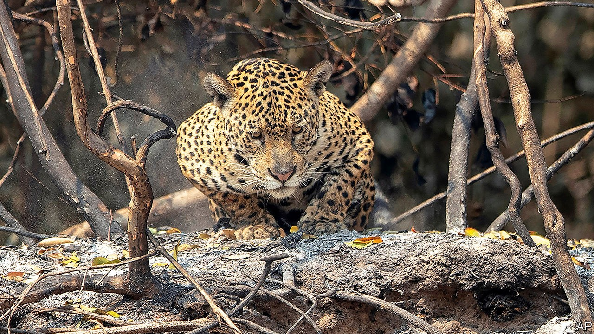
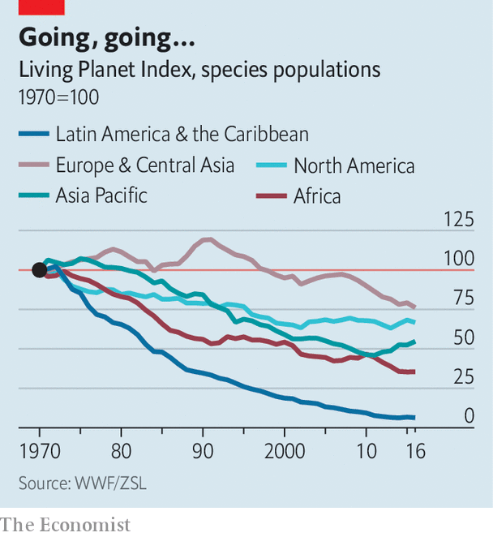

## Biodiversity

# Natural disasters quicken an already precipitous global loss of species

> Two new reports highlight how badly countries have been missing their biodiversity targets

> Sep 19th 2020

TROPICAL WETLANDS should be soggy and green, not lands of flaming vegetation. Yet the world’s largest tropical wetland, Brazil’s Pantanal, has been burning for weeks, in the largest blazes to take hold in the region since records there began in 1998. The consequences for one of the planet’s most diverse ecosystems are haunting. Blackened, starving jaguars wander amid the ashes, paws burnt through to the bone. They are the lucky ones. The charred remains of dead caimans, tapirs and monkeys bear testament to the less fortunate. Farther north in the Amazon, more than 20,000 fires were detected in the first two weeks of September, more than burned in the whole of September 2019.

In both regions, fires are set by farmers seeking to clear wild land for agriculture, encouraged by lax government policies. Deforestation in the Amazon is drying out the entire region, making the fires worse, and stymying “flying rivers” that carry moisture evaporated off the Amazon’s treetops downwind to the Pantanal.

Rainfall over the Pantanal this year has been at its lowest since 1973. Last year’s wet season was delayed, adding to the drought. On top of all this are the impacts of climate change. These are difficult to tease apart from natural climate variations in the Pantanal, but warmer temperatures and decreased rainfall in the region is consistent with some model results. Brazil’s National Institute for Space Research reports that there have been at least 15,000 fires in the wetlands since January, triple the number recorded over the same period in 2019 and a whopping 12-fold increase over the same period in 2018. A separate analysis by researchers from the Federal University of Rio de Janeiro suggests that, by September 6th, the fires had burned through a record 23,490 square kilometres—17% of the Pantanal’s total area.

This region is home to more than 1,000 species of birds, mammals and other vertebrates, almost 3,500 species of plants, and more than 9,000 species of insects and other invertebrates. It is not known how they will recover from the fires, but there are likely to be long-term impacts. Fire-adapted grasses will regrow much faster than tree species. Trees that are scorched, but which nonetheless survive, are less likely to make fruit next year, which will have knock-on effects on the remaining animals that rely on them for food.

This is the ugly face of biodiversity loss. Earlier this week the UN Convention on Biological Diversity released its fifth report on biodiversity, an assessment of progress made towards a set of international goals intended to halt the global loss of species. The 20 targets were adopted by the 196 nations that are party to the Convention in 2010, and were due to be met by 2020. Yet none have been. Metrics for many of the targets have stagnated or worsened.

There are some bright spots. In the 2010s the global rate of deforestation declined by a third compared with the previous decade and protected areas grew. Where good fisheries-management policies have been introduced, such as Chile, South Africa and Indonesia, the biomass of marine fish stocks has rebounded. The rate of extinction in birds and mammals is estimated to have been halved compared with a scenario without action.

But these efforts are still thin on the ground, as shown by the Living Planet Report, published last week by the WWF, an environmental group. The biennial assessment of the state of global biodiversity tracked data from 20,811 populations of 4,392 animal species. It found that animal populations worldwide shrank by an average of two-thirds between 1970 and 2016. The falls were greatest in the tropics. In Latin America and the Caribbean animal populations fell by 94%, on average, during the period (see chart).

Humans destroying wild ecosystems in favour of mining, urbanisation or, as in the deforestation in Brazil, agriculture, are a primary culprit. Invasive species are another factor. But undoubtedly the most important emerging threat to species is the destabilisation wrought by climate change. Around the world it is altering ecosystems, changing mating seasons and affecting food supplies.

Before humanity hit pause on its priorities to deal with a global pandemic, ecologists and politicians were due for another UN biodiversity summit in October in Kunming, China. Covid-19 has delayed that meeting until May 2021. Parties to the UN Convention on Biological Diversity would do well to look to Brazil and take note of what is at stake. ■

For more coverage of climate change, register for The Climate Issue, our fortnightly [newsletter](https://www.economist.com//theclimateissue/), or visit our [climate-change hub](https://www.economist.com//news/2020/04/24/the-economists-coverage-of-climate-change)

## URL

https://www.economist.com/science-and-technology/2020/09/19/natural-disasters-quicken-an-already-precipitous-global-loss-of-species
