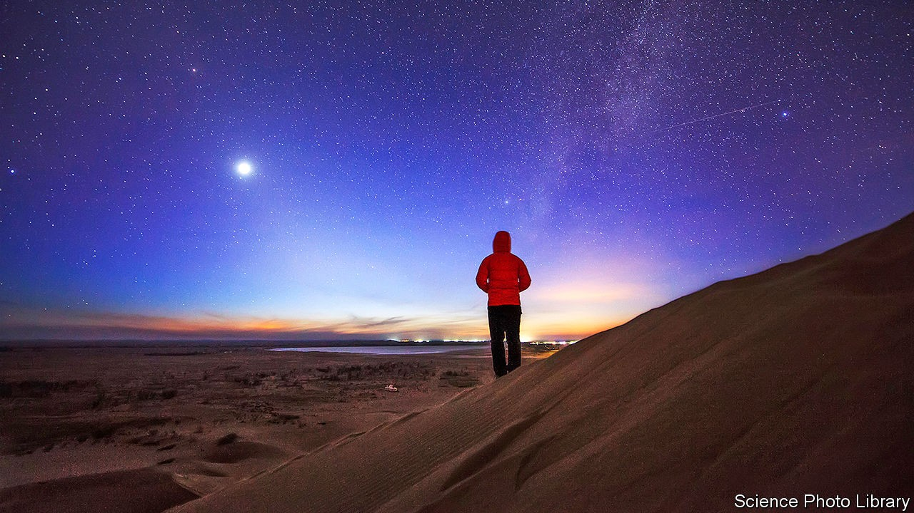
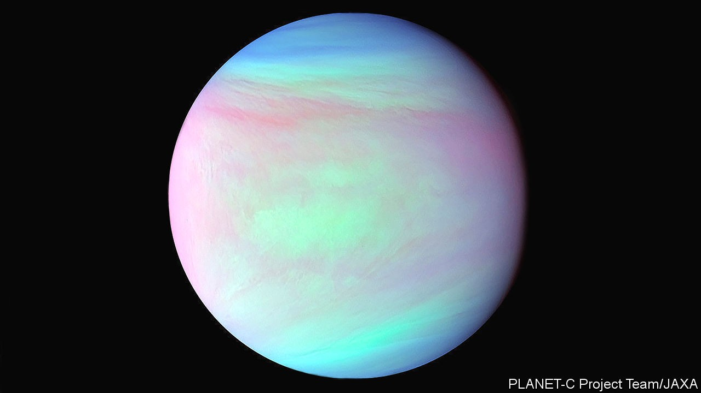

## Planetary science

# Scientists find possible signs of life in the clouds of Venus

> The discovery of phosphine in the planet’s atmosphere could redirect the search for life beyond Earth

> Sep 14th 2020

OF EARTH’S TWO planetary neighbours, Mars and Venus, it is Venus which shines brighter in the sky, comes closer in space, and is more similar in size and physical structure—almost Earth’s twin. But over the past 60 years it has been Mars that has held most attention. There are currently six operational spacecraft in orbit around it and two others are on its surface; more are on their way. Venus is observed by a single, small, ageing satellite. Yet following a new discovery made with telescopes on Earth, it is Venus which arguably now looks more likely to harbour the thing that planetary science cares most about: life.

The telescopes—the James Clerk Maxwell Telescope (JCMT) in Hawaii and ALMA in Chile—work not in visible light, but radiation that lies in between infrared and radio waves. The hot depths of Venus’s atmosphere give off a fair bit of radiation at these wavelengths. The molecules in the cooler air above absorb some of it as it passes out into space; the specific wavelengths absorbed depend on the molecules doing the absorbing. A team of scientists now report in Nature Astronomy that one of the molecules appears to be phosphine (PH3), composed of phosphorous and hydrogen.

This is a striking anomaly. In an atmosphere composed mostly of carbon dioxide, like Venus’s, phosphine should be able to survive only briefly before chemistry destroys it. For it to be persistent—the observers reckon it makes up perhaps 20 parts per billion of the atmosphere—something must be producing it.

On Earth, where there are on average a few parts per trillion of phosphine in the atmosphere, its presence seems to be almost entirely because of chemists (among other things, it is a potentially deadly by-product of badly run meth labs) and microbes. That means it has strong potential as a biomarker.

The discovery in the 1960s that the surface of Venus was far hotter than the ovens used to sterilise surgical instruments seemed to rule out any chance of life there. Still, a few scientists wondered if there might be life above the searing surface. The water droplets in Earth’s clouds contain living bacteria; though Venus’s clouds are incredibly acidic, might they too be inhabited by some sort of super-hardy bug?

The idea of detecting life through an otherwise inexplicable anomaly in a planet’s spectrum dates back to the 1960s, when it was given voice by James Lovelock, a British chemist and inventor. After astronomers started discovering exoplanets (planets that orbit other stars) in the late 1990s, they also began hypothesising what anomalous gases they could look out for as potential signs of life.

A few years ago, astrobiologists led by Sara Seager of MIT got interested in phosphine. Though it is not clear how microbes make it, or something which decomposes into it, its association with life is pretty clear (penguin guano seems rich in the stuff, for example). There seem to be no appreciable mechanisms for making it abiotically either in the depths of the Earth or through the photochemical reactions driven by sunlight which create other short-lived gases in the atmosphere.

In 2017 Jane Greaves of the University of Cardiff, thinking along similar lines, used the JCMT to look for phosphine lines in the atmosphere of Venus—not an exoplanet, but much easier to study. She and her colleagues saw something in the appropriate part of the spectrum; but the signal was weak. Dr Greaves decided to pursue the idea further using the more powerful ALMA, an array of 66 antennae in the Atacama desert. Those observations, made last year, provided a significantly better signal-to-noise ratio.

After the first observations, Dr Greaves’s team and Dr Seager’s heard about each other and pooled their resources. Dr Seager’s team has worked out that any microbial metabolism producing phosphine would probably work best in a very acidic environment—rather like that of Venus, where much of the cloud deck is almost pure sulphuric acid. Dr Seager, Dr Greaves and some of their colleagues developed a new model for how such life might function, with cells reproducing in the cloud droplets and turning into desiccated spores as the droplets fall towards the surface. Rising winds then bring some of these spores back up to the clouds, where they get absorbed into—or possibly catalyse the creation of—new droplets in which to reproduce once again. This hypothesis is being published in Astrobiology, a journal.

This speculation is fascinating, but also of a sort which might raise alarm bells. The team did not look at the whole spectrum dispassionately to see what was there; it sought out a feature that could be explained by phosphine, a molecule in which at least some of the scientists were already invested, and found what they were looking for. What is more, as they say in their paper, “we emphasise that the detection of PH3 is not robust evidence for life, only for anomalous and unexplained chemistry.”

Two things need to happen before things get truly exciting. Other teams need to make their own observations, ideally at other wavelengths. And a really thorough search for ways of making phosphine without biology under the conditions seen on and above Venus needs to draw a blank.

The team behind the latest detection has done some of this latter work, arguing that the phosphine cannot come up from volcanoes, drift down from comets, or be made in mid-air through photochemistry. But the chemistry that happens on surfaces can be very different from what happens in mid air, and Venus’s atmosphere, as well as offering extremes of temperature, pressure and acidity, has surfaces to spare, both in its cloud decks and in the hazes that float above and below them. Imaginative chemists should have a field day working through ever more abstruse possibilities.

On the issue of independent observations, the history of methane on Mars provides a cautionary tale. In 2004 scientists using three Earth-based telescopes and a spacecraft orbiting Mars all thought they had detected what appeared to be the spectral signature of methane in the planet’s atmosphere. It was a classic Lovelock anomaly. Chemical models insist that methane does not last all that long in the Martian atmosphere, so these observations suggested there had to be a continuous source of the gas. And on Earth most, though not all, methane is produced by microbes. What was more, there was an increasingly widespread belief that, although there is now only a smidgen of water on the surface of Mars, there might be plenty more below it, perhaps in deep aquifers. On Earth microbes are found many kilometres below the surface. Maybe Mars had a similar “deep biosphere”?

Maybe. But if so, there is currently no persuasive evidence that it is producing methane. In 2018 the European Space Agency’s Trace Gas Orbiter started to examine Mars’s atmosphere with much more sensitive instruments than had been used before. It has seen no evidence of methane at anything like the level previously claimed.

The chain of reasoning which made a deep Martian biosphere plausible applies to theories about life above Venus, too. In the distant past, when it had a thicker atmosphere, Mars clearly had running and standing water at its surface, at least sporadically. As Mars lost its atmosphere its surface became ever more arid and frigid. That put evolutionary pressure on any microbes previously living in those surface waters to migrate deeper and deeper into the still warm and moist subsurface.

The surface of Venus, too, has dried out over its history—but through heating, not cooling. For billions of years the Sun has been growing brighter. On Venus this eventually triggered what atmospheric scientists call a “runaway greenhouse effect”, boiling away its seas. If there had been microbes in the surface waters of Venus before this catastrophe, evolution would have urged them not into the depths, as it did on Mars, but into the skies, where even today the temperature remains bearable and water remains liquid, though admittedly in droplets not oceans.

It is a beguiling story of life finding a way, first suggested as a possible explanation for some oddities in the way the clouds absorb ultraviolet which could, with a significant exercise of the imagination, be taken to imply microbes. The way to find out for sure would be to go and take a closer look. NASA has not launched a mission to Venus since the 1980s, though two are being considered: VERITAS would be an orbiter intended to map the surface; DAVINCI+ would have a chemistry lab that would descend through the atmosphere.

The next confirmed mission to Venus is the Indian Shukrayaan-1 orbiter, pencilled in for launch in 2023, which should leave enough time to put on a phosphine-optimised instrument. Meanwhile, Dr Seager has secured a grant from Breakthrough Initiatives, a research programme funded by Yuri Milner, a Russian billionaire, to investigate the scientific case for life on Venus and the technical challenges of a potential exploratory mission.

Carl Sagan, who wrote a rather remarkable article about the possibility of balloon-like creatures in the clouds of Venus in the 1960s, is well remembered in astrobiological circles for the dictum that “extraordinary claims require extraordinary evidence”. Planetary observations are full of anomalies: you cannot invoke extraterrestrials willy nilly to explain them, creating what David Grinspoon, an astrobiologist, calls “aliens of the gaps”. No one is yet saying life exists on Venus, and the current claim can command attention simply by being intriguing, which it definitely is.

But it may be that the first half of Sagan’s dictum needs re-examining, as far as the hunt for life is concerned. Not long ago scientists had almost given up on finding life anywhere in the solar system beyond Earth. Now astrobiologists are investigating the possibility of life on, in or above Saturn’s moon Titan, or in the ice-covered ocean of one of the planet’s other moons, Enceladus. Jupiter’s moon Europa is also a possibility. And there is always Mars.

If science finds life on or in any of those bodies, the idea that its presence is in itself extraordinary will take a knock. If they find it over hellish Venus, life will come to look yet less like an odd exception. Indeed, at the microbial level at least, life may turn out to be quite ordinary. But that will make it no less wonderful. In some ways, it may make it more so.■

## URL

https://www.economist.com/science-and-technology/2020/09/14/scientists-find-possible-signs-of-life-in-the-clouds-of-venus
