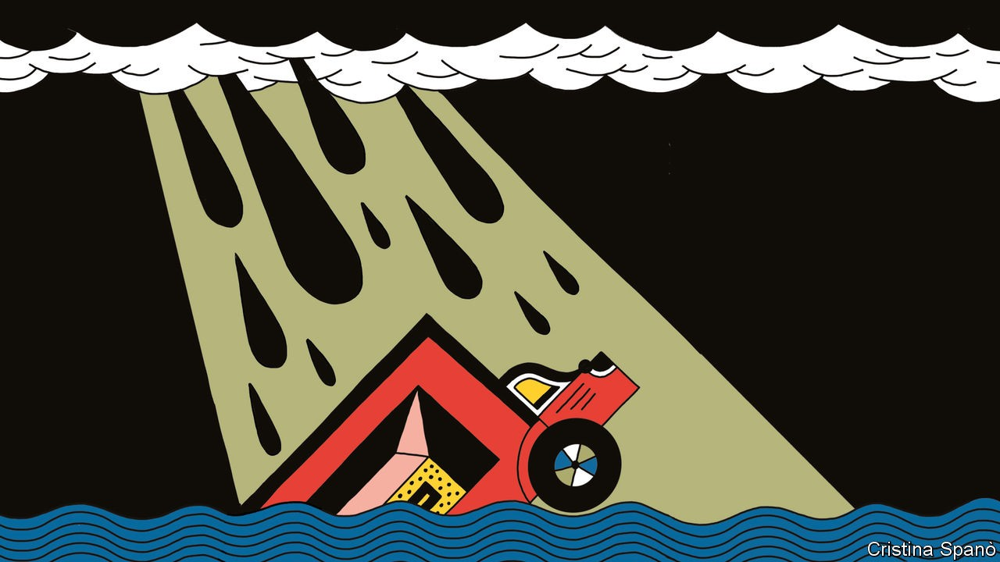
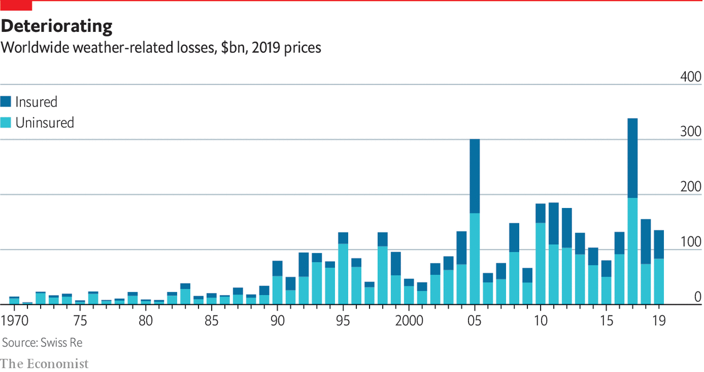

## Physical impact

# A grim outlook

> How worse weather will disrupt businesses and their supply chains

> Sep 17th 2020

IN 2012, WHEN post-tropical storm Sandy devastated New York, the city was left in darkness. Among the few buildings still lit up was the headquarters of Goldman Sachs, which had a 25,000-sandbag wall and a backup generator. Gary Cohn, then the bank’s president, said one problem was how to get staff into the office in a shut-down city. In 2018, after a storm battered Vancouver Island, falling trees toppled electricity poles. The resulting power cut led to the closure of a water-treatment plant. And last January, when wildfires ravaged Australia’s outback, the toxic air hampered production at a coalmine owned by BHP, a commodity giant.

Businesses have always had to adapt to a changing environment. But climate change is making this far harder. As weather conditions worsen, some companies are responding. But it is impossible to mitigate all the risks. For many firms, the physical impact of climate change will affect them more through disaster-struck suppliers or inundated transport routes than in their own operations.

That indirect impact makes physical risks trickier both to assess and to manage. One result may be shorter supply chains, with more products made close to home. Firms that rely on foreign suppliers may have to spend more to make their imports resilient to the climate. The move towards shorter supply chains is already under way, thanks to trade wars and covid-19. But whereas the pandemic will eventually subside and trade wars should abate, the climate is shifting from stable to less so. “Things will just keep on changing,” says Hauke Engel of McKinsey, a consultancy.

Climate change is clearly making the weather more extreme. Scientists say super-powerful storms have become more common, and there are more days of heavy rainfall or extreme heat. No matter what mankind does, this trend will continue for decades. Global temperatures respond only slowly to changes in the concentration of greenhouse gases in the atmosphere. Deteriorating conditions are locked in for some time.

Even if the goals of the Paris agreement were met and warming limited to below 2°C, the weather would keep getting worse. This may mean, among other things, a 40-80cm rise in sea levels, a 25% increase in dangerously hot days and a 36% jump in the quantity of rainfall over land. And each additional degree of warming increases the impact. Between 1981 and 2010, the average likelihood of a big heatwave (defined as at least four days with maximum temperatures above the 99th percentile of a normal warm season) was 5%. With global temperatures up by 1.5°C over pre-industrial levels that probability rises to 28%. At 2°C it is 49%, and by 4°C 92%. Likewise, floods that in the past might have happened only once in 50 years become more frequent as temperatures rise. One would happen every 42 years with 1.5°C of warming, every 34 years with 2°C and every 19 years with 4°C.

The physical effects of such changes will hurt the world economy, though precisely how much is hard to predict. Most estimates have hefty error margins and forecasts that stretch vaguely to the end of the century. Some analysis of the costs to businesses are more convincing than others, partly because time horizons are shorter. Most assets last for only 10-20 years, so forecasting to the end of the century is unnecessary. And facility-level data give researchers a more accurate grasp of a firm’s climate exposure. The pain will certainly be greater in poorer countries, which have less capacity to adapt and tend to be closer to the equator, where the weather is already harsher.

Two particular pieces of analysis illuminate the threat both by sector and by natural event. Both demonstrate how climate risk is unevenly spread. The first comes from Schroders, an asset manager. Its analysts looked at the physical risks posed to 11,000 publicly listed companies and concluded that climate change could reduce the firms’ value by 2-3% on average. But the numbers vary greatly by industry. Energy and utility sectors stand to lose 4% and 8%, respectively. Property firms could lose up to 9%. For services firms with few physical assets, such as tech and finance, the impact is smaller: less than 0.5% of their value.

In a separate piece of number-crunching, Four Twenty Seven, a climate consultancy, looked at the events that most threaten facilities owned by publicly listed firms. Water stress was the most prominent, affecting 30% of assets. Another 10% were at risk from heat stress and roughly 20% were vulnerable to floods, hurricanes and typhoons. Sea-level rise was the least concerning for businesses, affecting only 3% of assets in the data set.

As its impact becomes clearer, companies have to take climate change more seriously. Partly that reflects growing pressure from regulators, who want them to disclose their climate risks. Doing this is already mandatory for some firms in France. The European Union, Britain and Canada will follow suit. Institutional investors are also pressing for fuller disclosure, a key demand of the Climate Action 100+, a group of investors that includes BlackRock, the world’s biggest asset manager, and Fidelity, one of its rivals. Consumers and customers, especially younger ones, are calling for tougher and faster action on climate change.

More businesses now carry out risk assessments. But they may not be revealing the true extent of their exposure. Disclosures are self-reported, so it is easy for companies to downplay their risks, says Emilie Mazzacurati, of Four Twenty Seven. Firms may also talk up opportunities, such as selling new products to green-minded consumers. Last year the CDP, an environmental charity promoting emissions disclosure, surveyed the self-reported climate risks of 200-odd big firms. Total risks added up to roughly $1trn (5-7% of the firms’ value). But, somewhat suspiciously, the offsetting opportunities were put at more than twice as high.

Companies will not always get to mark their own homework. Third-party analysis is improving fast. Climate-risk consultancies are combining asset-level data with climate and econometric models to generate estimates of values at risk. “We now know many firms’ climate risk better than they do,” claims Rohan Hamden, the boss of the Cross Dependency Initiative, a Sydney-based climate-risk firm. Investors are doing similar analysis or hiring consultants. Many say they use analytics to exclude vulnerable firms from specialised climate funds.

A small minority of climate-conscious companies are making their operations more resilient. In every one of the 60-odd geographic regions in which Microsoft operates, it has built two data centres, in case one is struck by an extreme weather event. Kurita Water Industries, a Japanese company, spent $22m moving its offices to a place less exposed to cyclones. Some companies want more sophisticated analysis. A year ago it was acceptable just to model the exposure of a building, says James McMahon, of The Climate Service, a consultancy. Now property companies want to know how flooding will affect rents or their assets’ resale value in ten years’ time.

Defending an office or factory is reasonably straightforward. A thornier problem is supply chains. The world economy promotes efficiency in suppliers and transporters, not resilience. The risk to trading networks from climate change is often overlooked. Transport hubs are key. Airports and seaports process huge quantities of goods. A disaster that downs one can have an outsized impact, says Andrew Coburn of Cambridge University’s Centre for Risk Studies, an academic group. Along with colleagues, he has analysed maritime trade and identified 21 pinch points. These include the Suez canal (which carries 8% of global trade) and the Panama canal (4%), where falling water levels are forcing ships to shed cargo. Similar pinch points exist for air freight.

Another problem is critical infrastructure, such as electricity or telecoms. When power is cut, other services go down as well. Most telecoms towers have backup batteries that last for only four hours. Smartphones run out of power after about ten. After Superstorm Sandy, two-thirds of New York’s petrol stations were unable to dispense fuel because of power cuts.

The more complex a good, the greater the risk of disruption. Industries that rely on many suppliers and layers of manufacturing between the raw materials and the finished product tend to have more supply-chain risk than operational risk, explains Milan Simic of AIR Worldwide, a climate-modelling firm. Three particularly exposed industries are automotive (a single vehicle has approximately 30,000 parts, including the fasteners and screws), consumer electronics and semiconductors.

The risks are amplified when suppliers cluster in specialised regions. About 70% of the world’s smartphones are assembled in one region of China. Another sub-region accounts for half of global laptop production. That was a problem when covid-19 struck, because many laptop vendors hold just two weeks’ supply, says Razat Gaurav, the boss of Llamasoft, a supply-chain analytics firm. The risk of these regions being disrupted is rising. Today a one-in-100-year hurricane could bring semiconductor manufacturing to a standstill. By 2040 such an event will become two or even four times more frequent, according to McKinsey.

For companies trying to cope with climate risk in their supply chains, the simplest option is a contingency plan. So far many of these are inadequate, says Mr Gaurav. Backup suppliers are often from the same region, so the risk is not properly spread. Smart management of inventories helps by allowing goods to be sold even if the weather is disruptive. Pharmaceutical companies with bases in Puerto Rico track storms and move their products off the island ahead of hurricane season, says Katherine Klosowski of FM Global, an engineer-cum-insurer. For small products, storage can be cheap. McKinsey estimates that warehousing for semiconductors adds only 1% to the total price.

Another idea is to help suppliers become more resilient. Making factories in South-East Asia sturdier would add roughly 2% to building costs. Unilever owns tea in plantations near Kenya’s Mau forest. It has planted around 1.4m trees nearby to sustain the forest’s natural water supply for the plantations. Even so, there is only so much a company can do in advance. “About 20% of our supply chain resilience is proactive; 80% is reactive,’’ says Marc Engel, the firm’s head of supply chains.

There will inevitably be political pressure on governments to do more, if only because taxpayers often foot the bill for climate damage through disaster recovery schemes. Around two-thirds of weather-related losses are uninsured. In 2017 America’s Congress appropriated $136bn in emergency funds for climate-related disasters. That amounts to $1,000 for every American taxpayer, notes Paul Bodnar, of the Rocky Mountain Institute, a think-tank. City governments like Miami’s have introduced taxes to pay for climate defences. Over the next decade Mr Sorkin expects regions to compete over which can best protect its citizens. “People want to work in safe places, and capital will follow.”

Governments must play an even bigger part in how businesses respond to climate change in future. New climate-friendly rules will determine how quickly companies decarbonise—and how costly it will be for those that fail to do so. For many firms, the regulatory risks associated with climate change may be larger even than the physical ones from more storms and floods.■

## URL

https://www.economist.com/special-report/2020/09/17/a-grim-outlook
