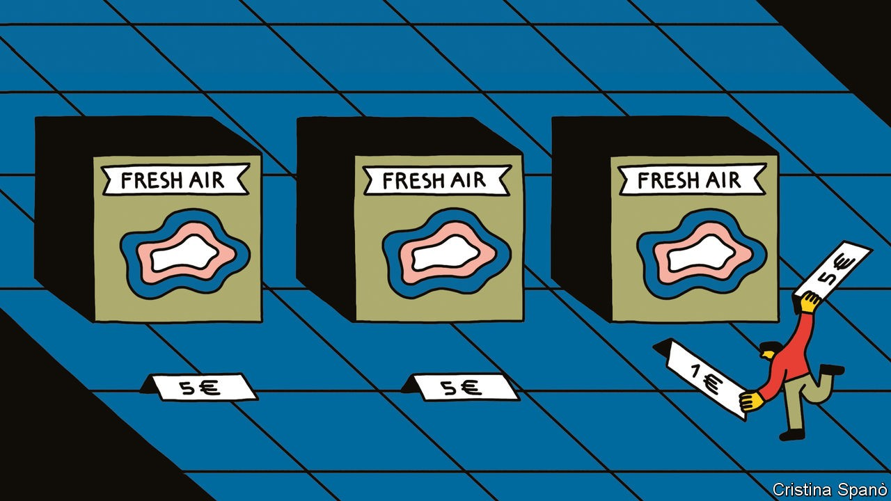

## Carbon offsets

# Cheap cheats

> Why are carbon offsets so cheap?

> Sep 17th 2020

CARBON OFFSETTING is in vogue. The practice involves giving money to a green charity that takes action, such as planting trees or building solar panels, to stop emissions entering the atmosphere or to remove them from it. In 2018 around $296m was spent buying the equivalent of 98m tonnes of CO2 offsets in the “voluntary” market (ie, outside government-mandated schemes). That is roughly twice the volume and value from the year before, and a seven-year high, according to Forrest Trends, a lobby group.

The boom has been aided by corporate demand. In 2019 EasyJet, Shell and other large emitters announced offset buying schemes. These are usually for firms going carbon-neutral (offset all emissions) or working to a net-zero emissions target (reduce emissions, then offset the rest). From 2021 an industry-wide scheme will mean that airlines start offsetting some of the growth in emissions from flights.

But offsets are oddly cheap. The average price in 2018 was $3 per tonne of CO2. The EU’s cap-and-trade scheme charges about eight times that. EasyJet wangled a below-average price, costing £25m, or 6% of pre-tax profits, to offset all its flights. What explains such low prices?

One answer is that big companies are able to buy in bulk, lowering the price. EasyJet says that, had passengers bought offsets individually, the cost would have been about four times higher. For their part, offset suppliers like the certainty of sales, which helps finance long-term projects. But another reason is that many offset projects are ineffective, especially those that offer “avoided emissions” (ie, those that would have happened without the project). It is hard to prove that an offset-financed wind farm would not have found cash elsewhere. (EasyJet says the effectiveness of its offsets is verified by a third party.) A study published by the European Commission in 2016 into one big programme found that 85% of the offsets had no environmental benefits.

The offsets with the hardest-to-measure impacts are also the most popular. Forestry schemes make up half the voluntary market. Yet many claiming to avoid deforestation cannot guarantee that loggers do not just cut down trees somewhere else. Some projects protect trees on unthreatened lands, such as national parks, says Gilles Dufrasne, of Carbon Market Watch, another lobby group. And the trees must remain standing for many years before the CO2 reduction is absorbed. Often that period is 100 years—plenty of time for corporate promises to be forgotten.

## URL

https://www.economist.com/special-report/2020/09/17/cheap-cheats
