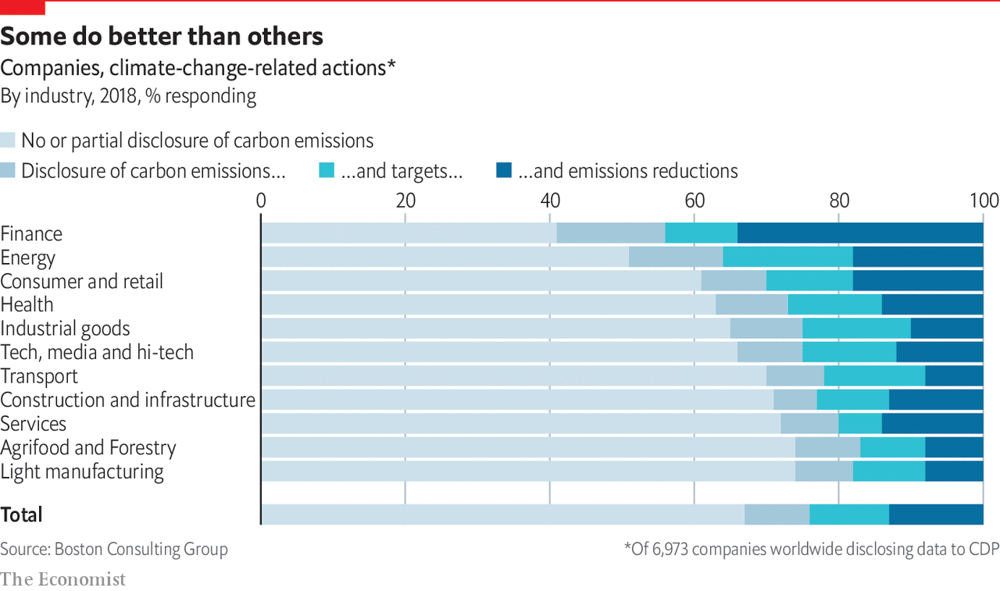
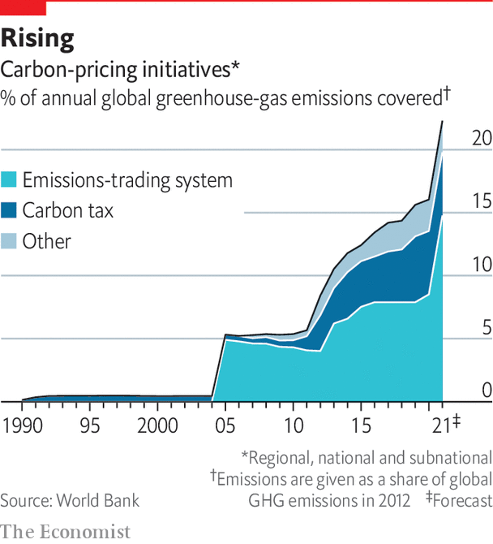

## Regulation

# Costs of carbon

> Rising regulation will force more firms to decarbonise

> Sep 17th 2020

SUPPORT FOR solar panels in Georgia came from a surprising point on the American political spectrum. In 2013 Georgia Power, the local electricity monopoly, was reluctant to increase the use of solar panels. That irked Debbie Dooley, a preacher’s daughter and co-founder of Atlanta’s Tea Party, a hard-right Republican faction. She wanted more energy independence, and rooftop solar was one answer. Forming an alliance with the Sierra Club, a green lobby group, she established the Green Tea Party coalition. It helped defeat a bid by Georgia Power to hit rooftop-solar customers with high fees. Since 2013 Georgia’s solar capacity has jumped more than 13-fold.

Politicians of all stripes are introducing green regulations. The Grantham Research Institute at the London School of Economics counts over 1,900 pieces of climate legislation around the world. Almost two-thirds were enacted in the past ten years. That may be good news for the planet, if perhaps not for many firms. By one estimate transition-related regulation, particularly carbon pricing, and technological disruption could reduce the market capitalisation of 1,400 of the world’s biggest companies by 3%, or $1.6trn. And the costs are not evenly spread. For some the figure will be as big as 60%. In anticipation of carbon pricing, a small minority of companies are decarbonising—but too few to save the planet.

More rules are likely. Urged on by voters, policymakers are setting ever tougher green targets. Over 70 countries have committed to reaching net-zero by at least 2050. The EU proposed a net-zero target in law in March. All but one of the G7 countries have made similar commitments. America is the odd one out. Donald Trump, its president, has dubbed climate change a “hoax”. His administration has rolled-back 68 environmental regulations, according to the New York Times. His scepticism has emboldened other world leaders such as Brazil’s Jair Bolsonaro to pursue environmentally destructive policies. And Mr Trump has begun the process of withdrawing from the Paris agreement.

Yet many American states and cities have pushed back. Some have sought to challenge Mr Trump’s rollbacks in court. Others have introduced their own green rules. Thirty of the 50 states have renewable-power portfolios; more than ten have low-carbon fuel standards for cars. Moreover, the polls suggest that Mr Trump’s days in office are numbered. His Democratic opponent, Joe Biden, is promising to make fighting climate change a centrepiece of his presidency. He plans to spend $2trn in four years on low-carbon infrastructure and energy. He wants to join others by going for net-zero by 2050 and emissions-free electric power by 2035. Mr Biden was part of the team that helped negotiate the Paris agreement, which he plans to rejoin.

If he is elected, an early test of Mr Biden’s ambitions may be America’s “nationally determined contribution” (NDC). These are decarbonisation plans that countries promised to devise under the Paris agreement. Their cumulative impact is not currently sufficient to meet the Paris goals. But the signatories also agreed to “ratchet up” their NDC ambitions every five years. The first round of updates were due this year. If Mr Biden wins, he could announce a new NDC in early 2021. Climate warriors will hope for national carbon pricing, which Mr Biden supported as vice-president.

Such a move would be a huge boost for carbon pricing everywhere. About half of current NDCs mention the idea. In 2010 about 5% of the world’s emissions were covered by a carbon price. Today, that figure is over 15%. Next year China is expected to roll out the world’s biggest scheme. The EU currently has the next-largest, and plans an expansion. Yet the price of carbon varies enormously. In most cases, it is far below $75 a tonne of CO2, the level the IMF says would be needed to meet the 2°C target. In some places, the price has started to climb. It hit record highs in California and Oregon in late 2019 due to tougher fuel-emissions standards. Having corrected an oversupply problem, the EU price also rose to €24 a tonne in January, up from €8 in 2018.

How might an upsurge in climate regulation affect business? An analysis by Vivid Economics, a consultancy, and the Principles for Responsible Investment, a UN-backed group of investors, offers some answers. The researchers looked at the exposure of 1,400-odd publicly listed companies to “transition risks”—technological and regulatory threats from decarbonisation. Some $1.6trn, or 3.1%, of market capitalisation, would be wiped off the value of the MSCI All Country World Index, a gauge of global stockmarkets. This assumes regulations are enacted from 2020. If policymakers delay five years, even faster decarbonisation will be needed, meaning stricter rules and a sharper revaluation of assets. In such a case, values may fall by 4.5%. The longer policymakers delay, the greater the shock, warns Jason Eis of Vivid Economics.

Whenever it occurs, the shock will be concentrated. In the least-damaging scenario, four-fifths of companies would see their value move up or down by less than 10%. But the impact on the remaining fifth is bigger. The worst-performing 100 firms would lose 43% of their value; the best performers would gain 33%. Energy is the hardest-hit sector, followed by other high-emitting industries such as utilities and mining. Within sectors there are winners and losers too. Companies that embrace low-carbon strategies will do best; heavy polluters will suffer most.

Pressure to cut CO2 emissions comes also from the bottom up. Climate-conscious bosses say consumers are demanding greener products, especially in Europe. A survey by Yale University found that almost a third of Americans claim to have bought products because a company is taking steps to reduce global warming. Over a quarter say they have avoided products sold by firms opposed to such steps. Company boycotts, supercharged by social media, pose rising reputational risk. Some big firms, including Amazon and Nestlé, have changed environmental policies following the threat of mass consumer action.

Sweden may offer a glimpse of the future. Shoppers seem to be turning away from polluting products. Even before covid-19, flygskam (flightshaming) appears to have cut demand in 2019 for European flights from Sweden on SAS and Braathens, two Scandinavian airlines, by 4% and 12%, respectively.

Shrewd firms are preparing for the transition by decarbonising now. Broadly speaking, four approaches have been followed. The first is to sell dirty assets or buy clean ones. Royal DSM, a Dutch chemicals company, cut its carbon emissions by 90% from 2006 to 2019. About half came from selling carbon-intensive business units such as petrochemicals, says Feike Sijbesma, its former boss. Earlier this month the oil major BP bought stakes in two offshore wind projects in America from Equinor, Norway’s state-owned oil giant.

A second tactic, used especially by firms with high vehicle or power emissions, is to buy cleaner energy, thus not having to alter business models. The more clean power that firms buy the further costs fall, notes Nigel Topping, an adviser to the British government. Around 260 companies have pledged to use only renewable energy from 2050 or earlier. Since 2008 companies have bought more renewable power than the annual electricity capacity of Vietnam. Green cars are in vogue too. Over 80 firms, including Amazon, have vowed to add many more electric vehicles to their fleets.

A third method is to invest in new low-carbon products. Corporate spending on climate-related investments crept up from $135bn in 2013 to $172bn in 2018, according to the Climate Policy Initiative, an advisory group. Some of this is in-house. Take Maersk, a giant in shipping, an industry that accounts for about 2-3% of global emissions. If Maersk wants its ships to stop all emissions by 2050, it needs the new technology by 2030. It is examining new fuels, from ammonia-based ones to alcohol. “This is a completely new game for us,” says Simon Christopher Bergulf, the firm’s head of regulatory affairs.

Other firms are investing in startups. JBS and Tyson, two meat- sellers, have invested in plant-based protein. Zunum Aero, a Seattle-based outfit, plans to bring a small hybrid-electric aircraft to market. Its backers include Boeing and JetBlue, an airline. Oil majors’ venture-capital arms routinely invest in clean-energy firms. Chevron, Occidental Petroleum and ExxonMobil have all bought into startups trying to suck CO2 from the air.

The final idea is to decarbonise supply chains. Andrew Howard, of Schroders, says that on average 60% of a company’s carbon risk lies in its supply chain, not least because tax-hit suppliers may pass costs back up the chain. But cutting carbon out of supply chains is fiendishly tricky. The first problem is data. Most companies have armies of suppliers, few of which monitor environmental metrics. Next is the difficulty of persuading suppliers to take action. Ikea has a €100m fund to help suppliers buy renewable energy. Scania, a Swedish lorry-maker, trains suppliers on decarbonisation and conducts sustainability audits. Those who continue to fail will lose Scania’s business, says Henrik Henriksson, its boss.

Badgering suppliers is important for two reasons. First, some emissions are outside companies’ control. The Economist estimates that emissions from publicly listed, investor-owned companies account for some ten gigatonnes of greenhouse gases, a fifth of the world’s total. Much of the rest comes from farming, households, governments and state-owned firms. Second, the share of firms shrinking their carbon footprint is small. A report by Boston Consulting Group, a consultancy, and the World Economic Forum says that fewer than 3,000 of the millions of companies around the world reveal their full carbon footprints to the CDP’s emissions-disclosure programme. Around 1,600 of these have set emissions-reduction targets but fewer than 1,000 have actually cut emissions in the past year. The firms that abate are typically those for which it is easiest. Financial firms lowered emissions by 34% in the past year, compared with just 9% in the transport sector.

Among the biggest polluters, decarbonisation efforts are dismal. A report by the Transition Pathway Initiative, a research project set up by asset owners, looked at 238 energy, industrial and transport firms with big carbon footprints. Just 18% are on course to cut their emissions enough to help meet the 2°C target. A study by the Climate Action 100+ found a similar result.

Carbon taxes are not bad news for all firms. Carbon-efficient ones in high-emitting industries will gain an edge. They would pay a small levy under carbon taxes, while large costs would hinder competitors. Take the aluminium industry. Producing one tonne of the metal typically generates about 13 tonnes of CO2. But that figure varies greatly depending on the power source. It can be cut to four tonnes using low-carbon energy to power smelters. All the largest non-Chinese producers now offer low-carbon products.

For firms where change is the hardest, lobbying against climate regulations is quietly taking place. InfluenceMap, a research firm, says that since 2015 lobbying efforts among oil companies have slowed. But the American Petroleum Institute (API), a powerful trade group, increased its lobbying after Mr Trump’s election to encourage regulatory rollbacks. Some oil firms, such as BP and Equinor, have publicly distanced themselves from the API even while retaining membership.

A further explanation may lie in another rising fear: the threat of litigation. Lawsuits have long battered the tobacco industry. Could climate-change prosecutions be next?■

## URL

https://www.economist.com/special-report/2020/09/17/costs-of-carbon
