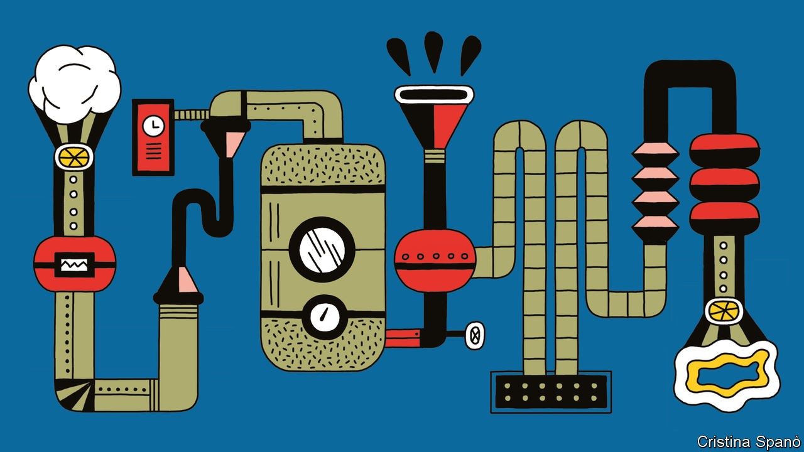
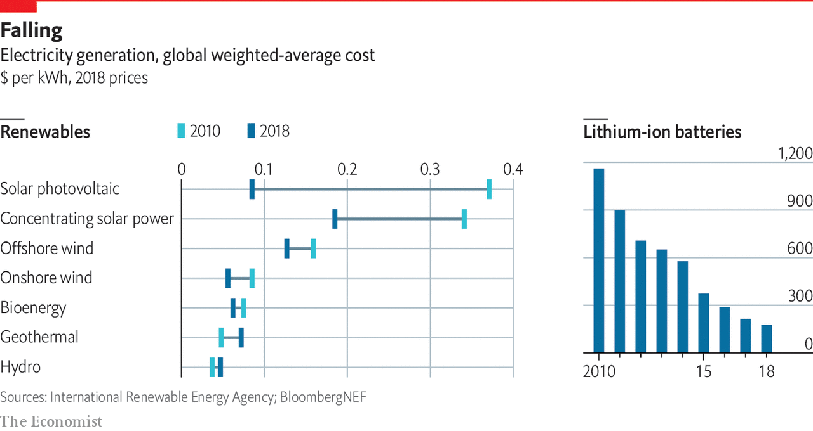

## Technology

# Green machines

> A wave of innovation may help tackle climate change

> Sep 17th 2020

“WE LOOKED for big industries that exist on inertia,” recalls Kathy Hannun. She used to work at Google X, the tech giant’s moon-shot division. Heating with fossil fuels was an example of an industry ripe for disruption. The distribution system is convoluted, argues Ms Hannun. Natural gas or fuel oil is taken from the ground, shipped across the world and piped into houses. But a huge amount of latent energy exists around us. In 2017 she founded Dandelion Energy, an attempt to harness that power by selling heat pumps, refrigerator-sized boxes that take heat from the air or the ground to warm a building. Orders grew fourfold in 2018 and 2019. Further expansion is likely. Last year 20m households purchased heat pumps. To stop the planet from overheating, the IEA reckons that number has to triple by 2030.

Yet that rate of growth may be optimistic without a push from regulators. Heat pumps face similar obstacles to other emissions-reducing measures. The upfront costs are large: some heat pumps cost over $15,000. And installation is disruptive, often taking days or weeks. Heat pumps are just the start: across the world entrepreneurs are busily inventing new technologies and tinkering with old ones. The opportunity is vast. The $1.2trn that the IEA says is needed for energy-system investment represents a 60% increase on current spending. But precisely which technologies and which firms flourish will depend to a large degree on getting the right pattern of regulation, subsidy and pricing.

This is best seen by considering four different places where greenery meets technological change. First comes the adaptation industry, which will thrive regardless, because of the physical risks linked to climate change. For the second, greater energy efficiency, to take off, something of a nudge from regulators will be required. The third, renewables, may need even more help, although prices have been tumbling. And the fourth, carbon removal, is nascent. It is still too expensive to remove a tonne of CO2 from the air and store it safely; the industry must have a high carbon price if it is to be competitive.

Start with adaptation. Even with a sharp, sustained fall in emissions, the weather is certain to keep getting worse. So governments and companies alike will have to spend more on adaptive measures, such as seawalls. The Global Commission on Adaptation, an intergovernmental body, reckons that to avoid the worst consequences of climate change, $180bn of annual investment is needed for a decade.

Infrastructure firms have seen climate-related work pick up since the Paris agreement in 2015. AECOM, an engineering firm, is designing measures to stop floods engulfing Route 37, a coastal road in California, including raising it 150cm (five feet) off the ground. The payback for such measures is high. Often a dollar invested in adaptation yields ten dollars in avoided damage, says David Viner of Mott MacDonald, another engineering firm.

Farming is adapting too. Bayer and Syngenta, two agricultural firms, are developing more resilient crops. A strain of shorter, sturdier corn is being tested by Bayer in Mexico. It needs less water and is less likely to be flattened by a storm. Worse weather will call for more varieties of new seeds. Bayer has spent $100m on a high-tech greenhouse in Arizona. In an automated process, a laser slices off a tiny fragment from an individual seed. The slice’s DNA is analysed while the rest is planted and grows normally. That allows researchers to track the genetic make-up of plants and find out which genes improve the likelihood of storm-survival. Along with other innovations, the process cuts the time when new seed varieties must be tested from two or three years to one.

Next come improvements in energy efficiency. In a scenario where the 2°C goal is met, greater efficiency could cut emissions by seven gigatonnes by 2040, about the same amount as renewables, according to the IEA. Up to a point, it makes economic sense as well. Analysts reckon that most companies can cut their emissions by 10-20% through greater energy efficiency and, in doing so, bring down their costs. That should be a boon for firms that pursue such goals—and those that sell them advice.

Schneider Electric, a French firm, is in the second group. Jean-Pascal Tricoire, its boss, says 70% of its revenue comes from green projects or energy-efficiency ones. Recently it ramped up a distribution centre for Lidl, a supermarket chain, in Finland. Rooftop solar panels, a microgrid and a smart energy-monitoring system were installed. Sensors cut wasted energy by switching off idle lights and machines. Excess heating from air-conditioning is stored for use when the weather cools. The system is so efficient that the surplus heat provides hot water for 500-odd homes nearby. Energy costs fell by 70%; carbon emissions by 40%.

Because decarbonising transport is so pricey, the potential efficiency gains are big. The Energy Transitions Commission (ETC), a global body, estimates that 35-40% of energy use in transport could be profitably saved. Digitisation is one way forward. Scania says the average lorry is only 60% full. One study found that 45 trucks visited a single department store in Copenhagen every day, whereas four fully laden ones could have delivered the same load. The firm is now planning to use GPS-trackers to cut unnecessary journeys. Similar gains can be made at sea. Ships often sail full-steam to get to port, then queue for hours or days before they can moor. PortXchange, a data company, cuts fuel use by alerting boats to port queues in real time.

The third area is renewables. In much of the world they are now cheaper than natural gas thanks to plummeting prices. More progress can be expected. Heliatek, a German firm, makes ultra-thin panels that can be printed onto flexible plastic. GE Renewable Energy, an engineering firm, is testing wind turbines as big as the Eiffel Tower. That is good news because a vast increase in renewable electricity will be needed. Adair Turner, chairman of the ETC, says decarbonising the economy will involve a threefold jump from 25 terawatt-hours today to 90 or so by 2050.

Because sunshine and wind are intermittent, better ways of storing energy are needed. Hydrogen and batteries are the frontrunners. Both have drawbacks. For a given volume, they store less energy than fossil fuels. Building the infrastructure to support them is a huge task, which requires much co-ordination (what low-carbon fuels should be available at petrol stations?). And even though the prices of both are falling, costs remain high.

One way to boost the amount of battery storage is through electric vehicles, which seem sure to spread. Because cars are parked 95% of the time, at any one moment a hefty amount of battery power is sitting idle. Enel X, the Italian utility’s innovation arm, is experimenting at its headquarters in Rome. Electric vehicles belonging to a dozen or so employees are hooked up to the grid using special two-way charging points. They provide about one megawatt of electricity, which is enough to serve hundreds of homes. “Electric cars for us are batteries with wheels,” says Eliano Russo, of Enel X.

Hydrogen is another form of storage. A recent report by BloombergNEF, a consultancy, finds that renewable hydrogen could cut up to 34% of global greenhouse-gas emissions from fossil fuels and industry. To do this would require $150bn in subsidies by 2030. That would bring prices down to a level competitive with natural gas in most of the world. Today most of the commercially produced stuff creates CO2 as a by-product. However “green” hydrogen can be made by splitting water into hydrogen and oxygen with clean power. It could then be pumped into existing pipelines and power natural-gas boilers. It could be used to cut emissions from many industrial processes, such as making ammonia. Or it could be stored in fuel cells and used to power vehicles. China is pursuing this idea. It spent a reported $12bn on fuel-cell subsidies in 2018. The share price of PowerCell, a Swedish outfit that makes hydrogen fuel cells, has doubled in the past year. In the same period Canada’s Ballard Power has seen its share price triple, while that of America’s Plug Power has risen fivefold.

The fourth idea is carbon removal. Between 100bn and 1trn tonnes of CO2 will have to be taken out of the atmosphere by 2100 if the 2°C goal is to be reached, according to a range of scenarios examined by the UN’s Intergovernmental Panel on Climate Change. The median value was 730bn tonnes. If carbon removal costs around $100 per tonne of CO2, an optimistic estimate for the foreseeable future, then annual global spending on carbon removals could easily reach $900bn in decades to come.

Many startups are trying to harness nature’s own carbon sequestration. One is Indigo Ag. Last June it launched a platform to pay farmers for absorbing more CO2 in their land. Soil is a natural store of carbon: the organic carbon into which plants transform the atmospheric CO2 is stored there in abundance. Changes in agricultural techniques, such as reduced deep-ploughing, help keep carbon in the soil. Indigo Ag’s first step is to measure the carbon content of soil. It uses an algorithm to crunch reams of data, from satellite imagery to information from tractor-based sensors, and generate estimates with 85% accuracy. Farmers who successfully use carbon-absorbing approaches will be paid for each additional tonne of CO2 sequestered. The firm sells the offset, at around $15-20 per tonne, with a mark-up for its trouble.

That may sound cheap, but it comes with risks. One is how securely the carbon is stored. A heavy storm could release some of it. An alternative source of negative emissions is machines or “direct-air capture” (DAC). Climeworks, a company based in Zurich, makes smart-car sized DAC machines which contain a fan drawing air through a filter, a bit like a sponge. Once saturated, the filter is heated and carbon is captured. Today it costs $600-800 per tonne of CO2 removed. Two other firms pioneering DAC technology, Carbon Engineering and Global Thermostat, also have price points firms deem too high to be commercially viable. And the scale is still too small. But a new facility that Climeworks is planning will suck 4,000 tonnes of CO2 out of the air each year, equivalent to the annual footprint of 600 Europeans.

That plant will be built with Carbfix, an Icelandic startup. Its researchers are trying to accelerate mineralisation, a natural process whereby CO2 is transformed into rock, over hundreds of years. Captured from a geothermal power plant or through DAC, CO2 is dissolved in water and injected into rock formations 500 metres underground. After two years, the carbon becomes rock and is stored in a stable form. Storage costs about $25 per tonne. The next step is to take the process offshore, storing carbon under the ocean. Seabeds are often made of deposits of basalt, the type of rock required. A pilot project will start in the next few years. If successful, it will create almost “limitless storage”, says Edda Sif Aradottir, Carbfix’s boss. The world may need it.■

## URL

https://www.economist.com/special-report/2020/09/17/green-machines
