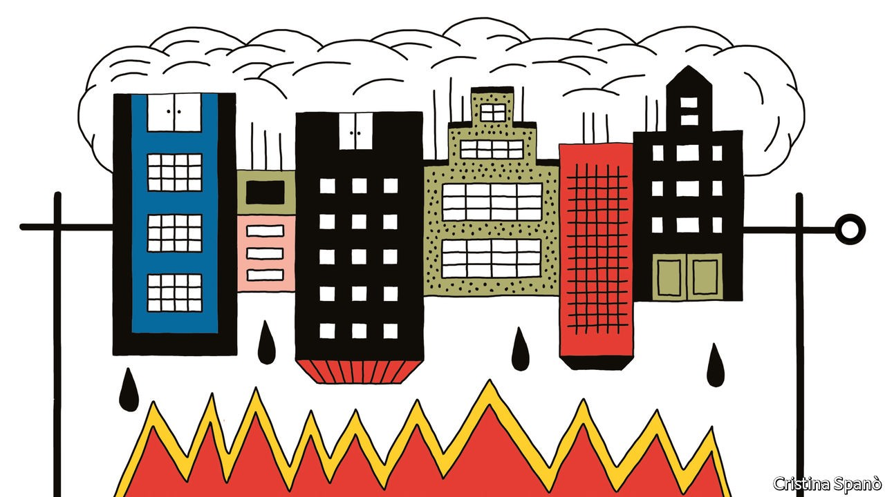
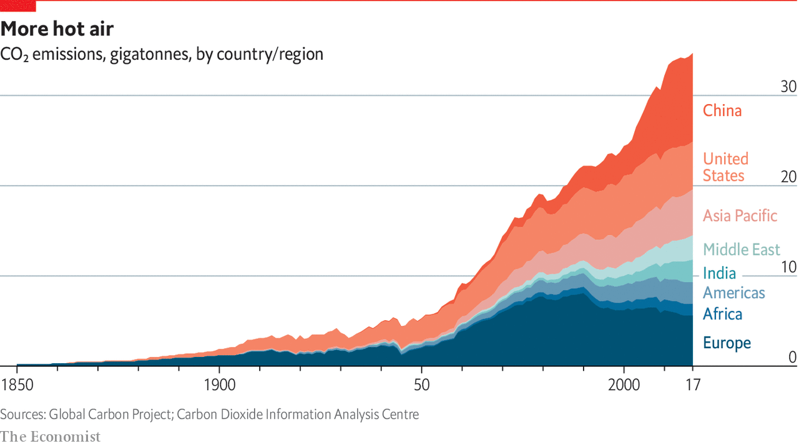

## Business and climate change

# The great disrupter

> Climate change is about to upend the corporate world. Firms must react fast, says Guy Scriven

> Sep 17th 2020

For more coverage of climate change, register for The Climate Issue, our fortnightly [newsletter](https://www.economist.com//theclimateissue/), or visit our [climate-change hub](https://www.economist.com//news/2020/04/24/the-economists-coverage-of-climate-change)

FOR MOST of the world, this year will be remembered mainly for covid-19. Starting in Asia, then spreading across Europe and America before taking hold in the emerging world, the pandemic has infected millions and killed hundreds of thousands. And it has devastated economies even more severely than did the global financial crisis which erupted in 2008.

But the impact of covid-19 has also given a sense of just how hard it will be to deal with climate change. As economic activity has stalled, energy-related CO2 emissions have fallen sharply. This year the drop will be between 4% and 7%. But to have a decent chance of keeping Earth’s mean temperature less than 2°C above pre-industrial levels, net emissions of CO2 and other greenhouse gases must fall to more or less zero by mid-century. And such a drop needs to be achieved not by halting the world economy in its tracks, but by rewiring it.

Ever since the Industrial Revolution 200 years ago, mankind has become increasingly dependent on fossil fuels. Carbon-dioxide emissions from their combustion have grown more or less continuously ever since. As they have accumulated in the atmosphere, the planet has heated up. In 2015 more than 190 countries signed the Paris agreement committing them to try to limit this warming to well below 2°C over pre-industrial levels. Net emissions have grown by 40% over the past 30 years. Meeting the Paris goals will necessitate a 90% fall from the current covid-struck levels over the next 30 years. Yet during that time world population is expected to rise by 2bn and gross product may triple. It follows that the world economy, which still generates over four-fifths of its energy consumption from fossil fuels, must change dramatically.

In 2018, before the pandemic struck, the world emitted greenhouse gases with warming potential equivalent to about 55 gigatonnes. Roughly a fifth of that comes from changes to land use and agriculture. The rest is largely made up of emissions from energy consumption and industrial processes.

Data from the World Resources Institute, a think-tank, show how these emissions are divided. Buildings (about 17% of the total) and road transport (12%) are the biggest contributors. Other forms of transport also matter, with shipping and flights accounting for 2% apiece. Within industry, iron and steel (8%), chemicals and petrochemicals (6%) and cement (3%) make up big slices of the pie. On a national level, China is the biggest polluter, belching out roughly a quarter of the world’s emissions. America is next, with 12%. The European Union and India produce about 7% each. All told, the world’s 20 most-polluting countries produce roughly 80% of global emissions.

The transition away from fossil fuels is a massive challenge. The International Energy Agency (IEA), an intergovernmental organisation, says $1.2trn of extra annual investment will be needed in the power system alone. Energy use must get smarter, saving both money and emissions. By making the economy greener and more efficient, the hope is to keep below that 2°C threshold. Yet on current trends, a rise of 3°-4°C is looking more likely. And that would make the weather much worse. Weather-related losses are already soaring: between 2017 and 2019 their annual costs averaged $210bn, twice as high as ten years previously, according to Swiss Re, a reinsurer.

The covid-19 pandemic now offers an opportunity to accelerate the reduction of greenhouse-gas emissions. Some governments, particularly in Europe, have been attaching green strings to corporate bail-out packages and are promising to invest more in the low-carbon economy. The virus has also shown that many trips, whether daily commutes or business flights, may not be really necessary. Falls in oil prices mean that cutting fossil-fuel subsidies should become politically easier.

Carbon pricing, which charges a levy on each tonne of CO2, will soon cover a fifth of the world’s emissions. Only complete coverage coupled with a high price can put the world on a low-carbon path. Even so, the patchwork of carbon pricing creates risks for firms with large emissions. Trillions of dollars of assets could become worthless or “stranded” if fossil fuels are squeezed out of the energy system. Carbon-efficient firms can gain an edge over competitors. Engineers, scientists and entrepreneurs are dreaming up clever ways to help.

From a low base, capital is starting to move. Climate-related investing grew by 70% to $579bn between 2013 and 2018, according to the Climate Policy Initiative, a lobby group. Returns on renewables projects are making them ever more competitive with fossil-fuel ones. Yet more is needed. Decarbonising the economy is an enormous task and will be hugely disruptive, but failing to do it will result in a harsher climate and even greater risks for companies. One lesson from the pandemic is that scientists’ warnings about seemingly distant disasters should be heeded.

Why should businesses care about all of this? This special report offers four broad answers. First, companies should worry about the immediate impact of climate change on their operations. Next, they must expect ever more intense regulation, driven both by governments and by the demands of customers and consumers. Third comes the growing risk of litigation over climate change. And fourth is technological change that will create opportunities as well as costs—opportunities that their competitors may be the first to exploit.

For now, though, too few firms are taking climate change seriously. As Rich Sorkin, head of Jupiter Intelligence, a consultancy, argues: “In ten years there won’t be a large entity anywhere on the planet that does not have a handle on its climate risk. Consumers, shareholders and employees won’t stand for it.” A good place to start is with the most obvious physical impact of climate change: that the weather is deteriorating.■

## URL

https://www.economist.com/special-report/2020/09/17/the-great-disrupter
