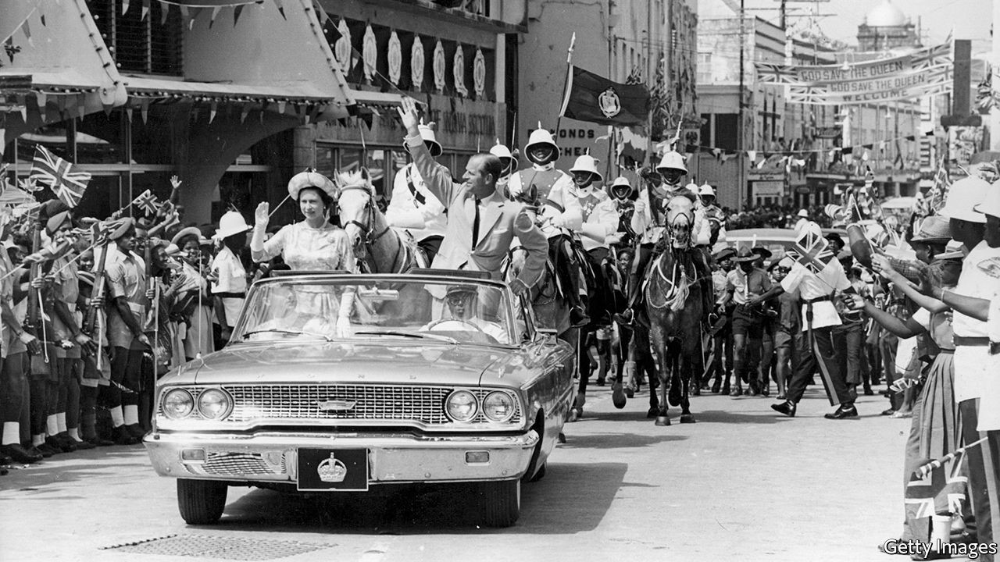

## Bajan bye-bye

# Barbados decides to dump the queen

> The path to becoming a republic is not always smooth

> Sep 16th 2020

WHEN SANDRA MASON gave her annual “throne speech” to open Barbados’s Parliament on September 15th, she proposed the abolition of her own job. As the country’s governor-general she represents Queen Elizabeth II, its head of state. From November next year, in time for the 55th anniversary of independence from Britain, Barbados will be a republic, Dame Sandra declared. “The time has come to fully leave our colonial past behind,” she said. “Barbadians want a Barbadian head of state.”

Barbados is one of nine Caribbean countries in which the queen fills that role. She also does in Australia, Canada, New Zealand and three Pacific islands. Like other Caribbean people, many Bajans, as Barbadians are also known, find it odd that their ceremonial leader is a white woman who lives an ocean away, however much they like her. Some of the monarchy’s symbols make them queasy. The governor-general is Dame Grand Cross of the Order of St Michael and St George, whose badge depicts a white-skinned angel stomping on a prostrate black-skinned Satan.

Dame Sandra pronounced the words but their author was Barbados’s prime minister, Mia Mottley. Her Barbados Labour Party has all but one of the 30 elected seats in the lower house of Parliament. Ms Mottley will have no problem mustering the two-thirds majority in both houses needed to dump the monarchy. She has not yet made clear how Barbados will choose its future head of state.

Many former British colonies have contemplated the republican idea, only to discover that it is hard to execute. Barbados dithered for nearly a quarter of a century. A constitutional commission proposed in 1998 that the country become a republic. Successive governments promised referendums to confirm public support for the idea, but never held one. Ms Mottley does not think she needs a referendum to get her republic, and is not constitutionally required to hold one.

Other Caribbean monarchies have flirted with republicanism without embracing it. Jamaica’s prime minister, Andrew Holness, proposed a referendum before his election in 2016. He won a second term this month, campaigning on a manifesto that merely promises “consultations” on the issue. Ralph Gonsalves, of St Vincent & the Grenadines, is the only Caribbean prime minister to have held a referendum on adopting a republican form of government. He campaigned for the change in 2009, and lost.

The many U-turns on republicanism are due to the fact that replacing the monarch with a president involves unpicking a country’s constitution. Governors-general are formally appointed in London, but are in fact chosen by the prime minister. But a prime minister can’t simply choose a head of state. A more democratic way must be found, but that risks giving legitimacy to someone who could become a rival. Few prime ministers want that.

The president of Trinidad & Tobago, which became a republic in 1976, is elected by Parliament, and has real powers. In 1997 the prime minister of the day, Basdeo Panday, backed a former one, Arthur Robinson, who became president. In an election four years later both parties won the same number of seats. It fell to Robinson to pick the winner. He chose Mr Panday’s opponent, Patrick Manning, for his “moral and spiritual values”. Furious, Mr Panday and his supporters blocked parliamentary proceedings. Fears of a similar confrontation may have led some Caribbean leaders to reconsider their support for republicanism.

On rare occasions governors-general can be political players. Paul Scoon, who represented the queen in Grenada in the 1980s, cohabited for four years with a pro-Cuban “people’s revolutionary government”. After the prime minister, Maurice Bishop, was deposed (and killed) in 1983 by someone still more radical, Scoon asked the United States, then governed by Ronald Reagan, to invade. The Americans booted out the Marxists and freed Scoon from house arrest. Dame Sandra’s remaining 14 months as the queen’s woman in Barbados are unlikely to be so eventful. ■

## URL

https://www.economist.com/the-americas/2020/09/16/barbados-decides-to-dump-the-queen
