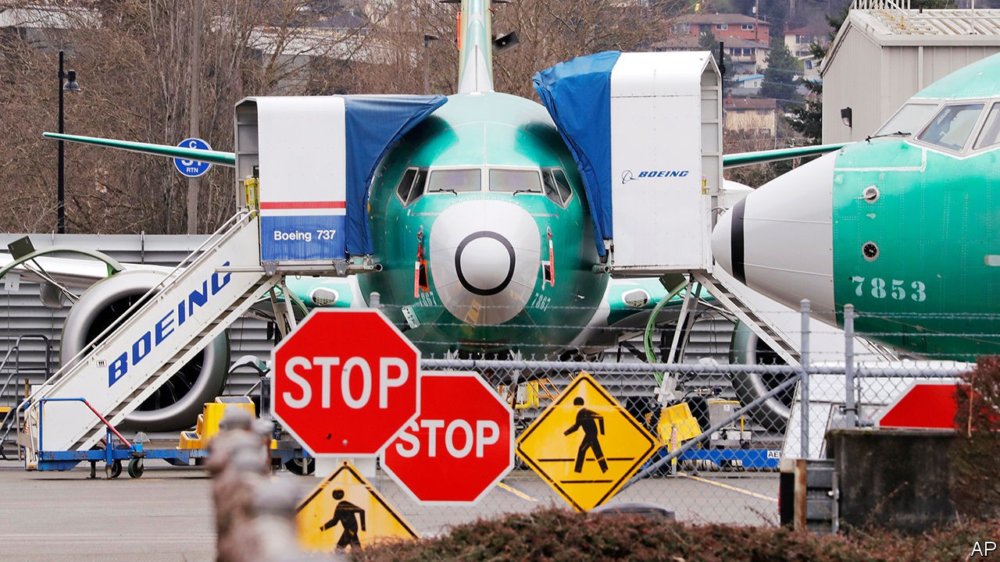

# Business this week

> Sep 19th 2020

The Federal Reserve announced it will keep interest rates pinned near zero. In a policy statement, the central bank also said it would keep them there until inflation is on track to “moderately exceed” its target of 2% “for some time”. Jay Powell, the chairman of the Fed, commented that America’s economic recovery is expected to slow and that the economy will require continued support from the central bank as well as from extra government spending.

American retail-sales growth slowed to just 0.6% month-on-month in August, a lower figure than what economists had forecast. The unexpected softening in consumer demand followed the expiration of extra emergency jobless benefits worth $600 a week at the end of July.

Worries that Britain is at risk of deflation grew after the annual rate of inflation fell to 0.2% in August, down from 1% the previous month. The effect of the government’s discount scheme for restaurants in August may have contributed up to 0.5 percentage points of the drop.

In its quarterly economic forecast, following its most recent one in May, the Organisation for Economic Co-operation and Development revised up growth forecasts for most countries it tracks. The intergovernmental think-tank said public spending was needed to support the economic recovery from the covid-19 lockdowns into 2021, albeit in a more targeted way, and that tax increases should be delayed. See [article](https://www.economist.com//node/21791871).

Bayer, a German chemicals firm, settled 15,000 lawsuits relating to Roundup, a weedkiller alleged to cause cancer, as part of an $11bn settlement. Bayer has estimated it faces a total of 125,000 filed and unfiled claims over Roundup.

President Donald Trump threatened to “do something” about the World Trade Organisation after it deemed that tariffs imposed by America on China in 2018 broke its rules. The WTO rejected America’s argument that the measures were justified by Chinese business practices, such as the theft of intellectual property, questioning whether the Chinese products in question had really benefited from them.

Oracle confirmed that it is ByteDance’s preferred American partner for TikTok. The impending deal comes after Mr Trump insisted that TikTok’s American arm be divested by ByteDance, the Chinese owner of the short-video platform, citing worries about national security. News reports suggest the firms hope that a proposal for Tiktok’s global operations to become an American-based company, with Oracle taking just a minority stake, will be enough to satisfy the White House. See [article](https://www.economist.com//business/2020/09/16/who-are-the-tiktok-sagas-biggest-winners).

The Trump administration announced restrictions on imports suspected of being made using forced labour in China’s Xinjiang region. Goods subject to sanctions include cotton and clothes; Xinjiang accounts for the vast majority of the country’s cotton production. China stands accused of human-rights abuses, such as interning an estimated 1m ethnic Uighurs in gulags, which it calls “re-education centres”.

The transportation committee of America’s House of Representatives published a critical report into the failures that led to two Boeing 737 MAX jets crashing in just five months, killing 346 people. Design errors, lax government oversight of Boeing and a lack of transparency at the planemaker and its regulators “point to a company culture that is in serious need of a safety reset”, the report said.

Shares in Hennes & Mauritz surged by 11% on the day it revealed better-than-expected third-quarter results. The world’s second-largest fashion retailer, which has its headquarters in Sweden, said profits in the three months to the end of August were around SKr 2bn ($222m), more than ten times higher than the average analyst forecast of just SKr 191m.

SoftBank, a Japanese tech firm, agreed to sell Arm to Nvidia, an American chipmaker. The takeover values the British chip designer, whose microprocessor blueprints are used in most of the world’s smartphones, at up to $40bn. Four years ago SoftBank bought Arm for $32bn. Nvidia has also promised to protect jobs at Arm and keep its headquarters in Cambridge. See [article](https://www.economist.com//business/2020/09/19/how-nvidias-purchase-of-arm-could-open-new-markets).

The value of shares in Snowflake leapt by more than 110% on its first day on the New York Stock Exchange. The flotation of the fast-growing cloud-computing firm is the world’s largest-ever software IPO. See [article](https://www.economist.com//business/2020/09/15/how-snowflake-raised-3bn-in-a-record-software-ipo).

## URL

https://www.economist.com/the-world-this-week/2020/09/19/business-this-week
