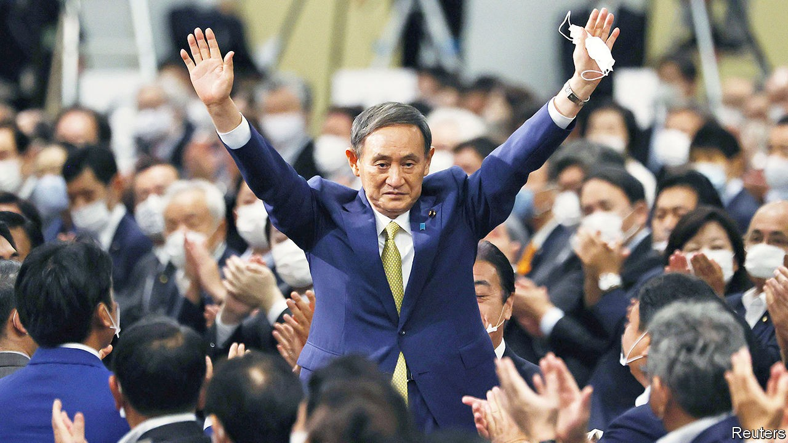

# Politics this week

> Sep 19th 2020

Suga Yoshihide became Japan’s 99th prime minister. He won the leadership of the Liberal Democratic Party with 377 votes of a possible 535, following Abe Shinzo’s resignation due to ill health in August. Mr Suga, who served as Mr Abe’s chief cabinet secretary, has promised continuity. But his background and stated priorities suggest a narrower focus on the economy. See [article](https://www.economist.com//asia/2020/09/19/suga-yoshihide-japans-new-prime-minister-promises-continuity).

Thailand became the first South-East Asian country to loosen tourism restrictions introduced during the pandemic. Visitors who agree to a 14-day quarantine and a minimum stay will be allowed to enter. Malaysia’s prime minister, by contrast, said he would tighten controls at borders. Singapore will give all adult residents vouchers worth S$100 ($73) to spend on local hotels and sights.

European Union leaders held an online meeting with China’s president, Xi Jinping. They urged Mr Xi to open China’s markets and end repression in Xinjiang and Hong Kong. Mr Xi rejected interference in China’s affairs.

Police in Ningxia, in north-west China,detained three wildlife-conservation activists for “picking quarrels and provoking troubles”—charges often levelled against protesters. One, Li Genshan, has been a prominent campaigner against pollution in the Tengger, one of the country’s largest deserts.

Regional and municipal elections were held in parts of Russia. Candidates backed by the country’s de facto opposition leader, Alexei Navalny, did well, denying the pro-Kremlin United Russia party majorities in Novosibirsk and Tomsk. But the inroads Mr Navalny can make are limited, not least because he is still suffering from the effects of Novichok poisoning last month. He is now breathing without a ventilator, and has vowed to return to Russia from Germany where he is being treated. See [article](https://www.economist.com//europe/2020/09/19/alexei-navalny-russias-poisoned-opposition-leader-has-a-siberian-success).

Belarus’s embattled president, Alexander Lukashenko, met Vladimir Putin in the Russian resort of Sochi. He got the promise of a €1.5bn ($1.78bn) loan, but what strings were attached was unclear.

Boris Johnson reached a deal with rebels in his own party over the internal-market bill, which if passed would give the British government the power to break parts of its Brexit withdrawal treaty. Mr Johnson agreed to give MPs the final say over any changes to the agreement. As well as Conservative MPs, the bill was criticised by Democrats in Washington, DC, putting a future trade deal with America at risk. See [article](https://www.economist.com//britain/2020/09/17/boris-v-the-blue-blob).

Democratic leaders rejected a $1.5trn covid-19 relief plan put forward by a group of 50 bipartisan legislators. The proposal is less ambitious than America’s last stimulus round, passed in May. Negotiations between congressional Democrats and administration officials over new stimulus are yet to bear fruit.

Wildfires devastated parts of America’s west coast. More than 5m acres have burned across California, Oregon and Washington state. This year is already California’s most-destructive fire season to date. See [article](https://www.economist.com//united-states/2020/09/17/global-warming-and-the-presidential-election).

The Atlantic Ocean was graced by five named tropical cyclones, which has only happened once before. Paulette hit Bermuda on Monday and Sally hit America as a hurricane on Wednesday, bringing floods to Alabama, Louisiana and Florida. Teddy seems headed for Newfoundland; Rene and Vicky petered out.

The killing of a taxi driver, Javier Ordóñez, by police in Bogotá, Colombia’s capital, triggered violent protests in several cities. Mr Ordóñez had been drinking alcohol on the street. At least 13 people died in the protests and 400 were injured, half of them police. See [article](https://www.economist.com//the-americas/2020/09/19/why-colombias-militarised-police-need-reform).

The government of Barbados announced that it will become a republic. A “throne speech” delivered by the governor-general but written by the prime minister, Mia Mottley, announced that the country will remove Queen Elizabeth II as its head of state by November next year. See [article](https://www.economist.com//the-americas/2020/09/16/barbados-decides-to-dump-the-queen).

Toots Hibbert, widely regarded as the founding father of reggae music, died aged 77. He was the lead singer of Toots and the Maytals. “Do the Reggay”, a song he wrote that was released in 1968, gave the genre its name.

Coup leaders in Mali refused to hand power to an interim civilian administration by a deadline of September 15th set by ECOWAS, the west African regional bloc. ECOWAS had previously said it would tighten sanctions if the deadline was not met.

Paul Rusesabagina, a critic of Rwanda’s government known for saving more than 1,200 people during the genocide in 1994, appeared in court in Kigali, the capital, on charges of terrorism. Human Rights Watch said his arrest amounted to “enforced disappearance”, a breach of international law, since it was not done through lawful extradition.

Donald Trump hosted delegations from Israel, Bahrain and the United Arab Emirates at the White House to sign agreements that normalise relations between Israel and the two Gulf states. According to Mr Trump the deals would “serve as the foundation for a comprehensive peace across the entire region”. Palestinian militants in Gaza fired rockets at Israel shortly after the ceremony took place. See [article](https://www.economist.com//middle-east-and-africa/2020/09/19/the-arab-israeli-conflict-is-fading).

Israel imposed a new lockdown. It will overlap with Jewish holidays, such as Rosh Hashanah and Yom Kippur. An ultra-Orthodox government minister resigned in protest.

India’s accumulated cases passed 5m, less than two weeks after they reached 4m. See [article](https://www.economist.com//asia/2020/09/17/a-real-life-bollywood-tragedy-becomes-a-political-farce).

France jumped past 10,000 cases a day. Jean Castex, the prime minister, warned that there had been a “clear deterioration” of the situation.

Boris Johnson’s government promised to speed up the processing of covid-19 tests in England after it emerged there was a backlog of 185,000. See [article](https://www.economist.com//britain/2020/09/19/britains-testing-system-seizes-up-just-when-it-is-needed-most).

AstraZeneca and the University of Oxford resumed their clinical trial of a vaccine following a short postponement when a volunteer fell ill. Eli Lilly, another pharmaceutical company, said that an experimental drug it has produced has an antiviral effect.

## URL

https://www.economist.com/the-world-this-week/2020/09/19/politics-this-week
