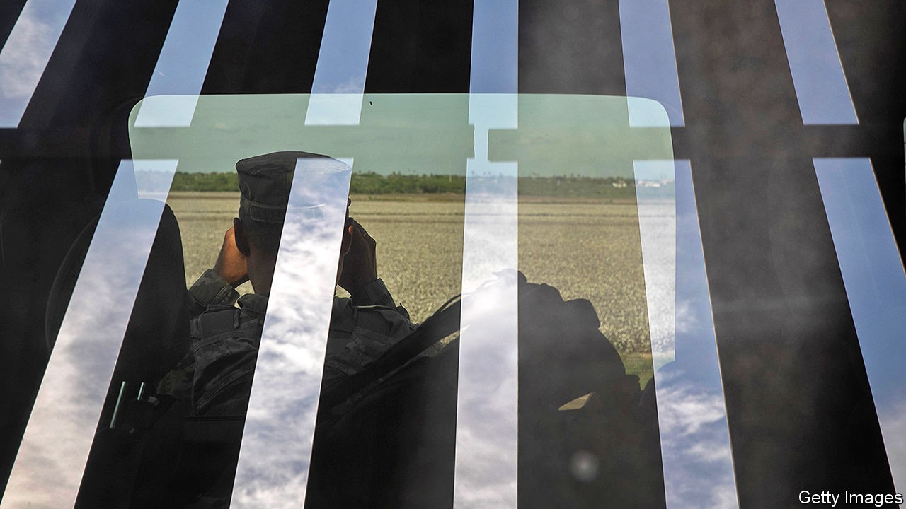

## The master’s bidding

# Assessing Donald Trump’s use of the Homeland Security department

> A shallow institutional culture and lots of troops make DHS an appealing plaything

> Sep 19th 2020WASHINGTON, DC

GEORGE W. BUSH and Barack Obama each had three secretaries of the Department of Homeland Security (DHS) in their eight years in office—two Senate-confirmed, and an acting secretary between. In less than four years, Donald Trump has had five. The last Senate-confirmed secretary, Kirstjen Nielsen, resigned in April 2019. Mr Trump reportedly told her she was “not tough enough” and did not “look the part”.

She had been chief of staff for the other Senate-confirmed secretary, John Kelly, who became Mr Trump’s chief of staff, and whom Mr Trump now describes as “totally exhausted” and “unable to function”. Chad Wolf, a former lobbyist, has been acting head for more than the 300 days allowed by federal law, having replaced another acting secretary, Kevin McAleenan, who resigned after complaining about the “tone [and] message” of the president’s immigration policy. Mr Trump does not seem minded to remove Mr Wolf. Acting secretaries, the president has said, give him “more flexibility”, and few cabinet departments have pursued his political goals as flexibly and relentlessly as the DHS.

Created in the wake of the September 11th attacks, the DHS is the youngest of America’s 15 executive departments; it opened its doors in 2003. Unlike other departments, it does not have a long-established institutional culture. Designed to bolster America’s defence against terrorist attacks, disasters and other large-scale threats, it now includes Customs and Border Protection, the Federal Emergency Management Agency, Immigration and Customs Enforcement, the Transportation Security Administration and the Secret Service, making it America’s largest federal law-enforcement agency, with more than 60,000 officers and agents.

Presidents stamp their priorities on it as they do on any other cabinet department. The first mission listed in the act of Congress creating the department was to “prevent terrorist attacks within the United States”. Paul Rosenzweig, a former deputy assistant secretary for policy at the DHS and now a senior fellow at the R Street Institute, a think-tank, recalls that Mr Bush held “Terrorism Tuesdays”, at which senior officials would brief him on threats. That posed by al-Qaeda receded during Mr Obama’s presidency, leaving him free to focus more on cyber-security and immigration. As Carrie Cordero of the Centre for a New American Security puts it, the DHS really is “an all-hazards department”.

It particularly interests Mr Trump because of its role in immigration enforcement. It has carried out several of his most controversial policies, including building bits of the border wall, separating migrant parents from children, implementing sweeping travel bans and deploying paramilitary forces against protesters in Portland, Oregon and Washington, DC. None of these uses clearly exceeds Mr Trump’s statutory authority; presidents have broad powers and discretion to define and respond to matters of national security.

But, Mr Rosenzweig argues, “this president has taken his discretionary authorities and used them in distorted ways that were never reasonably within the contemplation of those who created those authorities in the first place”. For instance, presidents can deploy BORTAC, the border agency’s paramilitary troops, to help the Federal Protective Service guard federal property, as Mr Trump did by executive order on June 26th. But none has previously deployed paramilitary forces against the wishes of a state governor—as Mr Trump did in Oregon, where, wearing uniforms without names or identification, they appeared to arrest people far from the buildings they were ostensibly guarding—nor sent them to “sanctuary cities”, from Boston to Los Angeles, in a show of force.

Presidents worry about border security and deterring illegal immigration. But Miles Taylor, a lifelong Republican and former DHS chief of staff, says that Mr Trump “deliberately told us, on multiple occasions, to implement policies that would maim, tear-gas and injure innocent, unarmed civilians” trying to cross the border. Mr Taylor told a podcast hosted by the Bulwark, a right-leaning website, that Mr Trump wanted the border wall topped with spikes that would “go through their hands and their arms and pierce human flesh”.

Under Mr Trump, the DHS has also been the subject of complaints by whistle-blowers. Brian Murphy, who ran the intelligence office, alleged that Mr Wolf told him to downplay reports of Russian electoral interference because they “made the president look bad”, (a DHS spokesman denies the allegation). Dawn Wooten, a nurse at an immigration-detention centre in Georgia, alleged that doctors underreported covid-19 cases and refused to test detainees with symptoms. She says one doctor performed hysterectomies on detained immigrants without their full consent (the doctor accused denies the allegation).

Mr Trump’s use of the department has led some on the left to press for its abolition—an outcome this is both politically unlikely and, in the amount of structural reorganisation it would require, unwise. Should Mr Trump lose in November, Democrats may suggest consolidating congressional oversight (more than 100 congressional committees have some homeland-security purview), press for more transparent operational guidelines and try to reduce the number of political appointees, rather than getting rid of it.

And what if Mr Trump wins? The DHS would remain dedicated to his political goals, meaning more federal officers facing off against protesters and more immigration enforcement designed to terrify. The president would find more inventive uses for this malleable bureaucracy.■

Dig deeper:Read the [best of our 2020 campaign coverage](https://www.economist.com//us-election-2020) and our [presidential-election forecast](https://www.economist.com/https://projects.economist.com/us-2020-forecast/president), then sign up for Checks and Balance, our [weekly newsletter](https://www.economist.com//checksandbalance/) and [podcast](https://www.economist.com//podcasts/2020/09/04/checks-and-balance-our-weekly-podcast-on-american-politics) on American politics.

## URL

https://www.economist.com/united-states/2020/09/19/assessing-donald-trumps-use-of-the-homeland-security-department
