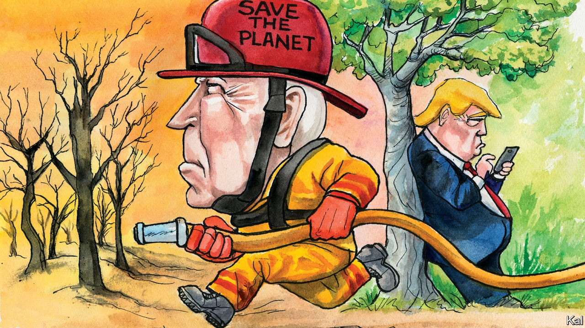

## Lexington

# Global warming and the presidential election

> Joe Biden is on course to make fighting global warming his signature issue

> Sep 19th 2020

THIS WEEK America’s oldest magazine offered its first-ever presidential endorsement. “We do not do this lightly,” said Scientific American, in explaining its decision to come out for Joe Biden. But what choice did it have? The country is gripped by two science-related catastrophes, a global pandemic and global warming. Donald Trump downplays the first on a good day (as America’s death-count approaches 200,000, he predicts it will soon “go away”) and denies that humans are causing the second. During a visit to Sacramento this week, to acknowledge the wildfires that have so far incinerated over 5m acres of forest and thousands of homes and killed at least 35 people, he assured a roomful of silent, serious Californians that global warming was about to go into reverse.

In a speech delivered in Delaware the same day, Mr Biden meanwhile underlined his determination to introduce at a national level the policies to combat climate change that America, almost uniquely among Western democracies, still lacks. Where Barack Obama made the issue secondary to health-care coverage, and Hillary Clinton put it behind immigration and other promised reforms, Mr Biden promises to make tackling climate change his priority. His proposals, with an important caveat, reflect that degree of urgency. There is no starker contrast between the Republican president and his Democratic challenger than on this issue.

The climate plan Mr Biden released in July includes faster, deeper cuts to America’s carbon emissions than either of his Democratic predecessors envisaged. Mr Biden promises a commitment to decarbonising the electricity grid by 2035. To that end, he pledges among other things to invest $2trn in renewable energy and other technologies over four years. He would also commit America to cutting its emissions to net zero by 2050. Mr Obama’s failure to enshrine a much more modest commitment—an 80% emissions reduction by 2050—indicates how bold that would be. Yet, if backed by a Democratic-controlled Congress, Mr Biden would probably have a much better chance of making progress on the issue than Mr Obama had.

That is chiefly because his party is desperate for him to do so. Before covid-19 hit, the combination of Mr Trump’s denials with ever-worsening wildfires, hurricanes and floods had made Democratic voters increasingly likely to cite climate change as their main concern. And Mr Biden, a master at hewing to his party’s shifting currents, has further hardened this environmental consensus by using it to bridge the rifts exposed by his nomination.

His appointment of John Kerry and Alexandria Ocasio-Cortez—emblems of the centre-left and activist left—to co-chair his climate-policy shop was evidence of that. So is the heterodox nature of his proposals. For example, though he dispensed with the socialism-by-stealth of the left’s Green New Deal—which included guaranteed jobs and Medicare-for-All—he has mollified Ms Ocasio-Cortez’s faction by emphasising environmental justice, as well as with the scale of his ambition. Labour unions are reassured by his stress on job creation in low-carbon industries. Centrists are thrilled that he has bucked the left by remaining open to nuclear power and to the possibility of making fossil fuels safe by capturing the gases they emit when burned.

In a sign of how the climate-policy debate often scrambles ideological positions, moderate Democrats are also largely responsible for limiting the scope of market mechanisms—either a cap-and-trade scheme or a carbon tax—in Mr Biden’s plan. Democratic leaders in Congress consider them desirable but unsellable. Hence the more regulatory approach laid out in a 547-page climate plan released by House Democrats in June. While allowing for the possibility of a nationwide carbon tax—as Mr Biden’s plan does—it lays more emphasis on the sector-by-sector low-carbon standards adopted in California—including zero-emissions from cars, as well as power stations, by 2035. Mr Biden’s plan follows suit.

Implicit in the way it is designed to have maximum Democratic appeal is an assumption that a Biden administration could count on no Republican support. That is a reasonable precaution. While Democrats and independents have become more concerned about climate change, opinion on the right has hardly moved. Like Mr Trump, half of moderate and 75% of conservative Republicans deny the link between human activity and global warming. At the same time, any Republican tempted to break with his or her party should not find Mr Biden’s proposals off-putting. His emphases on growth and technology are hard to argue with. The recent rise of renewables industries—which employ a lot of people in Republican states—has also made them less divisive. And the fact that Mr Biden would probably jam much of his promised $2trn splurge into a broad, post-virus stimulus package would provide moderate Republicans with additional cover on their right flanks.

The politics and economics of climate change may thus, for once, be coming into alignment. The issue has already gone some way to making sense of Mr Biden’s unexciting candidacy. One of its overarching promises is to salvage Mr Obama’s legacy, then improve upon it; the former president’s climate record is in dire need of both services. Another is to rebuild America’s economy at home and reputation abroad; Mr Biden’s climate plan could help do both.

The lurking caveat to this upbeat prospect is that the regulatory approach he is pushing will almost certainly deliver much slower, more partial and more inefficient progress than he predicts. America is not California. A Biden administration’s sector-by-sector carbon standards would draw a storm of legal challenges, stalling them and making them vulnerable to partisan judges and hostile successors. That is not to knock Mr Biden’s plans unduly; they may well be as bold as is politically feasible. But what is feasible in America’s dysfunctional politics is likely to be much less than the country—and in this instance the world—requires.■

Dig deeper:Read the [best of our 2020 campaign coverage](https://www.economist.com//us-election-2020) and our [presidential-election forecast](https://www.economist.com/https://projects.economist.com/us-2020-forecast/president), then sign up for Checks and Balance, our [weekly newsletter](https://www.economist.com//checksandbalance/) and [podcast](https://www.economist.com//podcasts/2020/09/04/checks-and-balance-our-weekly-podcast-on-american-politics) on American politics.

## URL

https://www.economist.com/united-states/2020/09/19/global-warming-and-the-presidential-election
