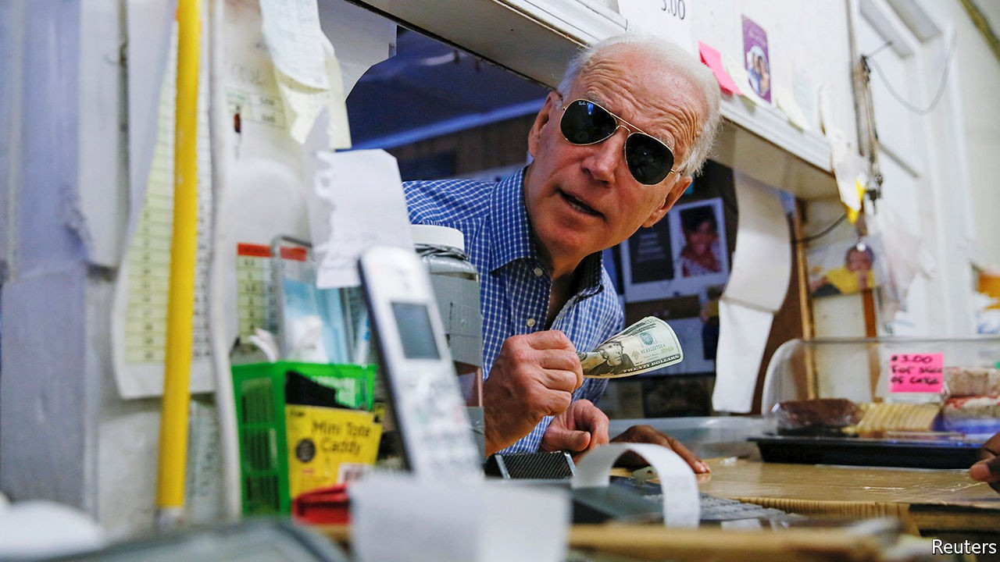

## Following the money

# Reports that the president’s campaign faces a crisis are exaggerated

> The Trump campaign has plenty of cash and may have one fundraising advantage

> Sep 19th 2020WASHINGTON, DC

SCENTING BLOOD, Donald Trump’s detractors have leapt on the news that his campaign has run down its huge cash reserves with gusto. After the New York Times reported last week that the campaign had ripped through $800m in the 18 months to July, headline-writers jostled to predict the serially indebted president was headed for yet another “cash crunch”. That seemed to be confirmed by reports this week that his campaign has recently been outspent by Joe Biden’s in most swing states. Yet how much does this actually matter?

As so often with Mr Trump, it is easy to be distracted by the outrageousness of his affairs. In May the Trump campaign’s larger-than-life manager, Brad Parscale, announced that he had spent nearly three years constructing a political “Death Star” and was about to “start pressing FIRE for the first time”. Two months later, with Mr Trump trailing by 10 points and the Death Star leaking allegations of mismanagement and extravagance, Mr Parscale was out on his ear.

He was reported to have issued contracts worth almost $40m to companies he owned. The wife and girlfriend of the president’s two adult sons were collecting $180,000 a year for cheerleading services. The Death Star had spent almost $60m on legal fees, much of which related to Trump scandals—such as the president’s battle to keep his tax records secret—only tenuously related to his campaign. The net sum of such expenditure—after Mr Biden outraised the president by over $150m in August—is that the former vice-president may now have as much cash on hand as Mr Trump. That would be a big turnaround—yet probably electorally insignificant.

No modern presidential election has been decided by campaign spending. That is because both candidates always have enough cash to achieve the single main point of it: near-universal name recognition among voters in the dozen or fewer swing states that determine the outcome.

This is even more obvious than usual this year. The extraordinary stability of the polls (Mr Biden led Mr Trump by roughly seven points last October and the same amount today) suggests most voters long ago made up their minds about them. And if Mr Trump’s campaign is now husbanding its resources a bit, so what? It has ample cash to hammer away at the tiny minority of undecided voters in the states that matter most: Arizona, Florida, Michigan, North Carolina, Pennsylvania and Wisconsin. The president’s campaign raised $210m in August—a vast sum by any measure except Mr Biden’s haul.

Beyond establishing name recognition, there is little evidence that the political ads campaigns splurge on have much effect on voter choice. Most Americans, accustomed to a deluge of pre-election ads, tune them out. That helps explain why Mr Trump beat Hillary Clinton despite his campaign having spent about half as much as hers.

Presidential campaign finance has in this way become a case-study in diminishing returns. The more hyper-partisan and tightly contested elections become, the bigger the sums donors are prepared to throw at them, and the less impact they have. The same pattern is apparent even in congressional races. The rivals in Montana’s current Senate contest, Steve Daines, the Republican incumbent, and Steve Bullock, the state’s Democratic governor, had raised a record $25m between them by the beginning of July. That represented around $35 per registered voter in the state—though both candidates were already well-known there. Given Montana’s low advertising costs, it is unclear how they will even dispose of their cash piles.

At this juncture, the main significance of Mr Trump’s and Mr Biden’s rival cash operations is two-fold. First, because small-dollar donors (who give $200 or less) are extremely likely to vote, the number that a campaign attracts is a useful proxy for voter enthusiasm. And here there is better news for the president. According to the Centre for Responsive Politics, a research outfit, Mr Trump has raised almost $100m more than Mr Biden from such voters, an indication of greater fervour in his base.

Second, where the candidates spend their money points to where their strategists think the race stands. And, sure enough, 85% of the campaigns’ TV advertising spending has been spent in the aforementioned swing states. Mr Biden’s disciplined campaign, that suggests, is not giving much thought to a possible blowout by splurging on Iowa, Georgia or other Democratic fantasies. It is focused on a narrower, but likelier, path to victory.

Mr Trump’s campaign is spending a bit more widely. It is trying to shore up its customary, yet perhaps vulnerable, advantage in Iowa and the rest, while also pushing tentatively into a couple of Democratic states, including Minnesota and New Hampshire. The overall picture is of a tight race, in which Mr Biden’s campaign is holding a steady course, while Mr Trump’s is probing nervously for possible alternative paths. That fits with the picture painted by the polls. It suggests Mr Trump’s campaign is lagging—but not in crisis.■

Dig deeper:Read the [best of our 2020 campaign coverage](https://www.economist.com//us-election-2020) and our [presidential-election forecast](https://www.economist.com/https://projects.economist.com/us-2020-forecast/president), then sign up for Checks and Balance, our [weekly newsletter](https://www.economist.com//checksandbalance/) and [podcast](https://www.economist.com//podcasts/2020/09/04/checks-and-balance-our-weekly-podcast-on-american-politics) on American politics.

## URL

https://www.economist.com/united-states/2020/09/19/reports-that-the-presidents-campaign-faces-a-crisis-are-exaggerated
