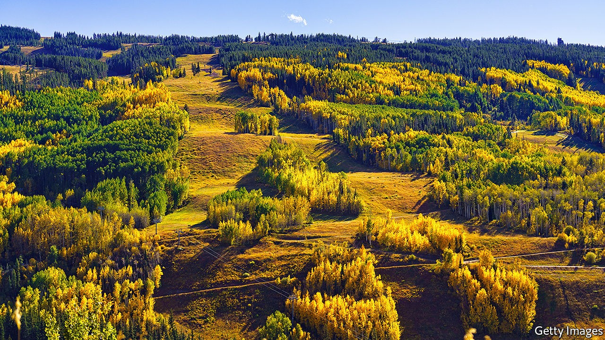

## Et in arcadia achoo

# The virus and America’s resort towns

> Signs of growing inequality as a result of covid-19 can be detected from cities to countryside

> Sep 17th 2020WASHINGTON, DC

SUN VALLEY, the remote and idyllic swathe of land sandwiched among the mountains of central Idaho, is one of the better places to see out a pandemic. America’s first ski resort, as the place styles itself, has drawn those seeking an alpine retreat since Ernest Hemingway, an author and outdoorsman, first decamped to the town of Ketchum in the 1930s. Now that office work is increasingly remote and cramped city living looks less appealing, the Elysian country life beckons. “We’re seeing almost a fourfold increase in vacant land sales over the last two to three months,” says Harry Griffith, the executive director of Sun Valley Economic Development. The high-end property market boomed throughout lockdown. A 14,000-square-foot mansion was recently sold for $18m—the most expensive residential-property transaction in the region’s history. Local developers have booked enough renovation and construction gigs to last for months.

At the same time as the well-to-do are able to flock to their second homes, the region’s less fortunate have rarely looked more in need. “Our numbers exploded. We saw our need more than double,” says Jeanne Liston, executive director of The Hunger Coalition, which operates a food-distribution programme and community garden in the area. There has always been need in resort towns—the workers who staff restaurants, lodges and ski lifts often do not earn sufficient wages to cover the high rents. United Way, a charity, reckons that half of the residents of Blaine County, which includes Sun Valley, are on the edge of being unable to afford basic necessities—a statistic driven largely by the exorbitant rents. As the usual “shoulder season” of low demand sets in during autumn, the level of need could grow even more.

Nationwide, the effect of covid-19 on economic inequality will remain unclear for some time. But now that most American stockmarkets have completely recovered—even as the cash provisions of the federal stimulus have expired—it may eventually prove to have drifted upwards. Most who consider growing inequality think first of cities, where rich and poor live close together.

These places were hit first and hard, disproportionately affecting the disadvantaged. The Centres for Disease Control and Prevention estimates that African-Americans, Hispanics and Native Americans were three times likelier to be infected and five times likelier to be hospitalised than whites. Office workers with university degrees were largely spared the unemployment that low-paid service-sector workers endured. Disruption to schools is likelier to permanently damage the educational outcomes for the children of the poor than for the children of the rich. Eviction invariably conjures up images of apartment buildings, not cabins in the woods.

Those natural associations obscure what has happened outside cities. This is both because the virus has hit some already down-and-out places especially hard—those living on the Navajo Nation reservation, for example—but also because of its second-order effects on the places that are thriving in spite of the pandemic. In Vail, Colorado, another ski resort, the number of homes sold for more than $1m between July and September of this year was double those of the same period last year. There, the development is welcome. If prices can be contained for the lower end of the market, “we have a huge opportunity to become a hub for location-neutral workers”, says Chris Romer, the president of the Vail Valley Partnership.

Here, too, food-bank usage is up even as high-end properties are snapped up. “The flipside of that is there could be some displacement of traditional long-term rentals and workforce housing,” says Mr Romer. “What that is going to require is political will from our elected officials to encourage inclusionary zoning.”

Prosperous resort towns may have the political will to do something. The town of Vail has set up a rent-relief programme for businesses hurt by the pandemic. Private citizens in Sun Valley raised enough money to allow every pupil to get access to remote schooling, says Sally Gillespie, the executive director of the Spur Community Foundation, a local organisation. Effective action elsewhere would require federal involvement, which hardly looks forthcoming. The lapsed stimulus has triggered an apparent increase in poverty nationwide. And the prospects for a second package that Democrats and Republicans can agree on, which is badly needed, appear dismal. Instead, managing the fallout will be a local affair, decided town by town.■

Editor’s note: Some of our covid-19 coverage is free for readers of The Economist Today, our daily [newsletter](https://www.economist.com/https://my.economist.com/user#newsletter). For more stories and our pandemic tracker, see our [hub](https://www.economist.com//news/2020/03/11/the-economists-coverage-of-the-coronavirus)

## URL

https://www.economist.com/united-states/2020/09/17/the-virus-and-americas-resort-towns
