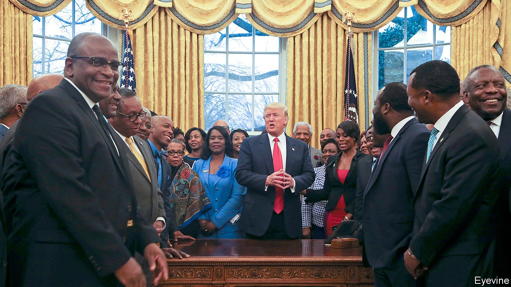

## Historically back

# Why is interest growing in America’s black colleges and universities?

> The death of George Floyd and the presidency of Donald Trump have both played a part

> Sep 19th 2020CHICAGO

SIX MONTHS ago prospects looked dire for many historically black colleges and universities (HBCUs): around 100 institutions, mostly in the South, which together boast 290,000 students. A few stars in the sector dazzled, such as Howard University in Washington (where both Kamala Harris and the actor Chadwick Boseman studied) or Morehouse in Georgia. But expectations for many were low.

Most have a distinguished history, founded after the civil war to educate freed slaves who were denied entry to white-only colleges. They trained the bulk of black doctors, lawyers and teachers and so helped create the African-American middle class. They still turn out over a tenth of all black graduates, but they are struggling. Overwhelmingly, their students are poor and new to higher education. Harry Williams, head of the Thurgood Marshall Fund, which helps the 47 public HBCUs (containing the bulk of students), says 73% qualify for Pell Grants, aid for the poorest.

Many colleges face worsening finances. Roslyn Artis, president of 150-year-old Benedict College in South Carolina, says enrolment there has slumped over the past seven years, partly for a welcome reason: predominantly white colleges have become much nimbler at recruiting black students. Even after she slashed tuition fees at her private college, she watched enrolment crash by 14% this year. “Benedict won’t get bailed out,” she says. If she has to cut her $50m budget more, then subsidies for poorer students may go, hurting “the ones we were built to serve”.

That is not unusual. Jarrett Carter, who runs HBCU Digest, a website, estimates that nearly half the colleges are under stress, and many (especially private ones) might “not be here in one to three years”. Most squeezed are the smallest, with trifling or no endowments and no rich alumni to tap. State funding for public ones has tumbled in the past two decades. A government report two years ago noted that nearly half their buildings need serious repair or replacing. “These institutions have been struggling for many years,” says Jourdan Sutton of EY Parthenon, a consultancy. He says too few find new ways, like luring foreign students, to plug funding gaps.

The pandemic has caused upheaval. William Harvey, president of Hampton University in Virginia, says he cut $43m from his $200m annual budget this year, as the entire college moved online. Another president says he trimmed 11% from his. Yet some colleges that expected students to abandon campus, and braced for less revenue, then found that young people from poorer or unstable families were desperate to return as covid-19 hit African-American homes especially hard.

Ruth Simmons, the president of Prairie View A&M in Houston, says she braced for enrolment falling by 5% this year, but it has risen “as people wait out the economic downturn”. She met students who slept in cars nearby, anxious to get back early. Quinton Ross, president of Alabama State University, says he budgeted for 400 fewer students; instead numbers rose by 1,000. Not all are back on campus, but as 15% of his students—notably in rural Alabama—have no internet at home, they demanded to get back. “HBCUs have been shelters in a storm for years,” he says.

A tumultuous summer has also stirred interest. More debate on racial justice may be spurring some students to choose black colleges over mostly white ones. National politicians from both parties are paying HBCUs more attention. The CARES Act, passed by Congress in March, set aside $960m for the colleges to pay for laptops, covid tests, protective gear and other stuff. That probably saved some from closure. “We’ve never had that type of engagement, that intensity before,” says Mr Williams, of politicians’ interest. He is working with leaders of both parties in Congress to obtain another round of federal help.

President Donald Trump brags that he “saved” the HBCUs. Such talk annoys some presidents, but they also praise him. He has “been beating the drum on HBCUs as a cornerstone of his education platform from month one of his time in office”, says M. Christopher Brown, president of Kentucky State University. “The action and the money don’t lie,” says Mr Williams. Many like the fact that Mr Trump met and spoke thoughtfully to HBCU leaders, and that he forgave loans to some hard-hit colleges. “These seeds have been sprinkled under him,” says Mr Brown. He may be reviled, says Mr Carter, but “he did some substantive things”.

Just as striking is a surge of interest from companies and donors, especially since the killing of George Floyd in May. Mr Williams says this year will easily see the largest-ever number of donations to HBCUs, perhaps well over $500m. Many colleges have seen “the largest single gift they have ever received” in recent months, says Mr Sutton. Hampton, for example, will get $30m from MacKenzie Scott, Jeff Bezos’s ex-wife. Tony Allen, president of Delaware State University, says he has held 20 meetings with companies and chambers of commerce this summer to manage a surge of requests to go into partnership with HBCUs, as firms seek ways to show interest in racial matters.

One challenge is to brush off token efforts, says a college president. Firms must show long-term plans to support HBCUs, not offer a small, one-off gift for the sake of public relations. Some heads of smaller colleges also quietly grumble that the best-known ones always get the lion’s share, as when this month Michael Bloomberg gave $100m to four historically black medical colleges. Howard University alone will get one-third of the pot. That is hard to avoid: it looks inevitable that bigger gaps, in enrolment, corporate partnership, endowments and other measures, will grow between thriving HBCUs and the rest.

In the long run companies, eager to hire non-white staff, could help most by turning to the colleges for recruitment. Mr Allen says Delaware State is now part of a scheme in which JPMorgan Chase plans to sign up 4,000 paid interns from the colleges. EY plans to recruit accountants from four HBCUs. Mr Brown says a “huge pharma company” plans a programme of paid internships, leading to full-time jobs, for his Kentucky graduates. Such pathways to eventual jobs could be the biggest spur for students to enroll and stay on.■

Dig deeper:Read the [best of our 2020 campaign coverage](https://www.economist.com//us-election-2020) and our [presidential-election forecast](https://www.economist.com/https://projects.economist.com/us-2020-forecast/president), then sign up for Checks and Balance, our [weekly newsletter](https://www.economist.com//checksandbalance/) and [podcast](https://www.economist.com//podcasts/2020/09/04/checks-and-balance-our-weekly-podcast-on-american-politics) on American politics.

## URL

https://www.economist.com/united-states/2020/09/19/why-is-interest-growing-in-americas-black-colleges-and-universities
