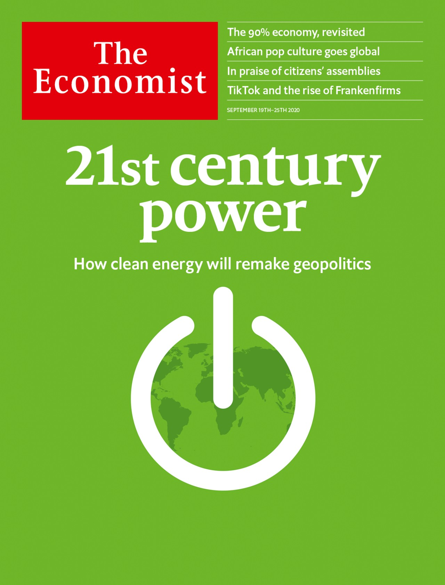

## 21st century power: How clean energy will remake geopolitics

### The world this week
#### [Politics this week](./The%20world%20this%20week/politics-this-week.md)
#### [Business this week](./The%20world%20this%20week/business-this-week.md)
#### [Kals cartoon](./The%20world%20this%20week/kals-cartoon.md)
### Leaders
#### [Is it the end of the oil age](./Leaders/is-it-the-end-of-the-oil-age.md)
#### [The ecbs lack of credibility could hamstring europes recovery](./Leaders/the-ecbs-lack-of-credibility-could-hamstring-europes-recovery.md)
#### [Will tiktok survive](./Leaders/will-tiktok-survive.md)
#### [Politicians should take citizens assemblies seriously](./Leaders/politicians-should-take-citizens-assemblies-seriously.md)
#### [The pandemic shows a better way to handle abortion](./Leaders/the-pandemic-shows-a-better-way-to-handle-abortion.md)
### Letters
#### [Letters to the editor](./Letters/letters-to-the-editor.md)
### Briefing
#### [Americas domination of oil and gas will not cow china](./Briefing/americas-domination-of-oil-and-gas-will-not-cow-china.md)
### Asia
#### [Suga yoshihide japans new prime minister promises continuity](./Asia/suga-yoshihide-japans-new-prime-minister-promises-continuity.md)
#### [As america draws down it troops afghans clear their throats](./Asia/as-america-draws-down-it-troops-afghans-clear-their-throats.md)
#### [A domestic worker takes on her singaporean boss and wins](./Asia/a-domestic-worker-takes-on-her-singaporean-boss-and-wins.md)
#### [Koalas almost bring down an australian state government](./Asia/koalas-almost-bring-down-an-australian-state-government.md)
#### [Referendums in the pacific are attracting attention faraway](./Asia/referendums-in-the-pacific-are-attracting-attention-faraway.md)
#### [Asias migrant workers are having a rough time under covid 19](./Asia/asias-migrant-workers-are-having-a-rough-time-under-covid-19.md)
#### [As bangladeshs relations with india weaken ties with china strengthen](./Asia/as-bangladeshs-relations-with-india-weaken-ties-with-china-strengthen.md)
#### [A real life bollywood tragedy becomes a political farce](./Asia/a-real-life-bollywood-tragedy-becomes-a-political-farce.md)
### China
#### [The bruised city of wuhan has become a showcase for china](./China/the-bruised-city-of-wuhan-has-become-a-showcase-for-china.md)
#### [The families of chinas pre communist elite remain privileged](./China/the-families-of-chinas-pre-communist-elite-remain-privileged.md)
#### [Chinas anti poverty drive is not disinterested charity](./China/chinas-anti-poverty-drive-is-not-disinterested-charity.md)
### United States
#### [Assessing donald trumps use of the homeland security department](./United%20States/assessing-donald-trumps-use-of-the-homeland-security-department.md)
#### [Why is interest growing in americas black colleges and universities](./United%20States/why-is-interest-growing-in-americas-black-colleges-and-universities.md)
#### [The virus and americas resort towns](./United%20States/the-virus-and-americas-resort-towns.md)
#### [Reports that the presidents campaign faces a crisis are exaggerated](./United%20States/reports-that-the-presidents-campaign-faces-a-crisis-are-exaggerated.md)
#### [Abortion by pill is becoming more widespread in america](./United%20States/abortion-by-pill-is-becoming-more-widespread-in-america.md)
#### [Global warming and the presidential election](./United%20States/global-warming-and-the-presidential-election.md)
### The Americas
#### [Why colombias militarised police need reform](./The%20Americas/why-colombias-militarised-police-need-reform.md)
#### [Barbados decides to dump the queen](./The%20Americas/barbados-decides-to-dump-the-queen.md)
#### [The return of the monroe doctrine](./The%20Americas/the-return-of-the-monroe-doctrine.md)
### Middle East & Africa
#### [Ethiopias democratic transition is in peril](./Middle%20East%20&%20Africa/ethiopias-democratic-transition-is-in-peril.md)
#### [Sensible budgets are not ghanas forte but there is hope](./Middle%20East%20&%20Africa/sensible-budgets-are-not-ghanas-forte-but-there-is-hope.md)
#### [Ugandas ruling party is fractious and disorganised](./Middle%20East%20&%20Africa/ugandas-ruling-party-is-fractious-and-disorganised.md)
#### [Why no one is called linda in saudi arabia](./Middle%20East%20&%20Africa/why-no-one-is-called-linda-in-saudi-arabia.md)
#### [The arab israeli conflict is fading](./Middle%20East%20&%20Africa/the-arab-israeli-conflict-is-fading.md)
### Europe
#### [Alexei navalny russias poisoned opposition leader has a siberian success](./Europe/alexei-navalny-russias-poisoned-opposition-leader-has-a-siberian-success.md)
#### [The spanish government proposes a new law on history](./Europe/the-spanish-government-proposes-a-new-law-on-history.md)
#### [Greeces navy is in need of a refit](./Europe/greeces-navy-is-in-need-of-a-refit.md)
#### [Germanys bail out brings worries about its long term effects](./Europe/germanys-bail-out-brings-worries-about-its-long-term-effects.md)
#### [Europes asylum compromise](./Europe/europes-asylum-compromise.md)
### Britain
#### [How state aid became a brexit deal breaker](./Britain/how-state-aid-became-a-brexit-deal-breaker.md)
#### [Why women in england and wales are having abortions earlier](./Britain/why-women-in-england-and-wales-are-having-abortions-earlier.md)
#### [Britains testing system seizes up just when it is needed most](./Britain/britains-testing-system-seizes-up-just-when-it-is-needed-most.md)
#### [The troubles go from h block to tiktok](./Britain/the-troubles-go-from-h-block-to-tiktok.md)
#### [Why poor britons in prosperous places are suffering](./Britain/why-poor-britons-in-prosperous-places-are-suffering.md)
#### [What a huge religious monument reveals about britain](./Britain/what-a-huge-religious-monument-reveals-about-britain.md)
#### [Britains armed forces get ready for a revolution](./Britain/britains-armed-forces-get-ready-for-a-revolution.md)
#### [Boris v the blue blob](./Britain/boris-v-the-blue-blob.md)
### International
#### [Citizens assemblies are increasingly popular](./International/citizens-assemblies-are-increasingly-popular.md)
### Special report
#### [The great disrupter](./Special%20report/the-great-disrupter.md)
#### [A grim outlook](./Special%20report/a-grim-outlook.md)
#### [Costs of carbon](./Special%20report/costs-of-carbon.md)
#### [Cheap cheats](./Special%20report/cheap-cheats.md)
#### [Guilty by emission](./Special%20report/guilty-by-emission.md)
#### [Green machines](./Special%20report/green-machines.md)
#### [Directing the disruption](./Special%20report/directing-the-disruption.md)
### Business
#### [Who will rule the teslaverse](./Business/who-will-rule-the-teslaverse.md)
#### [Can nikola become the next tesla](./Business/can-nikola-become-the-next-tesla.md)
#### [How bps newish boss sees the future of fossil fuels](./Business/how-bps-newish-boss-sees-the-future-of-fossil-fuels.md)
#### [How nvidias purchase of arm could open new markets](./Business/how-nvidias-purchase-of-arm-could-open-new-markets.md)
#### [Who are the tiktok sagas biggest winners](./Business/who-are-the-tiktok-sagas-biggest-winners.md)
#### [How do you stop corporate fraud](./Business/how-do-you-stop-corporate-fraud.md)
#### [How snowflake raised 3bn in a record software ipo](./Business/how-snowflake-raised-3bn-in-a-record-software-ipo.md)
#### [What is stakeholder capitalism](./Business/what-is-stakeholder-capitalism.md)
### Finance & economics
#### [Is the world economy recovering](./Finance%20&%20economics/is-the-world-economy-recovering.md)
#### [What is fuelling chinas economic recovery](./Finance%20&%20economics/what-is-fuelling-chinas-economic-recovery.md)
#### [How would joe biden change americas trade policy](./Finance%20&%20economics/how-would-joe-biden-change-americas-trade-policy.md)
#### [What is the point of green bonds](./Finance%20&%20economics/what-is-the-point-of-green-bonds.md)
#### [How many of americas top companies have a female ceo](./Finance%20&%20economics/how-many-of-americas-top-companies-have-a-female-ceo.md)
#### [Who will buy borsa italiana](./Finance%20&%20economics/who-will-buy-borsa-italiana.md)
#### [Can you make money from the big mac index](./Finance%20&%20economics/can-you-make-money-from-the-big-mac-index.md)
#### [How does todays tech boom compare with the dotcom era](./Finance%20&%20economics/how-does-todays-tech-boom-compare-with-the-dotcom-era.md)
### Science & technology
#### [Scientists find possible signs of life in the clouds of venus](./Science%20&%20technology/scientists-find-possible-signs-of-life-in-the-clouds-of-venus.md)
#### [Natural disasters quicken an already precipitous global loss of species](./Science%20&%20technology/natural-disasters-quicken-an-already-precipitous-global-loss-of-species.md)
#### [Davy joness data centre](./Science%20&%20technology/davy-joness-data-centre.md)
#### [A new global ranking of cyber power throws up some surprises](./Science%20&%20technology/a-new-global-ranking-of-cyber-power-throws-up-some-surprises.md)
### Books & arts
#### [African entertainers are wowing global audiences](./Books%20&%20arts/african-entertainers-are-wowing-global-audiences.md)
#### [A bold french film stirs controversy in america](./Books%20&%20arts/a-bold-french-film-stirs-controversy-in-america.md)
#### [Opera nazism and richard wagners painful legacy](./Books%20&%20arts/opera-nazism-and-richard-wagners-painful-legacy.md)
#### [Daniel yergins new survey of the world of energy](./Books%20&%20arts/daniel-yergins-new-survey-of-the-world-of-energy.md)
#### [Pride prejudice and the story of new york english](./Books%20&%20arts/pride-prejudice-and-the-story-of-new-york-english.md)
### Economic & financial indicators
#### [Economic data commodities and markets](./Economic%20&%20financial%20indicators/economic-data-commodities-and-markets.md)
### Graphic detail
#### [The age old strategy of buying cheap shares is faltering](./Graphic%20detail/the-age-old-strategy-of-buying-cheap-shares-is-faltering.md)
### Obituary
#### [Joan feynman died on july 22nd](./Obituary/joan-feynman-died-on-july-22nd.md)
