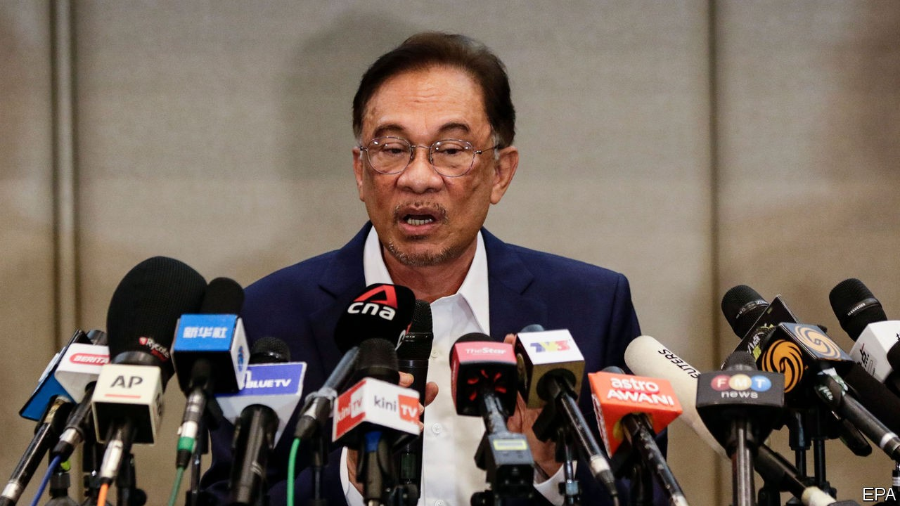

## Anwar on the attack

# A veteran Malaysian politician tries to topple the government

> But even if Anwar Ibrahim becomes prime minister, his tenure will be troubled

> Sep 26th 2020SINGAPORE

AFTER THREE stints in prison and more than two decades of waiting, Anwar Ibrahim has had enough. Long the leader of a multiracial opposition party, Parti Keadilan Rakyat (PKR), he declared on September 23rd that a “strong, formidable, convincing majority” of lawmakers wanted him to form a government. “The claim must be proven through the process and methods determined by the Federal Constitution,” retorted Muhyiddin Yassin, the incumbent prime minister. “Until proven otherwise…I am the legitimate prime minister.” The matter can only be settled by Malaysia’s king, to whom Mr Anwar promises to reveal his list of supporters. But the country remains in limbo, since the monarch says he is too unwell to receive visitors at the moment.

Mr Anwar came close to power in 2018 when a coalition of opposition parties including PKR defeated the ruling party of six decades, the United Malays National Organisation (UMNO), in a landmark election. But the job of prime minister went to Mahathir Mohamad, the leader of a smaller party in the coalition, Bersatu, on the understanding he would soon pass the baton to Mr Anwar. (The pair, who both used to belong to UMNO, had been in that situation before: when Dr Mahathir was prime minister in the 1990s, Mr Anwar had been his heir presumptive until they fell out and Mr Anwar wound up in prison.)

In the end the tension between the two men, and in particular the question of when Dr Mahathir would relinquish power, undermined the coalition. In February most of Bersatu and a faction within PKR jumped ship, siding with UMNO and an Islamic party, PAS, to form a new government with Mr Muhyiddin of Bersatu at its head. To soothe disgruntled MPs, Mr Muhyiddin was unusually generous about handing out ministerial posts and positions at government-linked firms.

That has not been enough to keep the new government’s MPs happy. For months Mr Anwar has wooed them to back yet another change at the top. UMNO’s president admitted on September 23rd that “many” of his party’s MPs had defected to Mr Anwar’s camp. But the splittists may have ulterior motives. UMNO is keen for a snap election and may not intend to keep any government formed by Mr Anwar afloat for very long. Its leaders assume that the endless bickering and scheming since PKR and Bersatu came to power will send disgusted voters flocking back to a more familiar force. Moreover, some suspect that Mr Anwar’s more racially diverse coalition will put off voters from the Malay majority, to UMNO’s benefit.

These dynamics mean that, even if Mr Anwar does manage to topple Mr Muhyiddin, the strife will continue. A man who has waited for decades to become prime minister will presumably not want to call an election right away if he will struggle to win. The timing of his bid for power—as Malaysia suffers from the painful economic impact of the coronavirus pandemic—shows his zeal for the top job. But the sickly economy will also weaken whoever ends up in charge. It took UMNO 61 years to discredit itself in the eyes of voters. Bersatu and PKR may have done so in just two. ■

## URL

https://www.economist.com/asia/2020/09/26/a-veteran-malaysian-politician-tries-to-topple-the-government
