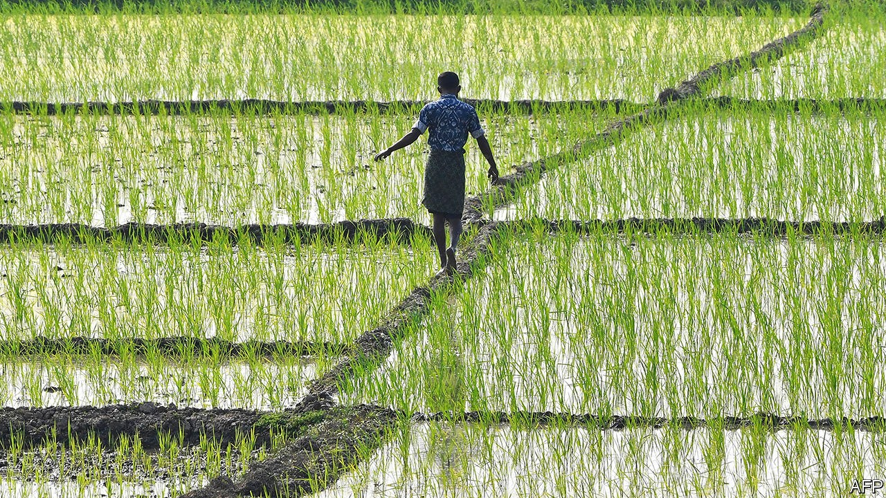

## Yield curve

# India’s government prunes the regulations stifling farmers

> But it pushed through the reforms in a needlessly confrontational way

> Sep 26th 2020

FARMERS ARE more than half of India’s workforce, but produce barely a sixth of its GDP. There are plenty of reasons for the shortfall. The tiny size of most farms is one. Some 86% of landholdings are smaller than two hectares. They are shrinking, too, as each new generation inherits ever-smaller parcels.

Yet one of the biggest underlying causes of inefficiency, ironically, is a tangle of laws that were designed to protect smallholders from grasping corporations, greedy middlemen, scheming hoarders and ruthless land speculators. In the 1950s and 1960s, paternalistic governments, hoping both to promote “food security” and to succour the poor, seeded a range of well-meaning policies that, among other things, restricted long-term contracts to supply crops to companies, obliged farmers to sell their harvest in designated wholesale markets and set minimum prices for a host of staples. Instead of protecting farmers from the depredations of capitalism, however, these policies have simply exposed them to new forms of exploitation.

The 7,000-odd wholesale markets, for instance, gradually fell under the sway of a class of middlemen—often themselves rich farmers—who fix the terms of sale, create cartels to manipulate supply and often serve as moneylenders. The concentration of business in the markets makes them an easy target for cash-strapped states’ tax-collectors. As a result, a recent study by the central bank shows, farmers tend to glean a relatively meagre proportion of the retail value of their produce.

Growers of wheat, rice and some other crops, meanwhile, have been able to earn guaranteed above-market prices from the government itself. This has ensured abundant stocks: the government’s current 70m-tonne grain mountain could feed India for a year. But it has also led to distortions. A small number of bigger farms reap the bulk of subsidies. The overabundance of certain grains has narrowed diets from a healthier range of traditional foods. The lucrative alternation of summer rice and winter wheat sucks up precious groundwater and encourages the burning of rice stubble to clear fields, adding to severe air pollution.

Narendra Modi, the prime minister, vowed during last year’s election campaign to double farmers’ incomes by 2022. The promise stoked scepticism, but his government, with a strengthened majority in its second term, seems keen to move. Since mid-September it has rushed a trio of farm bills into law. These aim to end the requirement for farmers to use state-sanctioned wholesale markets, free them to contract production for longer periods—for instance to supply restaurants or manufacturers of packaged food—and lastly to curtail the government’s power to set the prices and manipulate the stocks of crops it deems essential.

Mr Modi’s propagandists liken these changes to the ground-shaking reforms in the 1990s that unshackled India’s economy from the strictures of the previous “licence raj”. That seems a stretch. But economists do widely welcome the new laws, concurring that many past agricultural policies no longer serve their purpose. Plenty of farmers agree; one group that claims to represent southern growers described the farm bills as “visionary”.

Yet Mr Modi’s first crop of reforms has prompted complaints beyond the predictable ire of the opposition. Farm lobbies across much of north India have vowed to resist the changes, suspecting that they may be a precursor to the dismantling of support prices as well as of the subsidies farmers enjoy for electricity, fertiliser and other inputs.

Some analysts see the reforms not as needed practical measures, but as the continuation of a political strategy that has created new constituencies for Mr Modi by undermining precisely those groups that benefited from old rural power structures, such as middlemen, large landowners and landowning castes in general. The changes will probably also reward new groups that have supported Mr Modi, such as big corporations that may now find better investment opportunities in agriculture.

Even as the prime minister claimed to be liberalising farming and helping farmers, his government slapped an export ban on onions, whose rising cost apparently troubles urban voters. More undermining still, in the eyes of Mr Modi’s political opponents, was the way he pushed the farm bills through.

In the Rajya Sabha, parliament’s upper house, loud calls from the opposition for more debate were quashed. Amid a noisy fracas, two of the laws were passed on a voice vote. When protesting MPs were then suspended, the opposition walked out of both houses.

This has allowed the government to pass numerous bills in rapid succession, including big changes to labour laws. As with farming, these reforms may be long overdue, but Mr Modi’s legislative haste and disdain for consensus are generating unneeded bad will along the way. ■

## URL

https://www.economist.com/asia/2020/09/26/indias-government-prunes-the-regulations-stifling-farmers
