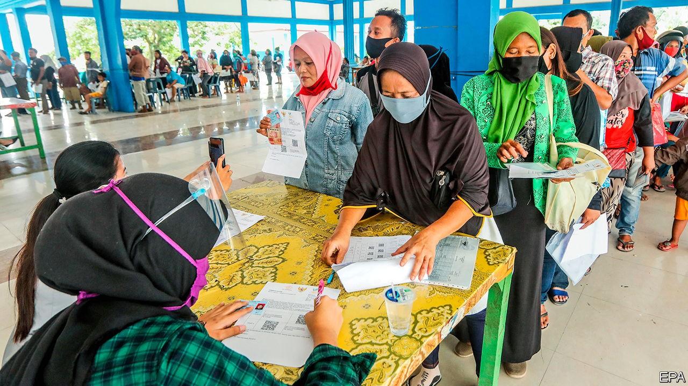

## Rejoice to serve

# Why so many Indonesians want to be public servants

> Hint: the public and service seldom have much to do with it

> Sep 26th 2020SINGAPORE

WHEN THE government rang to tell Budi (not his real name) that he had been hired as a tax collector, it was like a dream come true. When he graduated from university in 2013, the only work he could find was as a stevedore at the local port. Jobs in his hometown of Ende, a small city on the island of Flores, were scarce. Local government promised a steady income and a pension. Even more important for Budi was the status that came with the job. When he put on his civil-service uniform for the first time five years ago, “people saw me differently,” he says. “It’s one of the most respected jobs in the area.”

Budi was one of the lucky ones. Last year some 4.2m people applied for around 150,000 spots in the civil service. Many enlist to serve their country. Others are less high-minded. Jobs are hard to find for young Indonesians. In 2019 as many as 26% of those aged between 15 and 19 and 16% of those between 20 and 24 were unemployed and out of school.

In many poorer provinces, the government is one of the biggest employers: a study in the Indonesian part of New Guinea in 2014 found that, in many districts, more than one in ten people of working age were civil servants. Government salaries are often higher than those at private companies, and jobs are for life. Working-class Indonesians see the civil service as their route to the middle class, says Pande Made Kutanegara, an anthropologist at Universitas Gadjah Mada.

Moreover, there is prestige associated with being a government man. In the colonial era the Dutch stripped local aristocrats of their powers and turned them into bureaucrats. Fallen nobles lent prestige to their humble new posts, says Mr Pande. Today some senior bureaucrats, particularly in the farther reaches of the archipelago, regard the districts in which they serve as their own personal fiefs.

The reasons why so many Indonesians want to become public servants also explain why, once they have succeeded, they often fail to serve the people. Public services are patchy, particularly at the level of local government, which is responsible for health care and education, among other things. Real spending per person by local governments soared between 1994 and 2017, by 258% on average, according to the World Bank. But services remain ropy. More than half of children leave school unable to read properly, for instance. 

Inefficiency is rife. At the local level, exam results, jobs, promotions and transfers are regularly sold to the highest bidders, according to a study published in 2012 by Peter Blunt and Hendrik Lindroth of the World Bank and Mark Turner of the University of Canberra. Local politicians often reward supporters with temporary posts in the civil service. Thus many bureaucrats are unqualified for their jobs. A report published in 2017 by the State Civil Service Agency found that more than 40% of the 696 directors (the highest-ranking bureaucrats) that it assessed were not fit to do their jobs. 

Yet it is almost impossible to fire civil servants. In 2017 only 347 out of 4.3m were dismissed. “It means you don’t have this big motivation for your future or to develop yourself,” says Hadiono (also not his real name), who works for the Ministry of Tourism. Workers often slink away from their desks hours before they are supposed to. Municipal police in some provinces are under instructions to round up skiving bureaucrats (identifiable by their khaki uniforms) and deposit them back at the office, says Dr Pande. 

Many civil servants also seek to bump up their incomes through schemes which “distract the civil servants from doing their jobs”, says Kevin O’Rourke, a political analyst. Employees of the tourism ministry, for instance, are paid a generous daily fee when they travel for work. It is standard practice to extend trips by a day or two beyond what is necessary, to claim extra cash, says Hadiono. Some officials are not content to stop there. Every year, millions of dollars are siphoned off the health system which, with its relatively large budget, is a particularly popular target for embezzlers. Indeed, graft is so widespread that some bureaucrats are frightened of taking any decisions at all, for fear that watchdogs like the Anti-Corruption Commission will assume that their motives can only have been pecuniary, explains Mr O’Rourke.

Since the arrival of democracy in 1998, there have been many attempts to reform the bureaucracy; an entire ministry is devoted to the cause. Jobs are better defined and processes have been streamlined. Comptrollers are clamping down on expenses cheats. Salaries are now boosted by allowances pegged to performance. A law that will come into effect next year will make it slightly easier to fire people.

Such reforms are working, argues Rudiarto Sumarwono of the Indonesian Civil Service Commission. Indonesia is now ranked 59 out of 100 in the World Bank’s index on government effectiveness, from a low of 24 in 1996 (the higher the ranking the more effective the government). On the corruption perceptions index of Transparency International, a watchdog, Indonesia scores 40 out of 100 (where zero is highly corrupt) against 28 in 1996. But changing the culture of entitlement will take time. “Old-school” officials in their 50s are set in their ways, says Mr Rudiarto, who has hope for younger generations. Hadiono is less sanguine; plenty of people in their 20s and 30s think “being a civil servant means I can get an easy life”. Not even President Joko Widodo, popularly known as Jokowi, seems very keen to overhaul the institution, says Mr O’Rourke.

But the pandemic has shown just how urgent reform is. By June, two months after parliament had passed its covid-stimulus package, just 1.5% of the 75trn rupiah ($5bn) budgeted for the health system had been disbursed, prompting the normally placid Jokowi to lambast his cabinet for its business-as-usual response to the crisis.

Yet the bureaucracy seems unable to shake off its lethargy. Just a third of the government’s overall budget of 695trn rupiah for the year has been disbursed so far. According to Reuters, the government actually spent a smaller percentage of its budget in the first half of 2020 than in the same period in 2019. As the bureaucrats have fiddled, the number of cases of covid-19 has soared. Along with the Philippines, Indonesia has had more far more deaths from the disease relative to its population than the other countries of South-East Asia. To treat covid-19 properly, it will need to cure its bureaucracy. ■

## URL

https://www.economist.com/asia/2020/09/26/why-so-many-indonesians-want-to-be-public-servants
