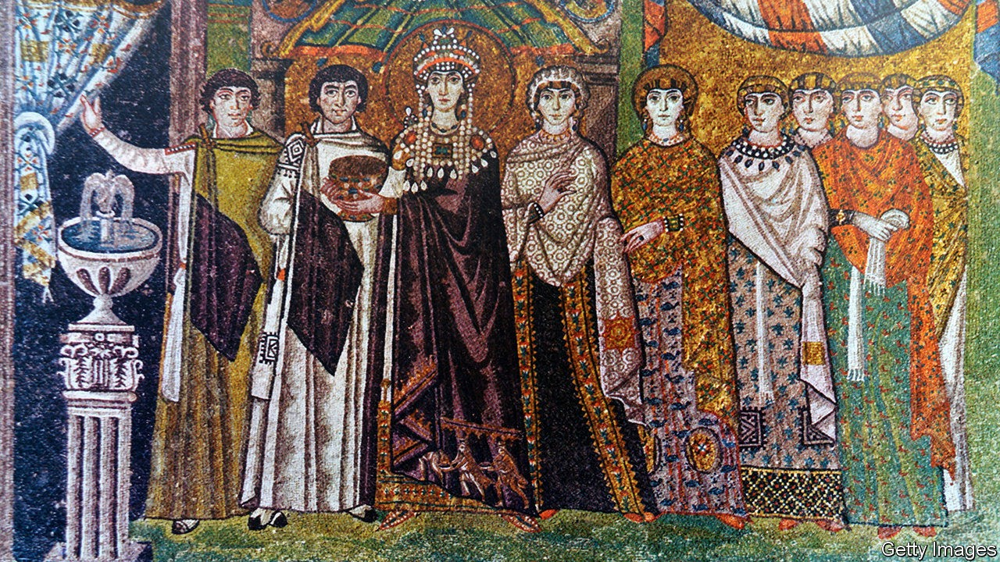

## Pivot of the world

# Civilisations once met and melded in Ravenna

> The city in a swamp was a hinge between East and West

> Sep 26th 2020

Ravenna: Capital of Empire, Crucible of Europe. By Judith Herrin. Princeton University Press; 576 pages; $29.95. Allen Lane; £30.

IN AROUND 700AD a nameless scholar in the north of Italy made a five-volume study of the universe. He covered everything you would expect for a man of his time: Africa, Arabia, India. Even far-off Britannia got a nod, the cosmographer informing readers that it was “said to form part of Europe”. More surprising than the ambit of his world is what he chose to put at its centre: not Jerusalem or Rome but Ravenna, a city clinging to the Adriatic marshlands south of Venice.

As Judith Herrin explains in her lively, startling book, Ravenna really did deserve “the most noble” title bestowed by this anonymous admirer. From its origins as a refuge in a dying empire, it went on to host kings and prelates, physicians and lawyers—and ultimately help shape Europe. Like the continent today, Ravenna was a cosmopolitan place, mixing Roman citizens and the Germanic warlords who came to rule the city. Later, under Byzantine control, Greeks mingled with Armenian administrators and Syrian merchants.

All this made Ravenna what Ms Herrin calls the “hinge” between the Romans and their successors and new kingdoms to the West. That status was reflected in its art. Bringing craftsmen from Rome and marble columns from Constantinople, Theoderic the Goth filled his palace with three tiers of glorious mosaics set against a gold background. When the Byzantines conquered the town in 540, more masterpieces appeared. Visitors to the basilica of San Vitale can still gawp at images of the Emperor Justinian and his wife, their dress and jewellery as fine as the day they were made.

More practical imports reached Ravenna too. Papyrus arrived from Egypt; learning from Alexandria helped make it the centre of medical education in western Europe. Modern knowledge of Galen, one of the ancient world’s most distinguished physicians, comes primarily from a reconstructed Ravennese source. At the same time the city proved adept at sustaining the best of Roman civilisation, even as the empire spluttered out. The Goths’ legal code, notes Ms Herrin, integrated classical traditions into their new administration. Usefully, the city attracted Roman luminaries such as Boethius, a philosopher and famed translator of Aristotle and Plato.

“Ravenna” is most engaging when focusing not on scholarship or laws but people. The author evokes lost worlds in surprising anecdotes, for example about a sixth-century bishop who let his clergy use the bathhouse of his palace on Tuesdays and Fridays. Ms Herrin does not neglect Ravenna’s humbler citizens. From chariot races to bust-ups between neighbourhood gangs, readers are vividly reminded that for all its grandeur, Ravenna was in its heyday a flawed and hectic place.

After silt clogged up the channels that linked Ravenna to the sea, its time as the pivot between East and West passed. Yet its achievements lived on. Churches became monasteries but continued to inspire travellers from beyond the Alps. The robustly independent civic life was a model for Venice and other Italian republics. Charlemagne’s grand ideas of kingship were influenced by its architecture: the ruler who came to personify Europe carted away building materials from this city in a swamp for his chapel in Aachen. ■

## URL

https://www.economist.com/books-and-arts/2020/09/26/civilisations-once-met-and-melded-in-ravenna
