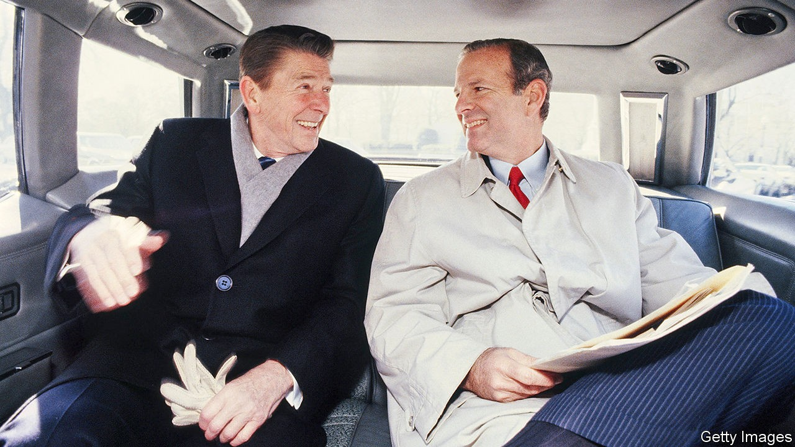

## All the presidents’ man

# James Baker and the art of power

> “The Man Who Ran Washington” describes a distinguished statesman’s career and guile

> Sep 26th 2020

The Man Who Ran Washington: The Life and Times of James A. Baker III. By Peter Baker and Susan Glasser.Doubleday; 720 pages; $35.

DURING THE confusion that followed the attempt on Ronald Reagan’s life in 1981, Alexander Haig, the secretary of state, proclaimed at the White House podium: “I am in control.” Breathless and sweating, Haig reassured no one. While he floundered, someone else took command. James Baker, the chief of staff, monitored Reagan’s condition, kept the government running and crisply briefed colleagues. Throughout the tense day Mr Baker proved unflappable, say Susan Glasser and Peter Baker (no relation to their subject) in a new biography.

Widely regarded as the most effective chief of staff ever, Mr Baker ran the White House for both Reagan and George H.W. Bush. He was also Reagan’s treasury secretary and Bush’s secretary of state, and led five presidential campaigns. Pragmatism and competence were his hallmarks. “There was little idealism involved and a fair degree of opportunism,” write the authors of “The Man Who Ran Washington”. By their account, Mr Baker “was not above political hardball to advance his team’s chances at the ballot box. He never lost sight of what was good for Jim Baker.” But he got things done.

Ms Glasser (of the New Yorker) and her co-author and husband (of the New York Times) are well-placed to chronicle Mr Baker’s life. They interviewed 170 people, including three former presidents and Mr Baker himself. Now 90, and a careful steward of his own reputation, he may have mixed feelings about the result. Yet it is a masterclass in political biography. The authors portray the man in full, managing to be both brisk and comprehensive.

They lay out his flaws, including his temper, cynicism, tendency to blame underlings and allegations of skulduggery. They decry his lack of vision in the last years of the cold war: he and Bush merely reacted to the Soviet Union’s demise, they argue, rather than devising a bold approach of their own. Yet the book also depicts a manager capable of handling almost any situation, from the Gulf war to the presidential recount in 2000, which Mr Baker confidently oversaw for the Republicans. He closed deals by focusing on the signature line rather than the fine print.

He was Jim to presidents and cabinet secretaries but “Mr Baker” to everyone else. Despite his patrician manner he could swear like a Texas roughneck; “ratfuck” was a favourite term for Washington backstabbing. He grew up among the Houston aristocracy, where the oilfield meets the tennis club. Bush, a fellow blue-blood, became his doubles partner, and the book explores their lifelong friendship. When Mr Baker learned from a doctor that his first wife’s cancer was terminal, he told Bush but not the patient herself. One key to his success, the authors write, is that he was adept at leveraging their connection. “Everyone knew that he was Bush’s good friend and that when Baker spoke, he was speaking with the authority of the president.”

His own name appeared on just one ballot: in the race to be attorney-general of Texas in 1978. He lost. Over the years he harboured presidential ambitions and, in 1996, came close to running. If he stayed out he could be remembered as the most important secretary of state since Henry Kissinger, a diplomat tested by great events and equal to them. If he ran and failed, he would be one more might-have-been. He weighed the options and made his choice. As so often, he was probably right. ■

## URL

https://www.economist.com/books-and-arts/2020/09/26/james-baker-and-the-art-of-power
