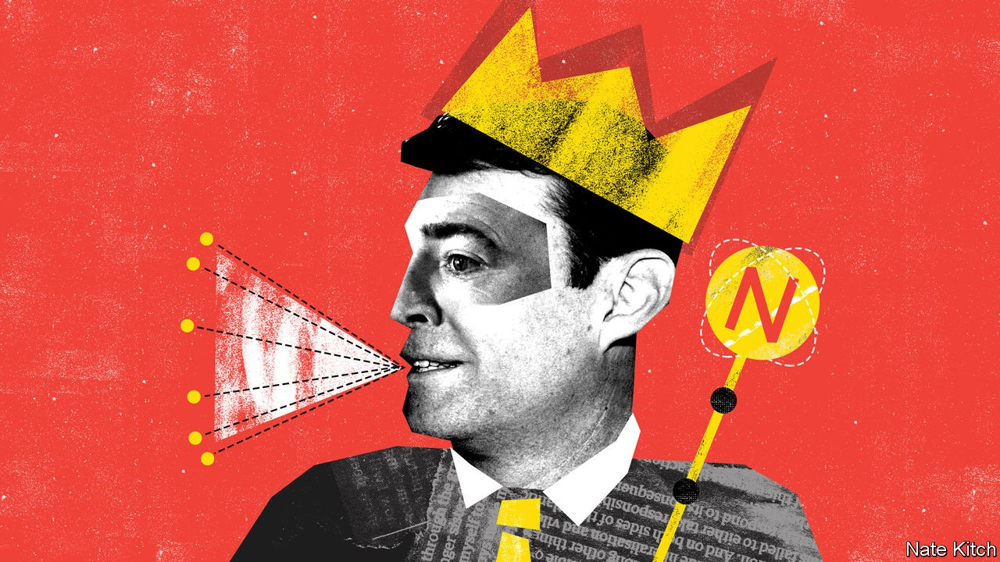

## Bagehot

# Andy Burnham strengthens the case for devolution in Britain

> The mayor of Manchester has influenced the government’s covid policies

> Sep 26th 2020

THE LIST of British politicians who have had a “good pandemic” is as short as the list of those who have had a bad one is long. But it must surely include the mayor of Greater Manchester. The pandemic has been good for Andy Burnham’s national political profile. He has had a bigger impact on the government’s covid policy than any other Labour politician, including Sir Keir Starmer. More important, it has been good for the great cause he has championed for the past decade—devolving power to the provinces.

As the voice of northern common sense and the scourge of southern muddle, Mr Burnham has excelled at getting himself heard in the capital. He has repeatedly raised the alarm early about the government’s failure to work with local authorities: for example, neglecting to provide local officials and experts with timely data about local infection rates. His success is partly a testament to his network and skills. As a former secretary of state for health (who, incidentally, presided over Labour’s response to the swine flu outbreak), he has good connections in the national press, and as a canny northerner he knows how to exploit the regions’ resentments of the Great Wen. It is also testament to the inherent virtues of regionalism: who better to tell you where the shoe pinches than the person who is wearing it? And who better to shape policy for a place than those who know it best?

Whitehall, argues Mr Burnham, operates in departmental silos: a regional mayor can integrate them and forge policies that suit the city-region’s particular needs. Manchester’s work in co-ordinating health and social care is a prime example of this approach. Mayors can also be innovators, designing local policies that can later go national. Mr Burnham took a radical (and successful) approach to getting homeless people housed, and was also one of the first to spot that the pandemic couldn’t be controlled if the homeless were left on the streets. And smaller units of government can often be nimbler than large ones. Manchester, for instance, managed to acquire millions of pieces of personal protective equipment for health workers in May, when Whitehall was still struggling to source the stuff.

Yet, measured by the proportion of revenue raised centrally and locally, Britain is far and away the most centralised country in the G7. This model of government doesn’t give Mr Burnham much scope for doing things differently. His powers are limited compared with, say, those of American mayors: some Mancunians have dubbed him “the bus conductor”, because he has more power over local transport than over schools and the police.

Covid-19 has reinforced the case for changing this model by exploding the most powerful argument against devolution: that central government is much more competent than the local sort. It has repeatedly demonstrated that even a weak mayor can come up with good ideas and tie together disparate policies. Germany has been much more successful at controlling the pandemic, in part because of its highly devolved public-health system.

The pandemic effect comes at a time when the arguments in favour of devolution are gaining traction. “Levelling up” areas outside the south-east of England is Boris Johnson’s mantra, and place-based policymaking is essential to achieving it. Regional inequality is an ancient and complex problem, but one-size-fits-all policies are part of its cause, not the solution to it. This week a group of leading economists, assembled by Mr Burnham, has published a report that both provides rich details about Manchester’s mix of strengths (clusters of excellence in medical innovation and manufacturing) and weaknesses (entrenched and growing poverty), and makes it clear that the only way forward is to involve local people with local knowledge not just in implementing new policies, but also in designing them.

Yet the centre rarely chooses to give up power. Dominic Cummings, Mr Johnson’s chief adviser, who cut his teeth in politics campaigning against a north-east assembly, is as hostile to local politicians as he is to national ones. His solution to regional inequality is to move bits of government to the provinces without shifting the locus of power. That would put lipstick on the pig of centralisation while doing nothing to capture the benefits of local knowledge. But the imminence of a white paper on devolution suggests that others are prepared to take the arguments for it more seriously. The “City Hall” faction in Downing Street (people who worked with Mr Johnson when he was mayor of London) is instinctively in favour of mayoral power, and Michael Gove, the Cabinet Office minister, has spoken enthusiastically about the need for devolution.

The government will not be able to ignore Mr Burnham, for the main battleground of British politics is now the northern constituencies (including Mr Burnham’s old seat of Leigh) that fell to the Conservatives in the election. This is a double blessing for the mayor. The Tories can’t hold on to power without offering something substantial to these red-wall voters; so he is in a good position to demand both money and freedom from central control. Labour can’t return to power without reversing its losses in the north, as Sir Keir admitted by giving his party-conference speech in Doncaster this week; so this gives Mr Burnham a fine chance to influence its policies. Labour needs to put a northern face on a party that has been run by two Londoners in a row. It also needs to tap people with executive experience, given that only one member of the current front bench has held ministerial office.

Britain was not always the highly centralised country it is now, and British politics was not always the monopoly of Westminster cliques. Victorian England was a land of mighty cities and powerful local economies that celebrated their success in magnificent civic buildings. Some of Britain’s most powerful politicians, such as Joseph Chamberlain on the Liberal side and Herbert Morrison on the Labour side, made their names as mayors. The ground has been prepared for a return to a better balance. ■

## URL

https://www.economist.com/britain/2020/09/26/andy-burnham-strengthens-the-case-for-devolution-in-britain
