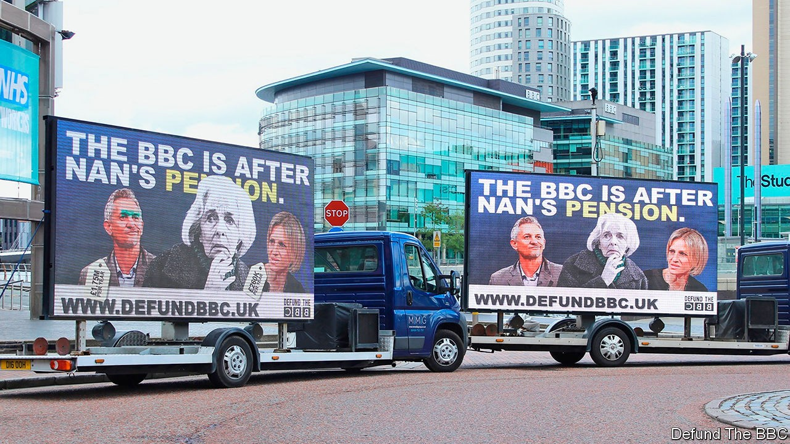

## Conservative protest

# Defund the BBC, home for idling Brexiteers

> A new battleground for the right

> Sep 26th 2020

ROGER SCRUTON, the late conservative philosopher, reflected last year that right-wingers are not good protesters. “If you think what a slogan would be on the conservative side, it would be something like: ‘Hesitate’,” he told an audience at an event organised by the Spectator magazine. That, he concluded, “doesn’t work”. Growing numbers of right-wingers are nevertheless giving it a go. In recent months, a new breed of revolutionary conservative has taken to the streets, armed with slogans that include “Masks are muzzles” and “Facts not fear”. Many got their first taste for protest during the Brexit wars.

Among them is Defund the BBC, a campaign group set up in June as Black Lives Matter (BLM) protests swept Britain. Its founder, James Yucel, a student at the University of Glasgow, was offended by what he saw as the BBC’s lack of impartiality. The group’s name takes a jab at BLM’s aim of defunding the police. That punchiness attracted Rebecca Ryan, a veteran of the pro-Brexit campaign, whose stewardship has sent advertising vans blazoned with the group’s slogans across northern England.

Defund the BBC’s first aim is to decriminalise non-payment of the licence fee, a £158 charge all television viewers must pay. But its long-term ambition is to reduce the scope of the BBC Charter, which sets governance rules, at the corporation’s mid-term review in 2022. Ms Ryan says that, rather than defund it outright, the group wants to force the BBC to evolve.

The government, too, doubts that the BBC is impartial, and takes a dim view of the licence fee. Is there any point, then, in a dedicated protest group? It helps “in finding a focus and building consensus”, reckons Andrea Jenkyns, a Tory MP and deputy chair of the right-wing European Research Group. It also provides a cause for idling Brexiteers. Ms Ryan ran StandUp4Brexit, a grassroots outfit whose work ended with a failed bid to get Big Ben to “Bong for Brexit” on January 31st. Darren Grimes, a member of the Brexit commentariat who ran the youth-focused BeLeave during the referendum, is on board. So is Calvin Robinson, a former Tory and Brexit Party candidate.

The Labour Party is used to radical fringe groups, including Stop the War and Abolish Eton. The Tories are less so. But the Brexit years have created a generation of radicals experienced in taking on liberal bogeymen, and winning. Over that period, Defund the BBC maintains, the corporation’s left-wing bias became more entrenched. It started pushing, Ms Ryan says, “an extremely metro-centric view”. Ms Jenkyns concurs. In her view, the corporation is “trying to re-educate the population to adhere to a certain view of the world”.

This might be going a little far. Polling by the Reuters Institute at the University of Oxford finds that the BBC reaches an audience from across the political spectrum. Meanwhile, Defund the BBC has not taken the nation by storm. It has raised only £60,000 ($76,000) out of the modest £100,000 it is aiming for, and it has its own struggles with metro-centricity. Ms Ryan runs a digital-marketing agency and lives in Kent. The northern ad-van campaign happened only after the group’s first billboard, in the capital, made them “keen to make sure that we are not London-centric”, says Ms Ryan. But, pointing to the Tories’ success in winning over disaffected Labour voters in the north, she claims that the BBC has disenfranchised people all over the land. “Kent is the red wall, too.”■

## URL

https://www.economist.com/britain/2020/09/26/defund-the-bbc-home-for-idling-brexiteers
