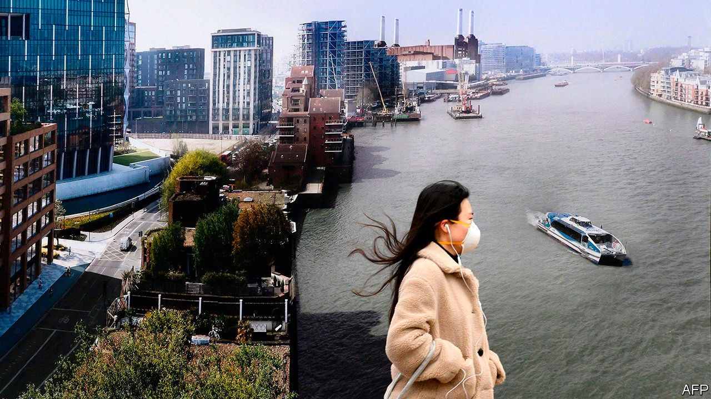
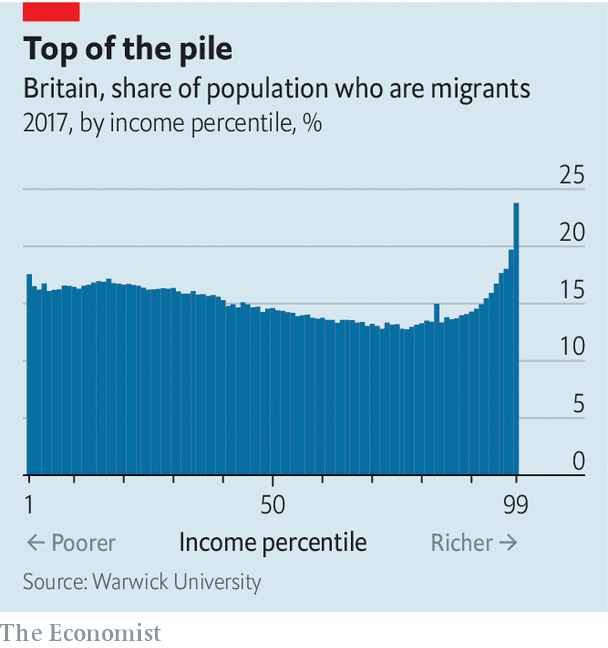

## Income distribution

# Does immigration import inequality?

> A new paper suggests that immigration has had a central role in the rise of the very rich

> Sep 26th 2020

THAT INCOME inequality has risen more sharply in Anglo-Saxon countries than in continental Europe and Asia is not much debated. The reasons for it are. Tax policy, looser regulation of financial services, performance pay for chief executives and culture are among the usual suspects. In a new paper, a group of economists at the University of Warwick, employing an unusual data set, have provided evidence to implicate another culprit: immigration.

The researchers looked at the National Insurance (NI) numbers of British taxpayers. The data are anonymised, but Britons are assigned NI numbers when they are 16, so those whose numbers were assigned later are bound to be immigrants.

People tend to think of immigrants as poor, but the research shows that they make up a much larger proportion of the top of the income range than of the bottom (see chart). Their share of the top of the distribution has grown rapidly since the late 1990s. They made up less than a fifth of the top 1% in 1997 but more than quarter 20 years later; 85% of the total growth in the income share of the top 1% since the late 1990s can be attributed to immigrants. Stripping them out leaves the income share of Britain’s top 1% similar to those in Italy, France and Sweden.

That is not to say that immigration caused the rise in inequality in Britain. If the country had not had a big financial services sector and lowish personal taxes, rich foreigners would not have come in such large numbers; had they not, there would still have been locals on six- and seven-figure salaries. But the research implies that immigrants are responsible for a big chunk of the rise in top pay: immigrant top-one-percenters are paid 8% more than locals, and a third arrived within the previous five years, suggesting they were headhunted for their specialist skills. Whatever the factors behind the growth, it has shaped British politics and society this century.

## URL

https://www.economist.com/britain/2020/09/26/does-immigration-import-inequality
