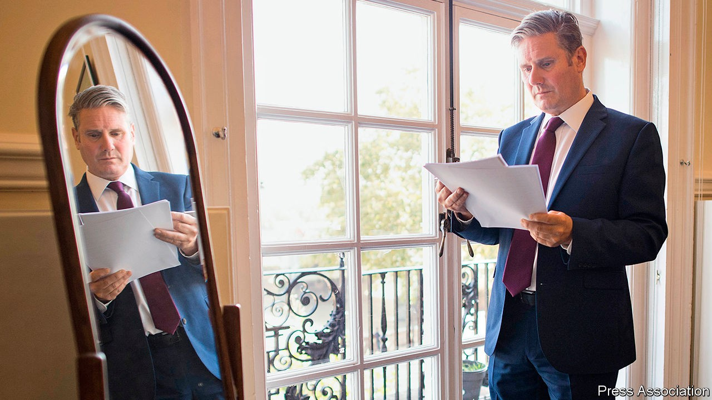
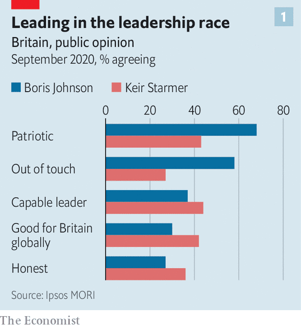
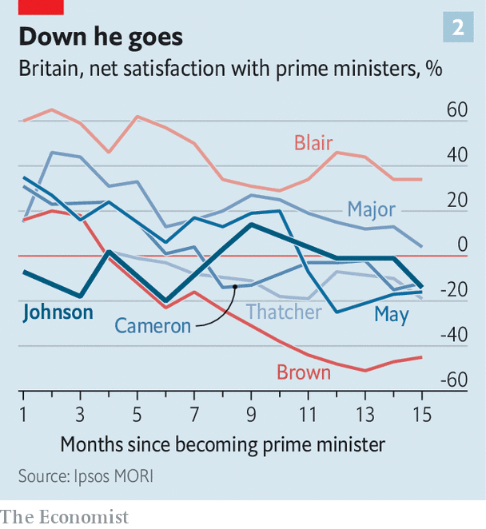

## Patriot games

# Keir Starmer’s rather conservative message to Britain

> The Labour leader stresses family, security and love of country in an appeal to former voters

> Sep 26th 2020

CONSERVATIVE PARTY literature makes plentiful reference to Sir Keir Starmer’s knighthood. Tories hope it will signal to voters that the Labour Party’s leader, a former human-rights lawyer who lives in a fashionable part of north London and defended immigrants and suspected extremists, is part of the metropolitan elite.

If Sir Keir, who calls himself a socialist and was named after his party’s first leader, saw his title in the same light, he might be expected to downplay it. But in his first speech to Labour’s annual conference as leader, on September 22nd, he told his party that his investiture at Buckingham Palace was one of the proudest days of his parents’ lives. His title is, he said, a symbol of what he owes Britain’s education system. It was granted in recognition of his term as the head of Britain’s public prosecution service, which he says he spent chasing terrorists and bent politicians. The subtext is that unlike his predecessor Jeremy Corbyn, he is proud of the monarchy and the British state, and qualified for the nation’s greatest office.

In vaunting his title, Sir Keir reveals his strategy. Both he and Boris Johnson are pitched at the same group of voters: socially conservative working classes in the so-called “red wall” of small towns in northern England, the Midlands and Wales which flipped dramatically from Labour to the Tories in 2019. While the Conservative Party is consumed by revolutionary fervour, Sir Keir is playing to an older, more deferential strand of conservatism, which defends the nation’s ruling institutions instead of attacking them.

Sir Keir’s address covered the traditional fare of a Labour leader: promises to improve Britain’s schools and hospitals, tackle racial inequality, and improve the lot of workers. Yet it was cast in strikingly conservative terms. Under his watch, Sir Keir said, Britain will be a “country in which we put family first”. Labour will defend Britain’s national security and territorial integrity, and champion decency and neighbourliness. Above all, it will be patriotic. “We love this country as you do.”

One of the speech’s authors was Claire Ainsley, an aide to Sir Keir and author of “The New Working Class: How to Win Hearts, Minds and Votes”, a book which argues that Labour’s policies need to be built on “moral foundations”—ideas such as fairness, hard work and family. Values trump soundbites. Mr Corbyn, who spent a career denouncing British militarism and sympathising with Irish Republicanism, left the party with a reputation for ambivalence or hostility to British interests. Sir Keir’s speech hit the right notes, says Deborah Mattinson, a pollster who advised the party under Tony Blair and author of “Beyond the Red Wall”, a study of the seats Mr Corbyn lost. “I cannot stress it enough: if you don’t love your country, the ‘red wall’ will never love you.” But it must be sincere, she says. “All voters, and ‘red wall’ voters perhaps more than most, can sniff out inauthenticity in a nanosecond.”

The appeal to patriotism is not new. Mr Corbyn and his predecessor, Ed Miliband, both declared their love for Britain in their first big speeches as leader. Yet Sir Keir’s pitch is more credible for two reasons.

One is that he can plausibly position himself as a better steward of Britain’s institutions than Mr Johnson. The government plans to unleash creative destruction on the civil service, curtail the judiciary’s power and break the Brexit withdrawal treaty—a breach of international law which Sir Keir characterises as a tantrum by an unqualified prime minister. “For a party called the Conservative Party, they don’t seem to conserve very much,” he said of the neglect of public services that covid-19 exposed. In his promise to make Britain “once again admired and respected” overseas, some supporters see parallels with Joe Biden’s pitch to restore dignity to the White House. “We don’t have to burn the institutions down to create a great country. We have to improve them,” says an ally. Anneliese Dodds, the shadow chancellor, has promised to be more careful with public money than the Tories.

The second is that Sir Keir is a more credible messenger than his predecessors. The Labour Party’s polling has undergone a rapid recovery under his watch. A poll by Ipsos MORI in September found that voters regard Sir Keir as more capable, as a better representative for Britain abroad, and as having better judgment than the prime minister. Voters regard Mr Johnson as more patriotic, and having more of a personality. Mr Johnson’s party is miserable after a string of U-turns and unforced errors. His satisfaction ratings after 14 months in office are similar to those of Theresa May and David Cameron at that point in their premiership: not a disastrous result, but not a good one considering he secured an electoral landslide in December 2019.

Sir Keir’s personality is more conservative too. He contrasts his diligent career at the Bar to Mr Johnson’s as a fabulist newspaper columnist. He is a family man, and neatly attired; the prime minister has a more bohemian lifestyle.

The Conservatives paint Sir Keir’s transformation as opportunistic and the party as unreformed. The Tories will remind voters of Sir Keir’s support for a second referendum on Brexit, and how he loyally served in Mr Corbyn’s team.

They risk fighting the last war. Mr Corbyn is out in the cold. Sir Keir declined to mention him in his address, unlike former winners Tony Blair, Harold Wilson and Clement Attlee, and told the party it must swallow the fact that voters had rejected his project. Brexit has united Mr Johnson’s electoral coalition and split Sir Keir’s. But voters are weary of the question and, like Sir Keir, want a deal struck and the issue put to bed. Sir Keir has elegantly brushed aside arguments which could fuel a culture war, such as whether patriotic songs should be sung at the Proms.

Still, it is four years till the next election, and Sir Keir has a mountain to climb, in the shape of Mr Johnson’s 87-seat majority. Despite his personal lead over Mr Johnson, the Tories are (just) leading in the polls. Some Labour MPs and many of its activists fear Mr Corbyn’s radical economic programme is being abandoned and dislike the leadership’s new turn. “They’re trying to wrap themselves in a bigger flag than the Tories,” says Joe Guinan, a left-wing thinker. When it comes to patriotism, he believes, the Tories will “always outbid us”.■

## URL

https://www.economist.com/britain/2020/09/26/keir-starmers-rather-conservative-message-to-britain
