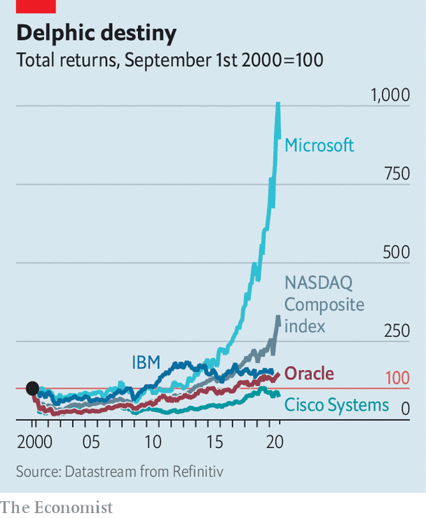

## Larry Ellison’s last stand

# Can TikTok help Oracle stay relevant in the cloud-computing age?

> The corporate-software giant has a few things going for it. But it faces stiff competition

> Sep 23rd 2020SAN FRANCISCO

LARRY WHO? A few weeks ago asking a young tech worker in Silicon Valley about Larry Ellison, co-founder, former boss and now chief technology officer of Oracle, might have elicited blank stares. More surprising, given that his company is still the world’s second-largest software-maker, a follow-up question might have been: “Remind me what Oracle sells?”

Being treated like a has-been must have irked the 76-year-old Mr Ellison. In Oracle’s heyday 20 years ago he was Silicon Valley’s best-known rogue billionaire—yesteryear’s Elon Musk. “The Difference Between God and Larry Ellison”, one of the many books written about the firm and its colourful founder, was subtitled “God Doesn’t Think He Is Larry Ellison”.

Now he and his firm are back in the headlines, thanks to something that, in software terms, is about as far from Oracle’s bread and butter of corporate databases as jelly beans are from white toast. Its deal to team up with TikTok has made its brand recognisable even to many teenagers—the main clientele of the Chinese-owned video-sharing platform. Whether the notoriety lasts more than 15 seconds, the length of a typical TikTok video, is another matter.

Attempts at reinvention are nothing new in Silicon Valley. It can be made harder by lucrative legacy businesses; just ask IBM, another once-great information-technology (IT) giant that has been sliding into irrelevance. Oracle would rather emulate Microsoft, which has ridden the cloud revolution to a market capitalisation of $1.6trn and stellar returns (see chart). The TikTok arrangement, which would see Oracle host the app’s data in its cloud, confirms that is Mr Ellison’s plan. Like the transaction—which could yet be blocked by President Donald Trump (see next article)—Oracle’s metamorphosis is not, however, a done deal just yet.

Since its founding in 1977 Oracle has been the odd one out in Silicon Valley—less focused on inventing the next new thing and more on signing the next big contract. By the mid-1990s it dominated the market for “relational” databases, which underlie corporate applications from book-keeping to supply-chain management. After the dotcom crash in the early 2000s it used its pile of cash and high share price to consolidate swathes of the IT industry. Within a few years it acquired several software rivals, including BEA Systems and PeopleSoft, as well as Sun Microsystems, a maker of powerful computers. It is still hard to find a sizeable firm that does not send a cheque to Oracle’s snazzy headquarters in Redwood City. With customers locked in by the sheer tedium of switching databases, Oracle could extract huge profits. In its last financial year the company earned a net income of more than $10bn on revenue of nearly $40bn.

Success in old IT was a big reason why Oracle was late to the new sort: cloud computing. Mr Ellison long dismissed it as a faddish label for existing technology. By the time he realised it was an epochal shift in IT, Oracle had fallen behind. Oracle Cloud Infrastructure (OCI), as it calls its offering, is said to have sales of less than $2bn annually, compared with more than $40bn for Amazon Web Services (AWS). The e-commerce titan’s market-leading cloud unit is valued at several times Oracle’s market capitalisation of $178bn. Cloud-based rivals of the sort that Mr Ellison once dismissed, such as Adobe and Salesforce, are worth around a quarter more than his firm.

Even in databases, Oracle’s core business, the world has moved on. For many new applications, such as customer-facing websites, its tools are too expensive and inflexible. Recent years have seen the rise of more specialised digital repositories, many of them in the cloud and based on malleable “open source” software. According to Gartner, a research firm, Oracle’s share of the database market fell from nearly 44% in 2013 to 28% last year. And it has yet to shake off a reputation for antagonising clients with things like audits to verify their use of software by workers—and hefty charges for firms that exceed licence limits. Brent Thill of Jefferies, a bank, echoes other Oracle bears when he says that the company has been stuck for years even as “we are living in the data age, the biggest tech-boom ever.”

Oracle optimists counter that the firm has a few things going for it. One is management. The death last October of a co-CEO, Mark Hurd, left Safra Catz as the woman in charge. She is widely considered an effective operator. Mr Ellison, who stepped down as chief executive in 2014, has in recent years taken a more active role in product development—considered his forte—without treading on Ms Catz’s toes. The upshot, says Ted Friedman of Gartner, is better technology such as the “autonomous database”, which uses artificial intelligence to automate work once reserved for human IT administrators. For example, it allows software updates to be installed without shutting systems down, a dreaded procedure which can go badly wrong.

OCI enjoys the latecomer advantage in the cloud, says Clay Magouyrk, one of its leaders. “We did not have to take the circuitous path others had to take to get it right,” he says. Mr Magouyrk points to Oracle’s next-generation cloud platform, which will, among other things, offer hundreds of local sub-clouds that let customers keep their data close to home, as privacy regulations may require them to. In April Zoom, a videoconferencing service, opted for OCI to help it manage pandemic-fuelled growth (mostly because Oracle charges less for the use of its networks). Landing the TikTok contract would be another boost: the video app spends an estimated $1bn annually on cloud-computing services.

A bigger opportunity for Oracle lies in cloud-based applications. It has begun converting some of its existing customers to these programs, which are more sophisticated than the basic computing and storage offered by AWS and OCI, observes Mark Moerdler of Bernstein, a broker. The company’s bundle of cloud-based services already accounts for 8% of its software revenue; sales have been growing by more than 30% a year.

The wild card is Oracle’s political bets. The firm has positioned itself close to Mr Trump. In 2016 Ms Catz served on the president’s transition team and this year Mr Ellison hosted a fund-raiser for him. This did not help them win a lucrative cloud contract with the Department of Defence; OCI was not technically up to snuff. But being in the White House’s good graces may have helped Oracle beat Microsoft (which won the Pentagon contract) to the TikTok deal. If the deal succeeds—a big “if”—Oracle’s cloud may emerge as a digital haven for companies seeking to reassure Washington that their data are safe from prying Communist eyes in Beijing amid the Sino-American tech cold war.

It is, then, too early to write Oracle off. When a group of youngish cloud-services CEOs recently met reporters on a Zoom call, they were unanimous in their assessment. Jennifer Tejada of PagerDuty, which helps firms manage IT incidents, summed it up: “You have to respect Oracle for finding ways to keep itself relevant.” Relevance is not the same as fast growth, which may prove elusive given competition from AWS and others. But it is better than the digital dustbin of obscurity.■

## URL

https://www.economist.com/business/2020/09/23/can-tiktok-help-oracle-stay-relevant-in-the-cloud-computing-age
