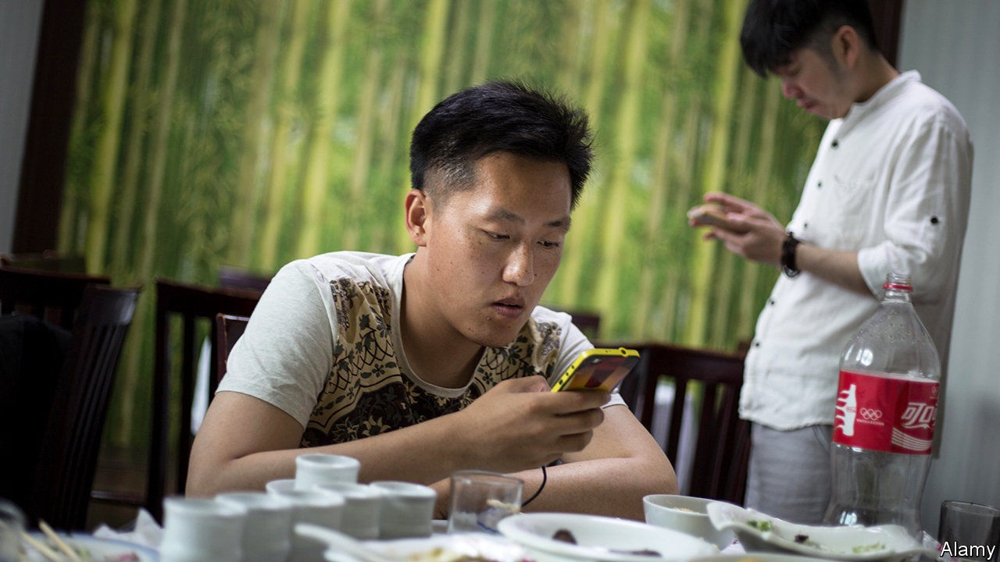
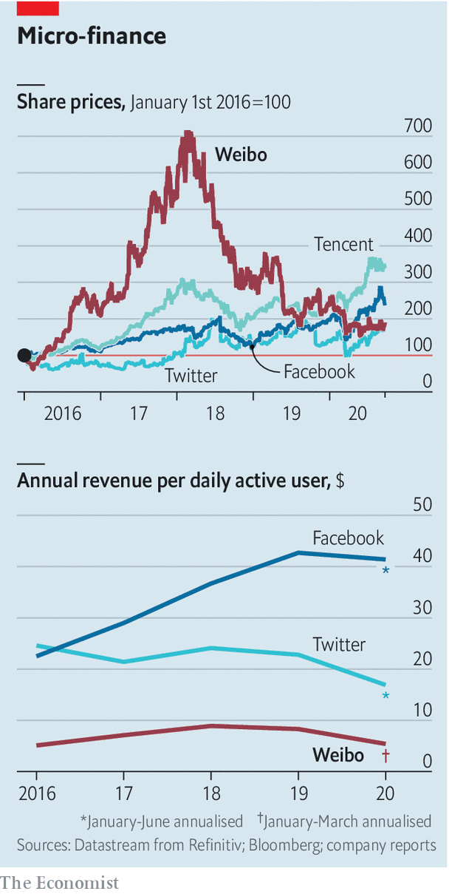

## Weibo woes

# Can Weibo do better than Twitter?

> China’s microblogging giant faces ever stiffer competition for advertising revenue

> Sep 24th 2020BEIJING

THREE YEARS after Twitter launched in 2006, Chinese techies created a similar microblogging service in China. Weibo (literally “microblog” in Chinese) boasted an average of 241m daily active users in March, more than Twitter. Like its American cousin, Weibo allows users to follow other users, tweet, retweet and browse a real-time list of trending topics (though it steers clear of politics, out of bounds in its communist homeland). And like Twitter, it relies heavily on advertising revenue.

So as coronavirus-induced uncertainty led advertisers to slash budgets, Weibo saw advertising revenue, which accounts for nearly 90% of sales, plunge. In the first quarter it fell by a fifth year on year, to $275m. Operating profit plummeted by more than half, to $58m. Delayed second-quarter results, due on September 28th, may be less terrible. China was the first to be hit by covid-19 but began to recover just as the West went into lockdown.

But Weibo also confronts a longer-term challenge. Yujun Shao of Westwin, a Shanghai-based digital-marketing firm, notes that for much of the past decade two firms—Weibo and Tencent (which owns WeChat, a messaging service)—sucked in the vast majority of advertising spending on Chinese social media. Today the “big two” are competing for ad yuan with another behemoth, ByteDance, which operates Douyin, an addictive short-video app (as well as TikTok, its global version). Other rising internet stars, such as Pinduoduo, which offers bargain shopping, are also muscling in on the advertising market.

Weibo already boasts more than half a billion registered users in China. But user growth has slowed. To keep advertisers on board, Weibo must therefore boost user engagement. The company understands this. It already sports a richer array of functions than Twitter, for example a popular question-and-answer service in the mould of Quora. It is constantly adding new ones. In 2018 it acquired Yizhibo, in which people live-stream stand-up comedy, moonwalks and other acts for tips. Last year it launched a photo-sharing service akin to Instagram called Oasis. Still, Weibo’s revenues per user have been declining since 2018, and its share price with them (see chart). That is one more feature it has in common with Twitter—but is the opposite of what you would expect from a platform with strong network effects, such as Facebook.■

## URL

https://www.economist.com/business/2020/09/24/can-weibo-do-better-than-twitter
