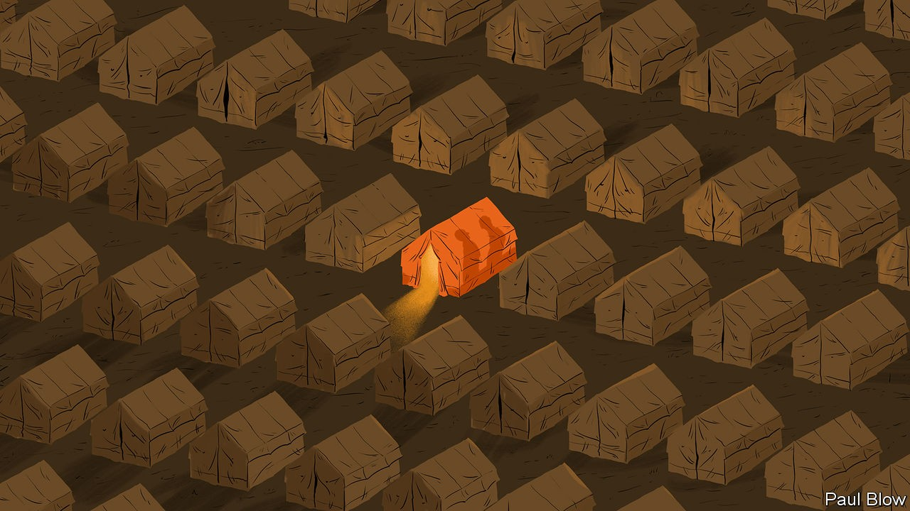

## Bartleby

# The world’s toughest business school

> The challenges of being an entrepreneur in a refugee camp

> Sep 24th 2020

IN 1996 CIVIL war erupted in what was then Zaire and is now the conflict-ravaged Democratic Republic of Congo (DRC). Karasira Mboniga managed to escape, eventually settling in the Kiziba refugee camp in Rwanda, and working as a secondary-school teacher. But he says that his life changed for ever when he started his own business in 2008, selling food and performing money transfers.

That business came under threat when the pandemic hit earlier this year. But Mr Mboniga was one of many refugees to be helped by the African Entrepreneur Collective (AEC), a charity which started to disburse grants from a special covid-19 relief fund in June.

AEC, which started in Rwanda in 2012, has had a focus on job creation from the start. Eventually it realised that helping refugees would serve that aim, as jobs would also be created in the host community. Until the pandemic, it focused on making loans, rather than grants, to small businesses.

Its new covid-19 fund was established with help from the MasterCard Foundation, the payment processor’s charitable arm. It has already helped almost 4,000 entrepreneurs; 91% of the businesses that were closed have since reopened. On average, the ventures have managed to increase their staff by a third within a month of receiving a grant.

Sara Leedom of the AEC says the charity has put few restrictions on how the refugees can spend the money. Some have used it to settle debts; some to pay their employees; some to restock the business; some on covid-related issues, such as sanitation; and some have invested in new technology. Many operate small shops, kiosks or cafés; several work in agriculture; and a few in tourism and hospitality. “We were blown away with what was possible,” she says.

All the residents in the camps tend to rely on grants from the UN refugee agency for their monthly income. When people do buy goods, they often have to purchase them on credit. As a consequence, the camp’s entrepreneurs can get easily into debt as they wait to be repaid by their customers. That, in turn, helps explain why loans and grants from charities can be necessary to tide them over.

As well as a grant, however, Mr Mboniga has received business training from the AEC and says he would advise other refugees to join the programme. In the long run, he hopes that “my business will help me to support my family, to be self-reliant”. But he also wants to “create jobs for other refugees who don’t have other sources of income”.

Another person to make it out of the DRC was Muzaliwa Rushama, who reached the Nyabiheke Camp in the Gatsibo district of Rwanda in 2008. For many years, he had part-time work delivering goods. Starting a business was difficult, he says, because he did not have enough capital and it was also hard to find somewhere to conduct his trade and to acquire business knowledge. From his part-time income, he would save around 20,000 Rwandan francs ($20) a month until eventually he was able to accumulate 300,000 francs. That allowed him to start his business, selling food, such as flour and rice, in 2017.

Mr Rushama started working with the AEC in 2018 and has benefited from training, particularly in book-keeping, which he found immensely useful. “I know how to count money in and out, my expenses and stock,” he says. He was able to borrow $100 in 2018 and is currently servicing a $300 loan; he estimates that the value of his business has risen more than threefold since it began. His dream is to diversify into selling other products, for example shoes and clothes.

The challenges of operating a business in the middle of a refugee camp are enormous, to put it mildly. Almost everyone there relies on aid. Access to traditional sources of finance, like banks, is extremely limited and expensive. Many goods need to be brought in from outside but the Kiziba camp has only a dangerous road linking it with the nearest town. On the plus side, the Rwandan government at least does not tax the enterprises run within the camps.

Creating a business gives refugee entrepreneurs two things: a degree of control over their own lives and hope for the future. For those who have languished in such places for years or decades both are invaluable.

AEC is expanding its operations. A year ago it began helping refugees in a Kenyan camp called Kakuma. Its entrepreneurial wards may never become the next Apple or Facebook. But turnover is not the only measure of business achievement. Small can be beautiful.

## URL

https://www.economist.com/business/2020/09/24/the-worlds-toughest-business-school
