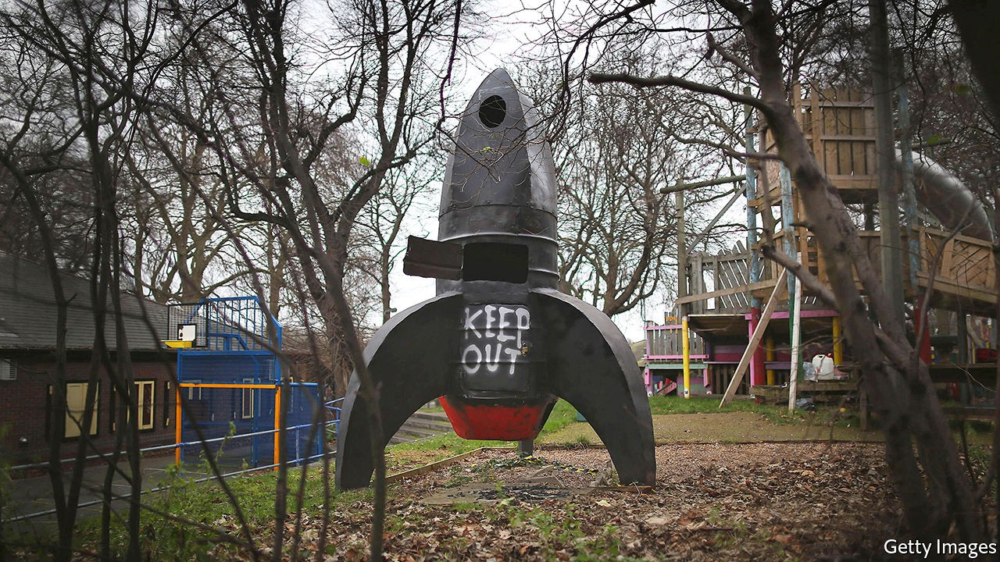

## Rocket Internet

# Why Rocket Internet has come down to earth

> Europe’s erstwhile online darling wants to delist

> Sep 24th 2020BERLIN

“I  AM NOT Scrooge McDuck,” said Oliver Samwer in 2017 when he denied the request of shareholders of Rocket Internet, the startup incubator he co-founded with his two brothers, to use the company’s cash to boost its ailing share price through share buy-backs. Now the way he has handled a planned delisting of Rocket from stock exchanges in Frankfurt and Luxembourg reminds those same shareholders of Walt Disney’s money-hoarding cartoon character. Those who put money into Rocket’s initial public offering (IPO) in 2014 may end up with a hefty loss.

“It is totally legal and totally immoral,” says Michael Kunert of SDK, an association which defends investors’ rights, about the planned delisting of Rocket, expected to be rubber-stamped at the firm’s extraordinary general meeting on September 24th, after The Economist went to press. Rather than using external capital to buy investors out at a premium, the usual way to take a firm private, Mr Samwer has used company cash to buy back €223m ($260m) of its own shares. This pushed his clan’s stake to over 50%. He plans to use another €1bn of Rocket’s cash to buy out minority shareholders at €18.57 a share, the volume-weighted average price in the past six months but down from the IPO price of €42.50.

Mr Kunert reports that Rocket’s minority shareholders complain Mr Samwer is using the coronavirus crisis, which has hit nearly all the firm’s 200-odd startups and brought its market value below that of its cash and liquid assets, to push them out. They say that the price offered by Mr Samwer’s does not take into account Rocket’s €1bn-worth of stakes in unlisted startups such as Traveloka, an Indonesian online-travel firm. Investors are under no obligation to sell their shares, of course. But those who stay put will have little power to affect the course of the firm now that the Samwer brothers control the board with their majority stake. Rocket has stated it will be “better positioned” for long-term development if not listed on a stock exchange.

Why did Rocket not take off? Analysts say the air got thinner as soon as others in Europe got better at aping American e-commerce successes at home and in emerging markets—a business model that Rocket pioneered. Rocket’s successful IPOs, like that of Delivery Hero, an online food-delivery business which recently joined Germany’s DAX 30 blue-chip index, have in recent years given way to smaller technology investments and a handful of real-estate bets. Following last month’s spectacular crash of Wirecard, an online-payments processor accused of huge fraud, Rocket’s bruising re-entry from public markets leaves Germany even more bereft of digital darlings than it already was. ■

## URL

https://www.economist.com/business/2020/09/24/why-rocket-internet-has-come-down-to-earth
