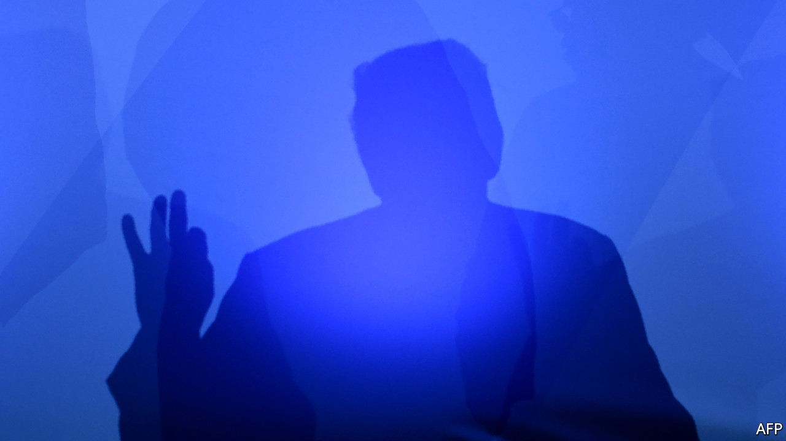

## The principals’ uncertainty

# Why the TikTok deal is like Schrödinger’s cat

> To understand the video-app saga, think of quantum mechanics

> Sep 26th 2020SAN FRANCISCO

IF YOU WANT to understand the agreement between TikTok, a Chinese-owned video-sharing service, and Oracle, which sells corporate software (see [article](https://www.economist.com//business/2020/09/23/can-tiktok-help-oracle-stay-relevant-in-the-cloud-computing-age)), it is useful to think of Schrödinger’s cat. Like the hypothetical feline of quantum mechanics, simultaneously alive and dead, the deal seems to be in two states at once—one hunky-dory to Beijing but fatally flawed to Washington, the other vice versa.

Take the question of who owns TikTok Global, the new company to be spun out of ByteDance, TikTok’s Chinese owner, to give the data of American users a secure home in America. ByteDance insists that it will hold 80% of the new entity. The Americans say they will control a majority stake. Oracle and Walmart, a supermarket titan which has joined in, will own only 20% of TikTik Global between them. But American venture-capitalists already own 41% of ByteDance. Apply the right maths and both the Chinese parent and the Americans own more than 50% of TikTok Global, which the deal values at $60bn and which is supposed to go public within a year.

What about TikTok’s technology? Beijing says that ByteDance’s eerily accurate recommendation engine is not for export. Security hawks in America want to ensure no data are diverted and the algorithm is not used to spread misinformation. So the source code will stay in China but Oracle will have access to it. How this will work in practice is about as clear as Schrödinger’s equation is to non-physicists.

In normal times everyone would resolve the ambiguities at the negotiating table. But times aren’t normal, especially in America. Ahead of November’s election, President Donald Trump prizes ambiguity. He wants to bash China but not irk America’s 100m users of TikTok, which he has threatened to ban (along with WeChat, a messaging app owned by another Chinese tech giant). A federal body that examines foreign investments in America looks ready to approve the Oracle deal, obviating a Department of Commerce edict banning Americans from doing business with TikTok from September 27th (a federal judge this week blocked the WeChat ban on free-speech grounds). Predictably, mostly positive noises from Washington have provoked angry ones in China, where state media have denounced the deal. Observe Schrödinger’s cat close enough and it ends up either dead or alive, after all. ■

## URL

https://www.economist.com/business/2020/09/26/why-the-tiktok-deal-is-like-schrodingers-cat
