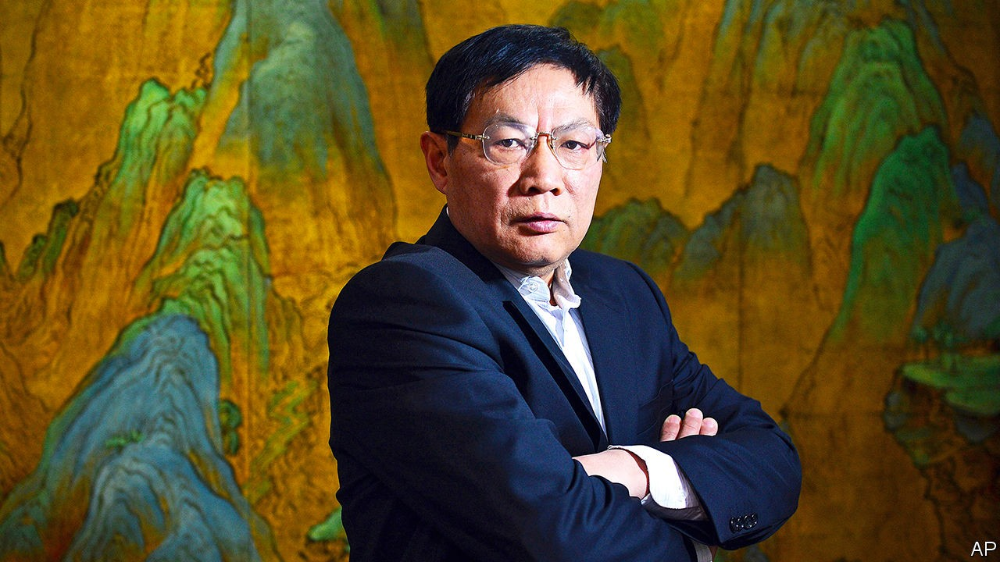

## A loose cannon silenced

# A prominent critic of China’s leader gets 18 years in jail

> Ren Zhiqiang’s sentencing shows that wayward princelings cannot expect leniency

> Sep 26th 2020BEIJING

“BIG GUN REN can no longer fire,” sighed one netizen in a (swiftly censored) post on Weibo, a social-media platform. On September 22nd a court in Beijing had found Ren Zhiqiang, a retired boss of a state-owned property firm, guilty of corruption, bribery, embezzlement and abuse of power. He was sentenced to 18 years in prison.

Weibo had once been Mr Ren’s weapon of choice for lobbing fiery remarks about politics, a habit that earned him the big-gun nickname among his 37m followers. It was also a habit that infuriated the Communist Party. In 2016 his account was shut down. The party put Mr Ren, a member, on notice for one year. But many assumed that, as the son of one of Mao Zedong’s vice-ministers, and as someone with high-level friends, he enjoyed a degree of protection.

Xi Jinping, China’s leader, has now made it clear that a red pedigree cannot shield a dissenter. Mr Ren was detained by police in March after one of his essays, circulated among the party elite, criticised a self-congratulatory speech made by Mr Xi about the government’s response to covid-19 even as the nation was reeling from a disastrous early cover-up of the disease. Mr Ren denounced him as “a clown with no clothes on who is still determined to play emperor”. He wrote: “All I see are lies being used as loincloth.”

The severity of Mr Ren’s sentence—which puts him behind bars until the age of 87—sends a stark warning to other insiders. When the party expelled Mr Ren in July, investigators said he had “besmirched” it and “shown disloyalty”.

Other forthright intellectuals have recently faced harsh punishment. Xu Zhangrun, a law professor, was detained for six days in July and then dismissed from Tsinghua University after writing essays critical of Mr Xi. Cai Xia, who taught at the party’s training school for senior officials, spoke up for Mr Ren—and was stripped of her party membership and her pension. This month police detained Geng Xiaonan, the head of a publishing house, and her husband; Ms Geng had publicly defended Mr Xu.

In Mao’s day taking down a party member of Mr Ren’s status might have involved a full-fledged political campaign. The speed and “surgical precision” with which he was removed shows how much the process of purging the elite has changed, says Ling Li of the University of Vienna. In 2018 a new body, the National Supervision Commission, fused the internal-discipline apparatus of party and state—making it even easier for the party to use the courts to penalise politically wayward insiders. The big gun was no match for its powers.

## URL

https://www.economist.com/china/2020/09/26/a-prominent-critic-of-chinas-leader-gets-18-years-in-jail
