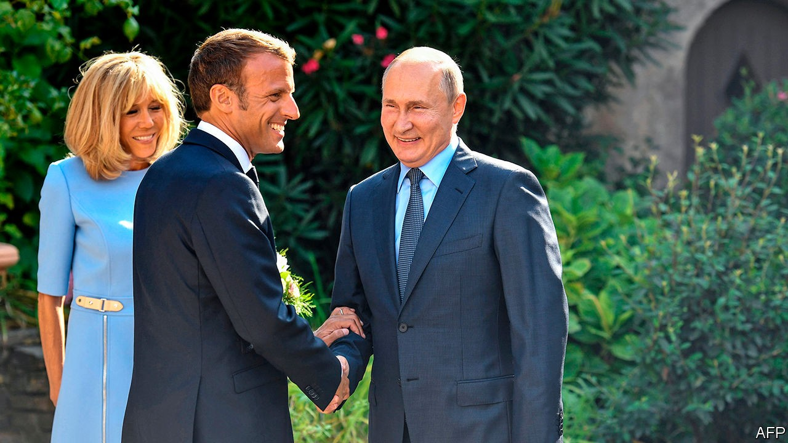

## Trying to square a circle

# France, as ever, wants to be both European and French

> It is proving awkward

> Sep 26th 2020PARIS

THE PANDEMIC has grounded most European leaders. But not Emmanuel Macron. In recent weeks, the French president has been in hyperactive diplomatic mode. He has jetted off twice to Lebanon, once dropping in on Iraq on the way back. He has dispatched a frigate and two fighter jets to help Greece and Cyprus defend their waters from Turkish incursions, and held a sea-front summit of Mediterranean leaders in Corsica to try to rally others to make a tougher stand against Turkey. On September 28th-30th the French president is off again, this time to Latvia and Lithuania, where he will visit French soldiers serving in a NATO battlegroup.

What is Mr Macron up to? Three years ago this month, in the amphitheatre of the Sorbonne, he outlined an ambitious plan to reinvigorate the European Union. This stood on two principles: more “solidarity” among member countries, and more assertion of European “sovereignty” in the face of big-power rivalry. In July, when all 27 EU members agreed to issue mutualised debt for a massive recovery fund, Mr Macron made progress on his first point. On the second, however, France is still trying to work out how to reconcile its version of the collective European interest, notably in response to regional troublemakers in Turkey, Russia, Libya and elsewhere, with how others see it.

In some respects the debate has shifted France’s way. “Mentalities are changing,” says Clément Beaune, Mr Macron’s Europe minister: “We inoculated Europe against hard power, because 70 years ago we built the project on reconciliation and said that hard power isn’t for us. Now we are learning to speak the language of power.” The phrase “European sovereignty”, which might once have been dismissed as a French abstraction, is now uttered even by the German foreign minister, Heiko Maas. Ursula von der Leyen, head of the European Commission, has said that she wants the commission to be “geopolitical”.

As France is discovering, though, such concepts do not mean the same to everyone. Take the French stance towards Turkey. Mr Macron’s muscular backing for the Greek and Cypriot navies, offered in August after a phone call to Kyriakos Mitsotakis, the Greek prime minister, was seen in France as clear-cut: support for a threatened fellow European country, in defence of international law and sovereign borders. Yet it was not universally welcomed. Norbert Röttgen, the Christian Democratic chairman of the Bundestag’s foreign-affairs committee, argued that the EU “shouldn’t pick a side” as “this will only lead to escalation”. Others said it undermined parallel German mediation efforts.

As it turns out, Turkey has now agreed to resume talks with Greece, a decision that Mr Macron applauded in a call to Turkey’s president. The French argue that it was the division of labour—with Mr Macron as warrior and Angela Merkel as mediator—that clinched it. Asserting European sovereignty means doing both, they say, and Europe should get used to that.

Misgivings about French activities on Europe’s periphery, though, remain. The most pressing concern Mr Macron’s efforts to create a “strategic dialogue” with Russia. With great fanfare he invited Vladimir Putin to the official presidential retreat on the Mediterranean in August last year (pictured), arguing that the best way to keep Russia out of China’s arms was to offer it a place on Europe’s eastern fringe under a new security architecture. At the time, such suggestions enraged Poland and the Baltic states, which eye Russia nervously on their eastern flank, and consider NATO—which Mr Macron went on to criticise—to be their guarantor of security.

The poisoning of Alexei Navalny, Mr Putin’s leading opponent, along with Russia’s propping-up of Alexander Lukashenko’s dictatorship in Belarus, has made Mr Macron’s approach increasingly untenable. Earlier this month the French called off a planned “2+2” meeting in Paris of French and Russian foreign and defence ministers. Le Monde described a “dialogue of the deaf” between Mr Macron and Mr Putin, in which the Russian president suggested in a phone call on September 14th that Mr Navalny may have poisoned himself.

“Ours is a strategy that has to adapt to circumstances,” Mr Beaune told The Economist on September 22nd. “We never said it was an unconditional or irreversible dialogue. The Navalny affair makes it more difficult in the short run. It’s never been a question of U-turns but adaptations.” Mr Macron had already expressed his “reservations” about Germany’s Nord Stream 2 pipeline, which will bring Russian gas to Europe. The tone in Paris is hardening.

“Macron is slowly coming to terms with the fact that he’s going nowhere with Putin,” says Bruno Tertrais of the Foundation for Strategic Research in Paris. This does not mean that France has abandoned its longer-run hopes of a meaningful dialogue with Russia. But the French president is under pressure to distance himself right now from Russia’s leader. France has backed the EU’s plan to impose sanctions on selected Belarusian leaders. Mr Beaune has urged Cyprus not to block them. There is talk that Mr Macron may meet Svetlana Tikhanovskaya, the exiled Belarusian opposition leader, when he is in Lithuania.

Mr Macron’s setback over Russia is by no means his only headache. Covid-19 cases at home are rising steeply again. His poll ratings remain low. On September 21st Pierre Person, the deputy leader of his party, La République en Marche, resigned from his post, saying that the party was “at risk of disappearing” and didn’t “produce any new ideas”. (The outfit has appointed Mr Beaune, among others, to come up with some.) Amid all of this, the president’s chief consolation is that a growing majority of the French give him credit for defending the country’s interests abroad, even if outsiders are not always so impressed. ■

## URL

https://www.economist.com/europe/2020/09/26/france-as-ever-wants-to-be-both-european-and-french
