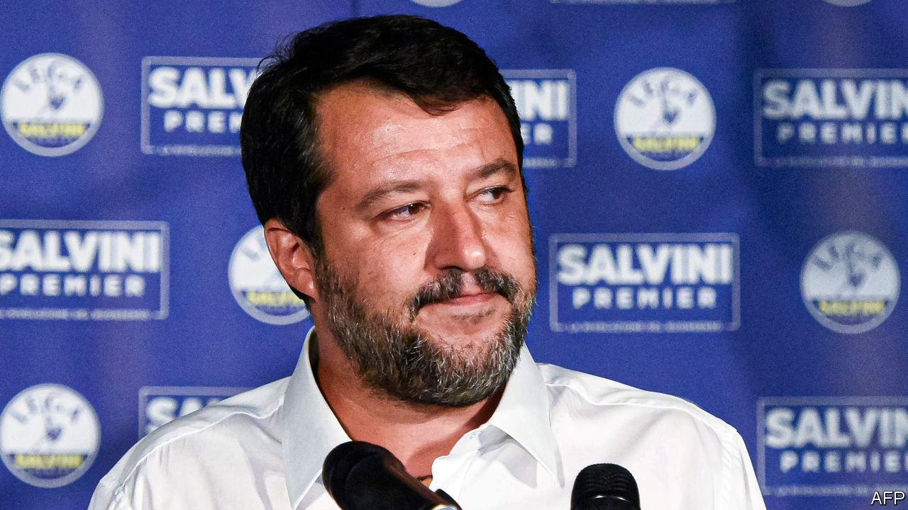

## Circus minimised

# Italians vote for fewer, better politicians

> After a referendum, parliament is to be cut down to size

> Sep 26th 2020ROME

IT IS NOT often that voters get a chance to cut politicians down to size. But on September 20th-21st, Italy’s did—and they seized the opportunity with both hands. By a whopping majority of 70% to 30%, they opted in a referendum to slash the number of lawmakers by more than a third. The lower house (the Chamber of Deputies) will have 400 members, down from 630, while the upper one will have 200 elected senators rather than 315. The reform also capped at five the number of presidentially nominated senators-for-life.

The new law will take effect after the next general election, which does not have to be until 2023 though it may come earlier. It will not affect the generous salaries and perks of Italy’s parliamentarians. Nor does it tackle a more fundamental problem: that the two houses have identical functions. Still, it brings the ratio of voters to lawmakers to around the same level as in Germany and represents a triumph for anti-politics, the distrust of a governing elite whose members are seen by many Italians as pampered, corruptible and virtually impossible to dislodge. Anti-politics was an important reason for the rise of the maverick Five Star Movement (M5S), which sponsored the reform.

So another populist advance? Regional elections held at the same time suggested otherwise. First, they showed Italians cared enough about old-school parliamentary democracy to defy the risks posed by covid-19 to vote in sizeable numbers. Nowhere was turnout below 50% and in Valle d’Aosta, by the border with France, it was more than 70%, impressive by any standards for a regional election. Second, faced with a Europe-wide resurgence of the virus and the daunting responsibility of investing wisely the vast funds that the EU has earmarked for Italy’s economic recovery, voters opted for continuity.

The centre-left Democratic Party (PD), which governs in a coalition including the Five Stars, had feared a disaster. Seven of Italy’s 20 regions were at stake, four of them governed by the PD. Polls suggested the party could lose three, including Tuscany, a left-wing heartland since the days of the now defunct Italian Communist Party. In the event, the PD’s candidate for governor in Tuscany convincingly defeated a challenger put up by Matteo Salvini’s hard-right Northern League. The only defeat for the PD and its genial but uncharismatic leader, Nicola Zingaretti, was in the neighbouring Marche region, once considered part of Italy’s central “red belt”. There, victory went to the Brothers of Italy (FdI), which has roots in neo-fascism (and which, despite its name, is led by a woman.)

It was the latest of many signs the FdI may now be poised to overhaul the shriller, more populist League to take command of the Italian right. It was little comfort for Mr Salvini that the League came first in the Valle d’Aosta, with almost 24% of the vote. And he will have been even less cheered by the outcome in Veneto, which has been a bastion of the League since its earliest days. The incumbent governor, Luca Zaia, romped home with 77% of the vote. But his triumph, like that of the Democrats’ Vincenzo De Luca, in Campania, the region around Naples, was largely attributable to his adroit handling of the pandemic rather than any obvious sympathy for the League’s harsh messages on immigration and Europe. Mr De Luca, whose authoritarian ways earned him the nickname “Pol Pot”, managed the seemingly impossible task of getting Neapolitans to respect the lockdown by, among other things, threatening to deploy police armed with flame-throwers. Mr Zaia won plaudits globally for containing the virus with blanket testing. The bad news for Mr Salvini is that as a result Mr Zaia is now being talked of as a potential and imminent successor to him.

Despite their referendum win, the Five Stars’ performance also showed that Italians have become picky about populism. In only one region did they scrape into double figures. Even worse was their result in Liguria, in the north-west. Here, the M5S allied with the Democrats to back a shared candidate, the idea being that this could deliver the extra votes to oust a centre-right incumbent. Instead, the allies’ contender slumped to a 17-point defeat. As Italy enters a crucial phase, which could decide whether it recovers its economic dynamism or sinks further into debt-laden lethargy, the PD will be firmly in the driving seat. ■

## URL

https://www.economist.com/europe/2020/09/26/italians-vote-for-fewer-better-politicians
