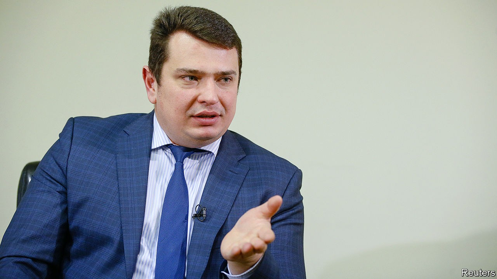

## Lock up the small fry—for a start

# Ukraine’s anti-corruption court bares its teeth

> In its first year it has racked up some real if modest achievements

> Sep 26th 2020KYIV

THE OFFICIALS who ran Ukraine before its revolution in 2014 are believed to have stolen billions of dollars. One crony gave Viktor Yanukovych, when he was president, a solid gold loaf of bread. So nabbing a regional forestry official for a $10,000 bribe may seem like small potatoes. But the sentencing on August 28th of Oleksandr Levkivsky, who stands to serve four years in prison for taking a kickback to let out public land, is a big deal. Mr Levkivsky is among the first officials convicted by Ukraine’s High Anti-Corruption Court (HACC), which began work a year ago.

The court was set up at the behest of the IMF, which demanded an independent anti-corruption mechanism, among other things, in exchange for the billions of dollars in credit Ukraine needs to keep its economy afloat. The HACC has handed down 17 verdicts so far (almost all of them guilty), and is hearing scores more cases. But after years of being robbed, many Ukrainians are not satisfied with small fry. They want bigger fish hooked.

The HACC’s 38 judges were selected in a multi-round competition, with help from international experts. Some of the cases they hear are brought by an anti-corruption prosecutor supervised by the prosecutor general, but others come from the National Anti-corruption Bureau of Ukraine (NABU), an independent agency. The judges have proved willing to push back against investigators: in Mr Levkivsky’s case, they dismissed evidence that was gathered illegally. “There is no question about the professionalism of this court,” says Andrii Borovyk of Transparency International Ukraine, an anti-corruption watchdog.

But efforts to beat graft are under constant attack. In August the Constitutional Court ruled that since the constitution does not give the president the power to select NABU’s head, Artem Sytnyk, the respected prosecutor picked to run the agency in 2015, had been illegally appointed. Mr Sytnyk refuses to step down, saying the ruling is retaliation for NABU’s investigations into judicial corruption, but the court has now ruled that NABU itself was established on dubious legal grounds.

It is no coincidence that pressure is increasing just as the new court hits its stride, says Vadym Valko, a legal expert who closely follows NABU. The judges are hearing a number of high-profile cases, including ones involving the mayor of Odessa and a former tax chief. But collecting smaller victories, rather than focusing on big fish in order to satisfy public pressure, may be a better strategy. “Make sure that due process works,” says Matthew Murray, a former official in Barack Obama’s administration who helped push for the HACC. The court’s chief justice, Olena Tanasevych, wrote recently that sometimes “it seems as though absolutely everyone is dissatisfied.” That may mean her team is on the right track.

## URL

https://www.economist.com/europe/2020/09/26/ukraines-anti-corruption-court-bares-its-teeth
