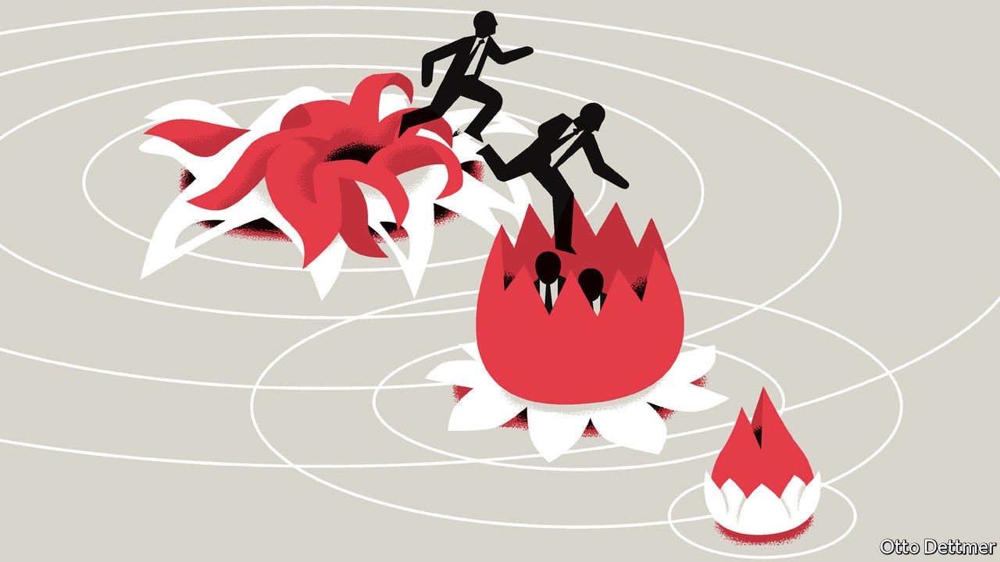

## Free exchange

# Can China’s economic miracle continue?

> In a new book, Thomas Orlik argues China is “the bubble that never pops”

> Sep 26th 2020

FORECASTS CAN haunt their authors, especially when they appear in headlines or book titles. Most pundits play it safe, giving “a number or a date, but not both”, as an old sage once advised. Thomas Orlik of Bloomberg is more courageous. His latest book, “China: The Bubble That Never Pops”, provides an unusually even-handed account of China’s economic resilience that is both closely observed and analytically interesting. But its title offers up quite a hostage to fortune. “Never”, after all, spans a lot of dates.

Fortunately for Mr Orlik, his definition of China’s bubble leaves him some wiggle room. He is not referring to any particular market or mania (such as the frenzy for tech stocks this year, bike-sharing in 2017 or caterpillar fungus in 2012). The title refers instead to China’s crisis-proof economic momentum, which has survived countless predictions of collapse. Even now, this unpoppable force is bouncing back with impressive speed from the covid-19 pandemic (which arrived after this book was written). Will Mr Orlik ever wish he’d never said never?

Although Mr Orlik does not draw heavily on economic theory to justify his confidence, he can take some comfort from it. A bubble that never pops sounds like the sort of thing that the laws of economics should rule out, like a free lunch or an unpocketed dollar bill. In fact, theorists have long entertained the possibility of sustainable bubbles, inspired by the work of two Nobel prizewinners, Paul Samuelson in 1958 and Jean Tirole in 1985.

They showed that bubbles can persist when an economy’s growth rate consistently exceeds its interest rate. In these circumstances, a bubble can remain both attractive and affordable, enticing the buyers it needs to sustain itself without dwarfing the economy. Suppose, for example, that workers in every generation plough a portion of their income into an intrinsically useless asset, such as an empty flat, which they plan to sell when they retire. Because every cohort has the same plan, each will find buyers among their descendants for the asset they bought from their forefathers. Since another generation is “always coming along”, as Samuelson put it, this chain need never break.

If the economy is growing, each generation will have more income to spend on the asset than the one preceding it. That will allow the seller to earn a positive return. And if the economy’s growth rate exceeds the interest rate, this return will be higher than what other saving vehicles, such as bank deposits, can offer. This condition, known as “dynamic inefficiency”, was once thought to be rare. But in an era of near-zero interest rates, it has come to seem almost familiar. China’s dynamic inefficiency was documented in 2006 by economists at the Hong Kong Monetary Authority and has been confirmed by subsequent studies.

It may be that China’s interest rate understates the true return on capital in the country, thanks to lingering financial repression. But even so, a long-lasting bubble could arise, according to a 2014 paper by Kaiji Chen of Emory University and Yi Wen of the Federal Reserve Bank of St Louis. In their model, private capital earns impressive returns for as long as it can profit from cheap labour migrating from fields to factories and from state-owned enterprises to private firms. That gives entrepreneurs the financial means to venture large sums in the property market. At the same time, they know that the profitability of their businesses will eventually decline as labour becomes scarce. That gives them the motive to diversify their wealth into other stores of value, such as property.

In this scenario, property prices will keep pace with the rate of return to entrepreneurial capital, which is even higher than the growth rate of the economy as a whole. Then, as workers become harder to find, the returns to capital and to property steadily diminish in tandem. The later chapters of Mr Orlik’s book explain how China managed this slowdown. It entered 2016 in a shaky state. Real-estate developers held daunting inventories of unsold flats and owed similarly daunting sums to shadow lenders. China also suffered from overcapacity in allied industries, such as steel, which threatened to plunge the economy into deflation.

How did China cope? The answer is what you might call the five r’s: reflating and remixing the economy, as well as refinancing, rotating and writing off assets and liabilities. China remixed the composition of activity without reducing its pace, spending less on new mines and steel plants, and more on infrastructure. Projects financed with short-term high-interest bank loans were refinanced with low-yielding bonds issued by provincial governments. Some debt rotated from overstretched developers onto the cleaner balance-sheets of households who were given easier access to mortgages.

China also wrote off bad loans (including shadow loans) and many physical assets. Old mines were closed. Slums were cleared. Displaced households were given money to help buy newer flats. These efforts were often financed by targeted loans from the central bank. The clearances, closures and write-offs reduced the economy’s stock of wealth, but did not interrupt the flow of fresh activity. Indeed, the combination of new money injected into the economy and old capacity removed from it lifted prices and quickened the growth of nominal GDP. That restored the gap between growth and interest rates, making debt levels easier to sustain.

This clean-up took advantage of some of China’s unusual strengths, including the reach of its regulators and the flexibility of its labour force. When the mix of activity changed, workers followed suit. But it also conformed to some economic principles that could apply anywhere. The deflationary pressure China faced in this dangerous period showed that there was room to stimulate the economy. And because interest rates were lower than growth rates, it could afford to roll over any liabilities it dared not write off.

Will China never pop? Safer to say there is little it cannot mop.■

## URL

https://www.economist.com/finance-and-economics/2020/09/26/can-chinas-economic-miracle-continue
