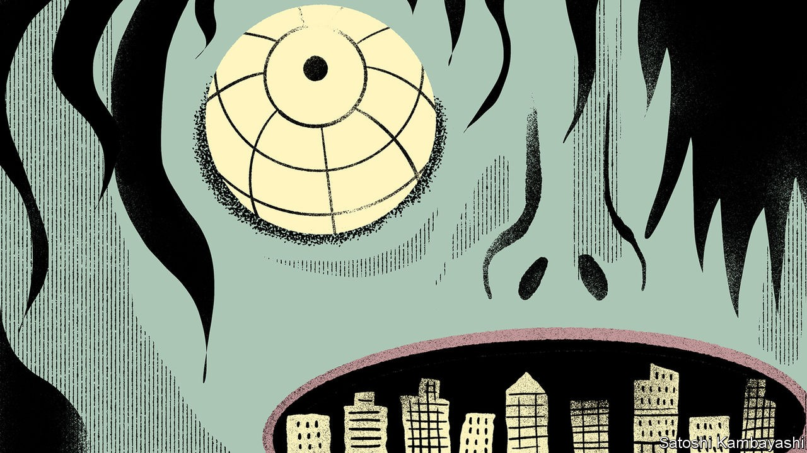
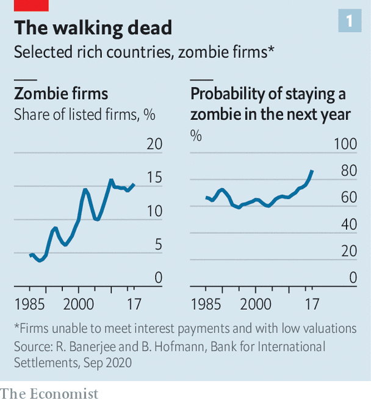
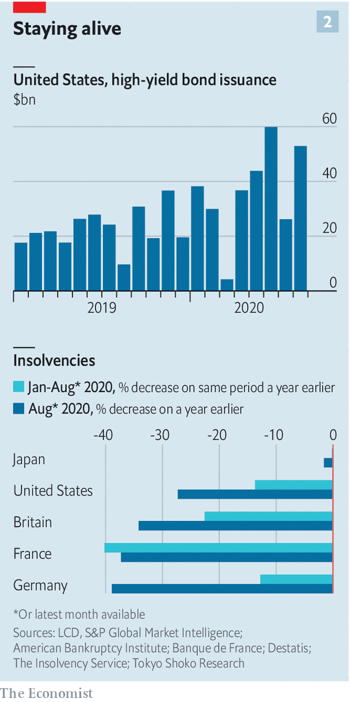

## The corporate undead

# Why covid-19 will make killing zombie firms off harder

> Easier access to credit and government support means they will stumble on

> Sep 26th 2020

COMPETITION BETWEEN businesses can deliver vast rewards to the winners, as rich lists dotted with spacefaring billionaires attest. The fate of the losers, on the other hand, is a gruesome demise. At least, that used to be the case. A horde of companies has of late emerged that is neither profitable nor condemned to liquidation or takeover. Such corporate “zombies” stalk the business landscape. They are bad news for the economy. And many more firms are in danger of being zombified during the covid-19 downturn.

Zombie businesses are not a new phenomenon. Marginally profitable firms featured prominently in Japan’s “lost decade” in the 1990s (see [article](https://www.economist.com//node/21792097)). They have since gained ground in the rest of the world. According to the Bank for International Settlements (BIS), a club of central banks, nearly one in six listed firms in rich countries could be classified as a zombie in the run-up to the pandemic, up from around one in 20 in the 1980s (see chart 1). These are defined as firms that fail to generate enough revenue to make their interest payments on borrowings for three years running, and have low valuations that suggest moribund prospects.

There is some disagreement over where these undead firms are concentrated. The BIS, which focuses on listed companies, finds most in places like America and Britain, estimating that as much as a fifth of firms there are zombies. But that seems to be because these places have lots of smaller listed firms, and smaller firms are generally more likely to be zombies. The OECD, a rich-country policy outfit, fingers others, such as the less dynamic duo of Greece and Italy. All sides agree, though, that the numbers have crept up in recent decades.

What conditions have helped zombies thrive? Rather like the living dead of horror films, unproductive businesses have found ways to stumble on despite lacking the usual vital signs. Banks would once have nudged their bad credits into bankruptcy, perhaps hoping to recoup some of their outstanding loans through restructuring, sale or liquidation. Far from playing their zombie-slaying role, banks have enabled them, letting ailing firms repay old loans with fresh borrowing.

That may be, indirectly, the result of loose monetary policy: lending money to a poor prospect is less painful if the bank pays little in funding costs. Banks with weak balance-sheets—often the result of low profitability itself linked to low interest rates—are more prone to backing zombies. Extending new loans and pretending they will be repaid avoids recognising losses, at the risk of compounding them.

“Evergreening” dud loans, in banking parlance, is particularly appealing if pushing a firm into bankruptcy results in a long, painful process of recovery. Some countries, like America, have efficient ways of restructuring failing firms, balancing the interests of creditors, employees and existing owners. But too often the prospect of years of judicial squabbles—resulting in little of value being left over—means that sitting still and hoping that the company in question somehow recovers is the least bad option. This is particularly the case for smaller firms, which are thus much more likely to be zombies.

Keeping ailing firms chugging along may seem unproblematic: a company need not make profits to keep paying its workers. But the rise in zombies coincides with broader signs of sapped economic vitality. As fewer firms have exited markets, fewer firms have also been created. Younger companies are hiring fewer workers. Employees are moving less, despite technology making it easier for them to find new jobs. Studies suggest that zombification hurts economic dynamism in several ways.

Zombified businesses are found to invest and innovate less than non-zombies. Worse, in some instances zombie firms seem to crowd out healthy ones. Economists at the OECD have found that productive firms in industries laden with zombies find it harder to attract capital. Margins at non-zombies are undercut by firms content to make no return on their investments. Healthy firms invest less as a result. A one percentage-point rise in the zombie share translates into a one percentage-point decline in capital spending by non-zombies, according to the BIS. In turn, productivity growth declines by 0.3%.

Zombification could also have consequences for market competition. Several studies have shown a widening range of productivity performance across firms in the same sector. The dispersion is not solely driven by superstar firms shining more brightly. Studies suggest that the laggards have also stagnated as they have been unable or unwilling to adopt best practices. Markets are less contested, and, in time, deliver lousier service to customers.

All this means that a further rise in zombie firms could be a nightmarish prospect. Covid-19 will swell their ranks. Firms will see profits decline because of the global recession, but two factors make conditions look ideal for zombification: companies’ easier access to credit; and governments’ attempts to freeze the economy in place during the pandemic.

Take credit first. A lending frenzy in recent years meant more loans were issued without covenants—clauses which, if breached, allow creditors to have a say in how a business is run. Almost all euro-denominated leveraged loans, for instance, were “covenant-lite” at the start of 2020; in 2013, fewer than a tenth were. Even if banks and other creditors wanted to push unprofitable firms to restructure or liquidate, they lack the power to do so.

In addition, the amount raised by high-yield bonds, issued by companies with ropy repayment prospects, has risen sharply in recent years. This has offered companies cheap ways to keep funding themselves while hoping for better times. Fears that the credit market would dry up as economic conditions turned have so far not materialised, perhaps thanks to the Federal Reserve’s emergency backstop for these dodgier “junk” bonds. High-yield issuance shot up in the first half of the year (see chart 2). The $292bn raised in America in the first eight months of 2020 exceeds the amount issued in all of 2019.

Government measures to protect the economy from the worst of the pandemic may also contribute to a rise in the number of zombie firms. Furlough schemes that cover wage bills and state-backed loans that provide liquidity enable unprofitable firms to keep going. Some politicians have leant on banks not to foreclose on companies. Many countries have thrown more sand in the gears of creative destruction. In March Germany allowed companies upended by covid-19 to put off filing for insolvency. Australia made pushing firms into bankruptcy harder. In India the central bank has allowed lenders to put off recognising bad loans even as they pile up, reducing the pressure for bankers to take on failing borrowers.

The concern now is that the covid-era zombies will pile up on top of older ones. There may already be evidence of such accumulation. Bankruptcies in 2020, given dire GDP figures, ought to be up by 20-40%, according to the BIS. But in many countries they are in fact lower than before the pandemic (see chart 2, right-hand panel). Credit markets suggest no uptick is expected.

As economic conditions improve, some zombies will no doubt emerge from their stupor. History suggests, though, that this is not easy. The probability of remaining a zombie from one year to the next has been steadily rising. Even revived zombies are problematic. Many relapse. Firms that used to be zombies in 1995 had a 5% chance of slipping back into an undead state, reckon BIS researchers, roughly the same as other firms. Now the probability is 17%. Even those that do not relapse stay weak, with lower growth in profits, productivity, investment and employment compared with non-zombies.

How then to tackle the potential hordes of the corporate undead? In Japan a clean-up of the banking sector in the 2000s led to a rapid decline in unproductive firms. The good news is that the zombie share fell partly because firms made more profits, rather than go out of business.

Today’s global recession makes an immediate profit recovery unlikely. So instead you might think that the downturn ought to clear out unproductive firms. But that presumes lenders can cope with credit losses, and will not try to dodge write-offs. Fragile banks during the financial crisis of 2007-09 did little to kill off zombies. This time, emergency support measures, if not tapered, will delay the needed clear-out.

One threat to zombies would be a change in investors’ willingness to put up with mediocre returns. Thus far bankers and markets have been accommodating. But a rise in interest rates, though not on the cards any time soon in the rich world, would be much more painful in a zombified economy. In horror films, finishing off a zombie is a gory affair. The same is likely to be true in business. ■

Editor’s note: Some of our covid-19 coverage is free for readers of The Economist Today, our daily [newsletter](https://www.economist.com/https://my.economist.com/user#newsletter). For more stories and our pandemic tracker, see our [hub](https://www.economist.com//news/2020/03/11/the-economists-coverage-of-the-coronavirus)

## URL

https://www.economist.com/finance-and-economics/2020/09/26/why-covid-19-will-make-killing-zombie-firms-off-harder
