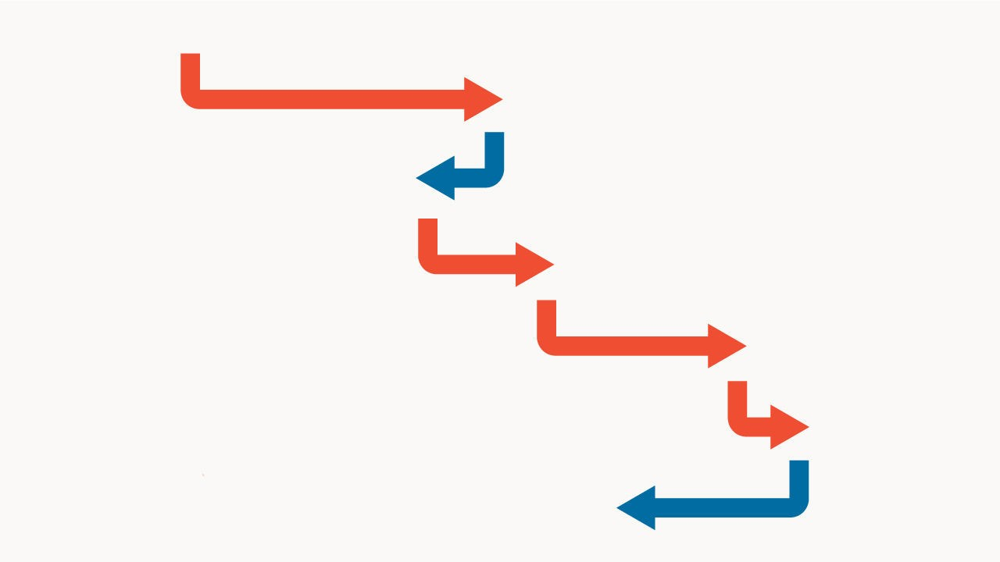

## The Maine reason

# Our new Senate model has inched towards Democrats in September

> A flurry of recent polls make Susan Collins an underdog for re-election in Maine

> Sep 23rd 2020

https://infographics.economist.com/2020/20200926_GDC100_1/index.html

On September 23rd The Economist published our first-ever statistical forecast of the battle for control of America’s Senate. It makes the Democrats modest favourites, giving them a two-in-three shot at re-taking the upper chamber. Had we launched our model two weeks earlier, it would have shown an even closer race, with a 60% chance of Democratic control. The biggest driver of this movement has been a change in its analysis of Maine, one of the most likely states to give Democrats their 50th vote in the 100-seat chamber.

With the benefit of hindsight, it looks as if our forecast was too kind to Susan Collins, the Republican incumbent, from the start. In states with little polling, our model relies on “fundamental” factors like past voting records, which favoured Ms Collins. She won re-election in a landslide in 2014. Donald Trump came within three percentage points of winning her state. Voters have historically rewarded centrists, and Ms Collins is the Senate’s most moderate Republican. And incumbency tends to be most valuable in small states with lots of secular white voters, such as Maine.

https://infographics.economist.com/2020/20200926_GDC100_2/index.html

During the summer, a number of polls showed Ms Collins trailing Sara Gideon, the Democratic Speaker of Maine’s House of Representatives. However, Ms Gideon’s leads were modest, and surveys taken long before an election often turn out to have large errors. As September began, the model still placed nearly as much weight on the fundamentals as it did on the polls, and it saw Ms Collins as a narrow favourite.

However, in mid-September four different pollsters surveyed Maine. On average, they gave Ms Gideon a lead of eight percentage points. Given such consistent new data, the model trimmed Ms Collins’s expected share of votes cast either for her or for Ms Gideon from 50.5% to 48%. (Maine uses a ranked-choice voting system, but polls imply that the size of the gap between the top two candidates remains similar after third-party votes are re-allocated.)

https://infographics.economist.com/2020/20200926_GDC100_3/index.html

A shift of 2.5 percentage points might sound trivial. But when races are close, even small changes in the central point of a distribution of potential results can have a big impact on the share of those possibilities that wind up on one side of the decisive 50-50 line. When the model thought Ms Collins was most likely to get 50.5% of the vote, she won 55% of its simulations; now, she wins just 30%. If the facts change, our model changes its mind.

Source: The Economist

Dig deeper:Read the [best of our 2020 campaign coverage](https://www.economist.com//us-election-2020) and explore our [election forecasts](https://www.economist.com/https://projects.economist.com/us-2020-forecast/president), then sign up for Checks and Balance, our [weekly newsletter](https://www.economist.com//checksandbalance/) and [podcast](https://www.economist.com/https://play.acast.com/podcasts/2020/01/24/checks-and-balance-our-new-weekly-podcast-on-american-politics) on American politics.

## URL

https://www.economist.com/graphic-detail/2020/09/23/our-new-senate-model-has-inched-towards-democrats-in-september
