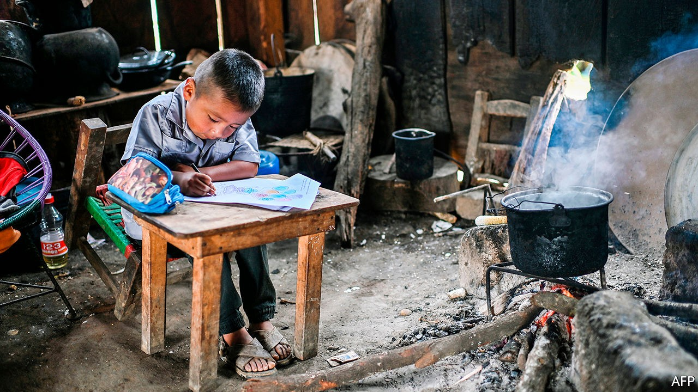
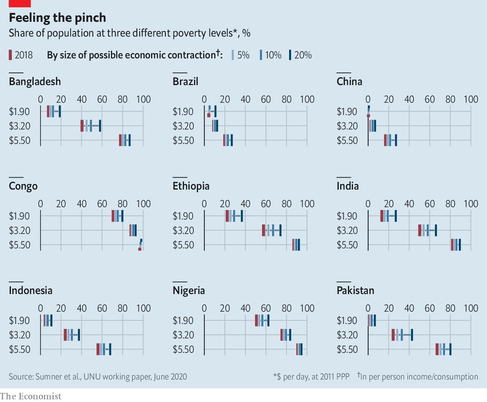
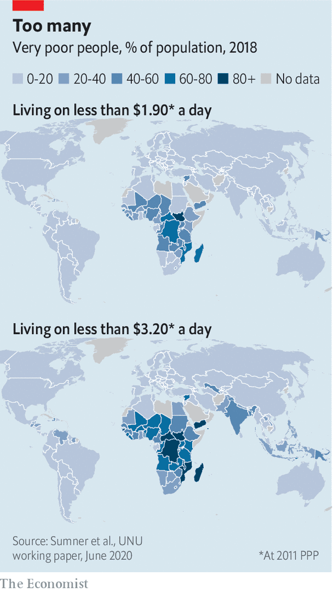
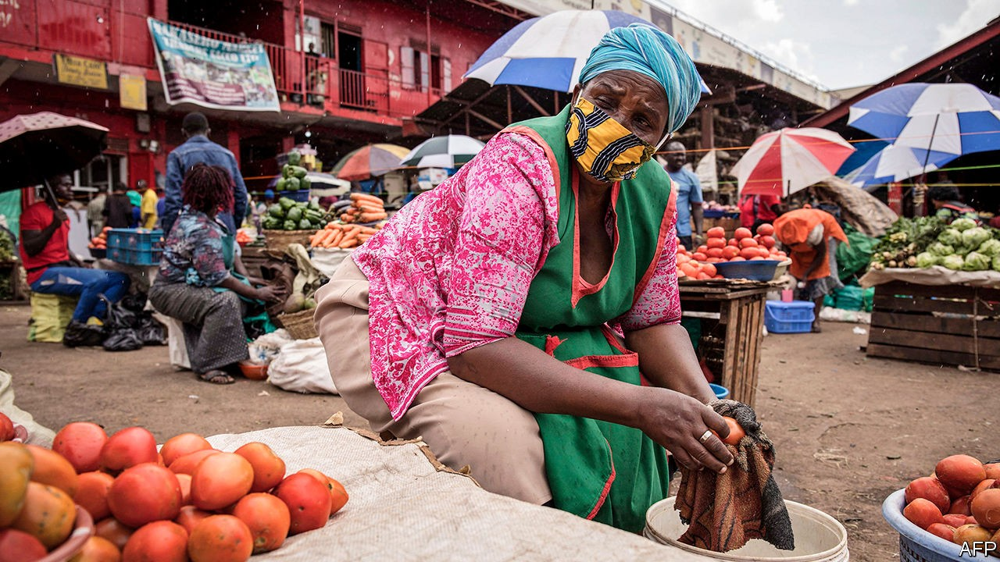

## From plague to penury

# The pandemic is plunging millions back into extreme poverty

> It could take years for them to escape again

> Sep 26th 2020CÁRDENAS, KAMPALA AND MUMBAI

Editor’s note: Some of our covid-19 coverage is free for readers of The Economist Today, our daily [newsletter](https://www.economist.com/https://my.economist.com/user#newsletter). For more stories and our pandemic tracker, see our [hub](https://www.economist.com//news/2020/03/11/the-economists-coverage-of-the-coronavirus)

FOR MORE than a decade Suresh Aryal has flogged momos, steamed dumplings from Nepal, on the streets of New Delhi. On a good day the 32-year-old could take home as much as 6,000 rupees ($82). Then in March, as covid-19 spread, India shut down. Mr Aryal waited for things to improve for three months. When they did not, he returned to his home village in Nepal.

India has since eased its lockdown. But Mr Aryal has no plans to return to the Indian capital. While people are still strapped for cash and reluctant to eat on crowded kerbsides, there is little point. Years spent surviving in a big city and sending money home to his family have left him with no savings. He has been getting by on loans from neighbours, but such generosity has its limits. Jobs are scarce in the village and Mr Aryal does not qualify for government support. “I don’t have a plan,” he says. “I’m going to have to hustle to feed my family.”

Mr Aryal is not alone. According to estimates in June by the World Bank, national lockdowns and the ensuing economic catastrophe will push between 71m and 100m people into extreme poverty this year, defined as subsisting on less than $1.90 a day (at 2011 prices). Its predictions have worsened since the pandemic began, and suggest that three years of progress will be wiped out. Some countries could be even worse hit, depending on the scale of the recession (see chart). From 1990 until last year the number of extremely poor people fell from 2bn, or 36% of the world’s population, to 630m, or just 8%. Most of those left in poverty were in sub-Saharan Africa (see map) and in countries riven by conflict. By contrast, almost half the newly destitute will be in South Asia.

The United Nations is even gloomier. It defines people as poor if they do not have access to things like clean water, electricity, sufficient food and schools for their children. Working with researchers from Oxford University, it reckons the pandemic could cast 490m in 70 countries into poverty, reversing almost a decade of gains.

The economic crisis caused by the pandemic has exacerbated inequalities more sharply than previous recessions. The pandemic has left them with few fallback options. Those who lost formal jobs were unable to make a quick buck in the informal sector driving rickshaws, shining shoes or sorting rubbish, because the world had shut up shop. Lockdowns have frozen entire economies—black, white and grey. Since the disease has struck everywhere, relatives in richer countries may not be able to send extra cash home; remittances may drop by about a fifth this year, the biggest decline in recent history, according to the latest figures from the World Bank.

Worst affected have been the millions who escaped poverty by moving to bustling cities with running water, electricity and schools. Many have lost work and fled to more rural areas, where there are few jobs but at least living costs are cheaper. Official data in India suggest 10m people have relocated, but others reckon the total is five times more. In Kampala, Uganda’s capital, SafeBoda, a motorbike ride-hailing app, reckons that 40% of its drivers went back to the countryside under the lockdown. Returning to big cities holds little appeal until it is clear that economic activity is picking up and that further lockdowns are unlikely. With places such as Jakarta, Indonesia’s capital, announcing new restrictions in response to rising infections, it is not clear when that will be.

The economic crisis is already turning into a food crisis. Peter Lutalo ran a thriving bar in Kiboga, in central Uganda. His family used to eat meat at the weekend and drink milky tea every day. But since the government ordered bars to close they can afford meat only once in three weeks and take their tea black. He is far from alone. The number of people unable to afford enough to eat could double as a result of the pandemic, says the UN’s World Food Programme. That would mean an additional 130m people this year suffering from the sort of debilitating hunger that harms adult health in the long term and can stunt children’s development.

Nor have international organisations plugged the gap. Anna Obba is a teacher in the Bidibidi refugee camp in Uganda. When schools shut down, her income disappeared and her children’s education was disrupted. The World Food Programme cut food rations for refugees by 30% in April, citing a financial crunch. Since then the family has been living on one meal a day.

The disruption to education will have awful long-term consequences. Children whose families have fled cities will probably get a worse education in rural areas, if they get one at all. A survey by the UN’s World Health Organisation found that in August schools were fully open in only six of 39 African countries; only 12 more expect classrooms to reopen this month. Kenya has closed schools until 2021. As every year of education is reckoned to increase annual earnings by roughly 10%, the consequences for poor children are alarming.

The harm to health-care systems will be long-lasting, too. Clinics have been short of staff as medics have been unable to travel to work safely. People have been nervous about visiting them, too. The Bill & Melinda Gates Foundation says vaccination rates among children are dropping to levels last seen in the 1990s. Some of those jabs can be done once doctors are able to work properly again. But for infectious illnesses like measles, even a temporary pause may be lethal. Just 67% of the world’s children may get a crucial third dose of the diphtheria-tetanus-pertussis vaccine (which is usually administered around the age of six months) this year. Last year 84% did.

Some hope that, as lockdowns lift, economies will start to grow again fast, as they often do after disasters. Large parts of Vietnam were destroyed during the war there, but the country bounced back rapidly thanks to economic reforms: between 1990 and 2015 real GDP per person tripled, according to IMF estimates. The portion of the population living on less than $1.90 a day has fallen from over 60% in the 1980s to less than 5% just before covid-19 struck.

Poor countries are unlikely to see similar growth in the short term. For the first time in 25 years sub-Saharan Africa will fall into recession this year. The IMF is forecasting a contraction of 3.2% in the region in 2020, and an underwhelming rebound to 3.4% growth next year. Among the G20 economies India’s shrank most in the spring; its GDP is set to fall by about 4.5% in 2020. It may take some time to catch up. “Historically certainly, growth and poverty reduction have gone hand in hand,” says Carmen Reinhart, chief economist at the World Bank. “But there are enormous question-marks about how much growth we’re going to get.”

There are some signs of improvement. According to recent phone surveys by the World Bank in Ethiopia, 87% of respondents said they had had at least an hour’s work in the week before the interview, though that is still below pre-pandemic levels. Employment levels in Nigeria are almost back to their pre-pandemic level.

But it seems likely that a return to growth will be fitful and uneven. People in poor countries are plainly desperate to return to work. Most are young, and so less vulnerable to covid-19. The World Economic Forum estimates that just 3% of Africans are over 65 years old, whereas over 40% are under 15. Hunger could kill them before the virus does.

If these economies were getting going again, those who stayed in cities should be able to find plenty of work, given the exodus to the countryside. Poor workers still have the same skills they had six months ago; most are keen to use them. But demand for labour remains low. Vishwanath Kamble used to earn around 350 rupees a day as a cobbler in Mumbai. With offices shut and few passers-by, he more often gets only ten rupees nowadays. When he says his daily prayers, he pleads for things to go back to how they were before. That is still far off. Data from Google Maps show that even in mid-September visits to Mumbai’s restaurants, cinemas and shopping centres were down by over 70% compared with January and early February.

Widespread fears about the spread of the virus are still hampering any recovery. “I’m scared too, but what can I do? I have to go to work,” says Munni Mehra, a maid looking for a job in Mumbai. Her husband is working as a cook, earning 10,000 rupees a month. But if Ms Mehra stays at home much longer they will have to go back to their village in Uttarakhand, in India’s far north. Domestic workers see the irony in how middle-class employers think they are the ones at risk if they rehire house servants, says Martha Chen of Harvard, who has been interviewing informal workers around the world throughout the crisis.

Cleaners, with their meagre salaries, are not the ones visiting shopping malls, spas and cinemas where covid-19 thrives. Raju, a flower-seller in the same city, can no longer deliver flowers to people’s homes because security guards will not let him into posh blocks of flats. With no trains running, he has been unable to get to the wholesale market, so has had to use pricier local suppliers. As a result his costs have soared. Since covid-19 took hold in India, his earnings have almost halved, from 13,000 a month to 7,000 rupees.

Nor can poor countries rely on foreign spending. The sharp fall in oil prices earlier this year was enough to slash revenues in countries like Nigeria and Angola that rely on oil exports. In two-thirds of poor countries, commodities make up more than 60% of total merchandise exports, according to the UN’s latest estimates, rising to 88% in Zambia and 100% in Angola. Foreign tourists are not booking safaris in east Africa or beach breaks in Bali. Demand for exports such as Kenyan flowers and Bangladeshi garments has slumped, too. These industries can expect to recover when the pandemic subsides and borders reopen. But the poor cannot wait.

For the time being they must rely on help from their own governments. The World Bank reckons that in the past six months 212 countries and territories have rolled out—or made plans to roll out—1,179 social-protection measures that will reach 2bn people. As well as the usual efforts to hand out food and waive utility bills, poor countries are trying out new ideas. Kenya’s government has started a programme to give temporary jobs to more than 26,000 young Kenyans. Montenegro’s is offering subsidies to the tune of 70% of the minimum wage to encourage employers to create new jobs.

Cash handouts, heralded by policymakers for years as a cheap and effective form of support, are proving most popular. Technology is helping. A new national ID system in the Philippines and a unified digital payment system in Tunisia have been speeded up, so that governments can get cash to the poor faster. The Democratic Republic of Congo wants to use mobile-phone data to locate the poor and then send money directly to their e-wallets. In July the central bank also said it would set up special accounts—either through banks or online—to hand out emergency cash.

But such schemes are useful only if governments can afford to hand out serious lumps of cash. Poor countries on average have spent just $4 a head on programmes to help the poor during the covid-19 crisis, compared with an average of $695 per head of the population in rich countries such as Britain, France and America, according to World Bank estimates. The Congolese government plans to hand out $50m to just two million people in Kinshasa and other badly affected provinces, amounting to $25 for each recipient.

And in other countries governments are doing far from enough. A World Bank survey in Ethiopia in June found that 2% of households had received government help in the previous three weeks. A poll of people in Indian cities by the London School of Economics at around the same time found that only a fifth of those responding had received any money from the government. The transfers on average made up less than a quarter of their monthly salary.

Other governments are barely doing anything at all. Residents of Cañales, a poor suburb of Cárdenas, a smallish city in the Mexico, say the only help they have received was a single round of food packages from the state government in May. Marco Antonio González Cruz has been jobless since the pandemic struck. But he isn’t holding out for help from politicians. “They only come when they want the vote,” he says. President Andrés Manuel López Obrador, a left-wing populist, created a slew of welfare programmes after taking office in 2018, including an expanded pensions system, an apprenticeship scheme for the young and a tree-planting programme in a number of Mexico’s states. But he has provided close to nothing in response to the worst recession the country has seen in a century.

Because the urban poor have been harder hit than those in rural areas, governments need to spend any money they do have more cleverly. The Indian government should expand its rural employment guarantee scheme to urban areas, suggests Abhijit Banerjee, an economist at the Massachusetts Institute of Technology. The programme, which provides 100 days of guaranteed work every year, could deploy low-skilled workers as assistants in primary schools or care workers for the elderly. “If the cities recover, then there is hope,” argues Mr Banerjee, who won the Nobel prize for economics last year.

Governments will struggle to continue funding such efforts as revenues fall. Emerging-market governments issued $124bn in hard-currency debt in the first six months of the year. But there are limits to how much more they can borrow. The recent wave of sovereign downgrades has been startling, even compared with previous crises.

The response from richer governments and international institutions has been patchy. The IMF has disbursed over $30bn in emergency financing to 76 countries since March. It has acted fast, but the sum is far from enough. Earlier this year African finance ministers got together and calculated that African countries alone will suffer a short-term funding gap of $100bn in 2020, rising to $200bn next year.

The G20 has agreed to suspend payments between May and December on bilateral debt from 73 of the world’s poorest countries, if they want such help. That is a fraction of the $31.5bn in external debt servicing they face in that period. So far just 42 countries have requested support, which would free up $5.3bn for them to spend on things like health care and welfare programmes. The scheme doesn’t touch commercial lending from banks or bondholders. Nor does it include Asian countries such as India and the Philippines, where many of the newly destitute reside.

Politicians in poor countries, shackled by debt, will struggle to provide meaningful support. The pandemic has shown how flimsy recent progress has been, says Andrew Sumner of King’s College London. He reckons that the proportion of people in poor countries living on less than $1.90 a day had fallen last year to 17%. But a third were still living on less than $3.20 a day. Covid-19 has exposed the vulnerability of that group—the poor but not destitute—in the face of a big economic shock. Policymakers must now help people climb back above the poverty line—and devise ways to make them more resilient to future shocks. ■

## URL

https://www.economist.com/international/2020/09/26/the-pandemic-is-plunging-millions-back-into-extreme-poverty
