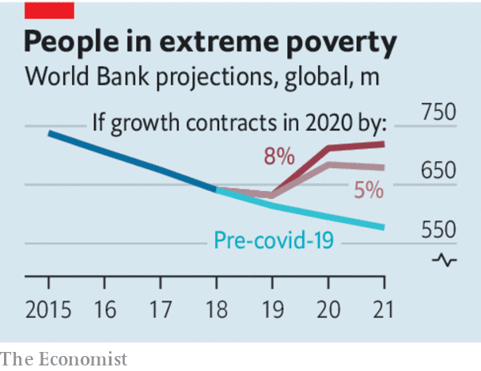

## Failing the poor

# Covid-19 has reversed years of gains in the war on poverty

> Politicians deserve much of the blame

> Sep 26th 2020

Editor’s note: Some of our covid-19 coverage is free for readers of The Economist Today, our daily [newsletter](https://www.economist.com/https://my.economist.com/user#newsletter). For more stories and our pandemic tracker, see our [hub](https://www.economist.com//news/2020/03/11/the-economists-coverage-of-the-coronavirus)

THIS CORONAVIRUS affects everyone, but not equally. The young often shrug off the virus; the old often die of it. The rich shrug off the economic shock; the poor cannot. Because of covid-19, the number of extremely poor people (ie, those making less than $1.90 a day) will rise by 70m-100m this year, the World Bank predicts. Using a broader measure, including those who lack basic shelter or clean water and children who go hungry, the ranks of the poor will swell by 240m-490m this year, says the UN. That could reverse almost a decade of progress (see [article](https://www.economist.com//international/2020/09/26/the-pandemic-is-plunging-millions-back-into-extreme-poverty)). If a vaccine is found, economies will no doubt bounce back. But widespread vaccination will take years and the very poor cannot wait that long. By then, malnutrition will have stunted a tragic number of children’s bodies and minds.

Governments in rich countries have spent over 10% of GDP to ease the economic pain. Others cannot be so ambitious. Emerging economies have spent just 3%, and the poorest nations less than 1%. Safety-nets in low-income countries are cobweb-thin. Governments there have handed out only $4 extra per person on social programmes—in total, not per day.

Donors should help. Rich countries are on course to cut direct aid by a third compared with last year. The IMF and World Bank have raised lending, but only 31% more of the bank’s money has reached poor countries, says the Centre for Global Development, a think-tank, about half the increase in the global financial crisis, a much smaller shock.

Governments in poor countries, meanwhile, need to spend their money wisely. Too many offer pork for chums and crumbs for the poor. Since the crisis began, Mexico has provided no new programmes for the hard-up but has given Pemex, the state oil giant, tax breaks worth $2.7bn, or $21 per Mexican. India has poured $7bn down coal mines. South Africa is expected soon to confirm another wasteful effort to keep its money-losing airline aloft. Even when money is earmarked for good ends, it is too often wasted or stolen. South African investigators are probing possible fraud in 658 contracts worth $300m for covid-fighting kit. Nigeria’s health ministry bought some masks for $53 each. In a leaked recording, a voice allegedly belonging to a Ugandan official guffaws as she and her colleagues appear to plot to pocket money meant for alleviating suffering in the pandemic.

The best way to help the poor is to give them money directly. The simplicity of this policy makes it less vulnerable to corruption. With a little extra cash in their pockets, recipients can feed their children and send them back to school. They can avoid a fire-sale of assets, such as a motorbike-taxi or a cow, that will help them make a living in the future. One country that has done well getting cash into poor pockets is Brazil, despite President Jair Bolsonaro’s habit of downplaying the effects of covid-19. Various measures of poverty there have actually fallen, largely because the government has sent $110 per month for three months to the impecunious, helping 66m people. A priority for governments should be basic health care, which the pandemic has disrupted so badly that vaccination rates for children have been set back about 20 years.

The crisis requires politicians to make hard choices quickly. Mistakes are inevitable, given how much remains unknown about the disease. But some are inexcusable. India’s sudden lockdown threw millions of migrant workers out of their urban jobs and lodgings, forcing them to head back to their villages on foot or crowded trains, spreading the virus far and wide. South Africa barred people from leaving home at night but then evicted tens of thousands of squatters from shacks on public land, with no place to go. Politicians governing remotely from their comfortable home offices should think harder about how their decisions might affect those whom covid-19 is plunging back into dire poverty. It is shameful when their responses to the pandemic add to the suffering of the least fortunate. ■

## URL

https://www.economist.com/leaders/2020/09/26/covid-19-has-reversed-years-of-gains-in-the-war-on-poverty
